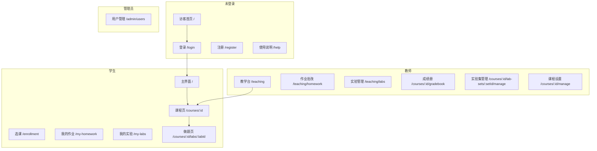

# 教学实训平台 — 全站页面设计说明

> **文档用途**：交给 UI/UX 设计人员，用于界面重设计或视觉规范制定。  
> **依据代码**：`frontend/src`（截至当前仓库实现）。  
> **设计基准**：内容区最大宽度 **920px**（`--content-max`），顶栏全宽；浅色学术风格 + 路由转场/滚动揭示动效。  
> **演示账号**：见项目根目录 `RUN.txt`（密码统一 `Demo123456`）。

---

## 1. 信息架构总览



---

## 2. 全局框架（所有已登录页共用）

**实现文件**：`frontend/src/components/Shell.tsx`  
**样式**：`frontend/src/styles.css`（`.app-header`）、`frontend/src/styles/motion.css`

### 2.1 顶栏 `header.app-header`（sticky，全宽）

| 区域 | 位置 | 现有内容与控件 |
|------|------|----------------|
| 品牌区 | 左上 | 文案 **「教学实训平台」**，链接至 `/` |
| 用户区 | 右上（未登录） | 按钮 **「登录」**、主按钮 **「注册」** |
| 用户区 | 右上（已登录） | 文案 `{姓名}（学生/教师/管理员）`；未验证时红色 **「邮箱未验证」**；按钮 **「退出」** |
| 主导航 | 顶栏下方第二行（仅已登录） | 见下表「角色导航矩阵」；激活项有滑动光带 `nav-link__pill`；**消息** 带未读角标 `nav-badge` |

### 2.2 主内容区 `main.app-main`

- 路由切换时有 **页面转场**（淡入 + 上移 + 轻微模糊，约 0.38s）。
- 多数业务页使用 **PageShell**：左右 `padding` 24–28px，内容 **max-width: 920px** 居中。

### 2.3 角色导航矩阵

| 导航文案 | 路由 | 学生 | 教师 | 管理员 |
|----------|------|:----:|:----:|:------:|
| 主界面 | `/` | ✓ | ✓ | ✓ |
| 选课 | `/enrollment` | ✓ | — | ✓ |
| 教学台 | `/teaching` | — | ✓ | ✓ |
| 我的作业 | `/my-homework` | ✓ | — | — |
| 我的实验 | `/my-labs` | ✓ | — | — |
| 消息 | `/messages` | ✓ | ✓ | ✓ |
| 个人中心 | `/profile` | ✓ | ✓ | ✓ |
| 用户 | `/admin/users` | — | — | ✓ |

### 2.4 通用布局组件

| 组件 | 文件 | 结构说明 |
|------|------|----------|
| **PageShell** | `components/layout/PageShell.tsx` | 外层 `.page-shell` + 内层 `.container.page-shell__inner`（920px） |
| **PageHeader** | `components/layout/PageHeader.tsx` | 上：左 **标题 h1** + **副标题 p**；右 **actions** 按钮组；下：**below** 插槽（面包屑/子导航） |
| **Panel** | `styles.css` `.panel` | 白底卡片；`.panel__head` 左色条 + 标题；`.panel__body` 内容区 |
| **EntityCard** | `styles.css` `.entity-card` | 网格卡片，用于课程/作业/用户等列表 |
| **EmptyState** | `components/layout/EmptyState.tsx` | 空列表占位，仅标题 + 可选说明 |
| **StatusBadge** | `components/layout/StatusBadge.tsx` | 状态标签：`ok` / `warn` / `muted` / `brand` |
| **Toast** | `components/ui/Toast.tsx` | 右下角浮层提示 |
| **ConfirmDialog** | `components/ui/ConfirmDialog.tsx` | 居中确认弹窗 |

### 2.5 设计 Token（`:root`）

| Token | 值 | 用途 |
|-------|-----|------|
| `--content-max` | `920px` | 主内容列宽 |
| `--bg` | `#f3f4f8` | 页面背景 |
| `--brand` | `#4f46e5` | 主色（靛蓝） |
| `--accent` | `#0d9488` | 辅助色（青绿） |
| `--text` | `#1c2333` | 正文 |
| `--muted` | `#6b7280` | 次要文字 |
| `--radius` / `--radius-lg` | `10px` / `14px` | 圆角 |
| `--shadow` | 轻阴影 | 卡片 |
| 字体 | Inter + 思源黑体/苹方/微软雅黑 | 无衬线 |

---

## 3. 路由与页面对照表

| # | 页面名称 | URL | 源码入口 | 需登录 | 角色 |
|---|----------|-----|----------|:------:|------|
| 1 | 访客首页 | `/` | `pages/Home.tsx`（GuestLanding） | — | 全员 |
| 2 | 主界面（仪表盘） | `/` | `pages/Dashboard.tsx` | ✓ | 全员 |
| 3 | 登录 | `/login` | `pages/Login.tsx` | — | 全员 |
| 4 | 注册 | `/register` | `pages/Register.tsx` | — | 全员 |
| 5 | 使用说明 | `/help` | `pages/Help.tsx` | — | 全员 |
| 6 | 选课系统 | `/enrollment` | `pages/enrollment/EnrollmentPage.tsx` | ✓ | 学生、管理员 |
| 7 | 教学台 | `/teaching` | `pages/teaching/TeachingHub.tsx` | ✓ | 教师、管理员 |
| 8 | 作业批改列表 | `/teaching/homework` | `pages/teaching/HomeworkList.tsx` | ✓ | 教师、管理员 |
| 9 | 实验管理列表 | `/teaching/labs` | `pages/teaching/TeachingLabs.tsx` | ✓ | 教师、管理员 |
| 10 | 我的作业 | `/my-homework` | `pages/MyHomework.tsx` | ✓ | 学生 |
| 11 | 我的实验 | `/my-labs` | `pages/MyLabs.tsx` | ✓ | 学生 |
| 12 | 消息中心 | `/messages` | `pages/Messages.tsx` | ✓ | 全员 |
| 13 | 个人中心 | `/profile` | `pages/Profile.tsx` | ✓ | 全员 |
| 14 | 用户管理 | `/admin/users` | `pages/AdminUsers.tsx` | ✓ | 管理员 |
| 15 | 课程壳布局 | `/courses/:courseId/*` | `pages/course/CourseLayout.tsx` | ✓ | 选课/任课相关 |
| 16 | 课程设置 | `/courses/:courseId/manage` | `pages/CourseManage.tsx` | ✓ | 教师、管理员 |
| 17 | 成绩册 | `/courses/:courseId/gradebook` | `pages/Gradebook.tsx` | ✓ | 教师、管理员 |
| 18 | 实验做题 | `/courses/:courseId/labs/:labId` | `pages/Lab.tsx` | ✓ | 全员（权限内） |
| 19 | 实验集管理 | `/courses/:courseId/lab-sets/:labSetId/manage` | `pages/LabSetManage.tsx` | ✓ | 教师、管理员 |
| 20 | 练习答题会话 | `/courses/:courseId/practice/session/:sessionId` | `pages/course/PracticeSession.tsx` | ✓ | 全员 |

**课程内 Tab 子页**（嵌在 #15 的 `course-panel` 内）：

| Tab 文案 | segment | 组件文件 |
|----------|---------|----------|
| 课程公告 | `announcements` | `sections/CourseAnnouncements.tsx` |
| 作业管理 | `homework` | `sections/CourseHomework.tsx` |
| 实验管理 | `labs` | `sections/CourseLabs.tsx` |
| 成绩统计 | `grades` | `sections/CourseGrades.tsx` |
| 练习 | `practice` | `sections/CoursePractice.tsx` |
| 课程资料管理 | `materials` | `sections/CourseMaterials.tsx` |

**课程内深层路由**（仍在课程壳或独立全宽）：

| 页面 | URL | 组件 |
|------|-----|------|
| 公告详情 | `.../announcements/:id` | `CourseAnnouncementDetail.tsx` |
| 作业详情 | `.../homework/:id` | `CourseHomeworkDetail.tsx` |
| 实验集题目列表 | `.../labs/sets/:labSetId` | `CourseLabSetProblems.tsx` |
| 实验讨论帖 | `.../labs/:labId/discussions/:postId` | `LabDiscussionThread.tsx` |

---

## 4. 分页面说明（布局自上而下 / 从左到右）

---

### 4.1 访客首页 `/`

**文件**：`pages/Home.tsx` → `GuestLanding`  
**宽度**：`.container`（920px）  
**背景**：三层浮动光晕 `.landing__glow`（紫/青渐变 blur）

```
┌────────────────────────────────────────────── 920px ──┐
│ [Eyebrow] TEACHING PLATFORM                          │
│ [H1] 在线教学与实训平台                                 │
│ [Lead] 为高校教学设计的一体化空间：选课、实验…           │
│ [主按钮 登录] [注册账号] [使用说明]                      │
│ [向下探索 + 动画线]                                     │
├──────────────────────────────────────────────────────┤
│ [H2] 核心能力                                          │
│ [Lead] 教学全流程在一个平台完成…                        │
│ ┌────────┐ ┌────────┐ ┌────────┐ ┌────────┐         │
│ │图标 课 │ │图标 验 │ │图标 作 │ │图标 练 │  (4列网格) │
│ │课程与选课│ │在线实验│ │作业批改│ │智能练习│         │
│ └────────┘ └────────┘ └────────┘ └────────┘         │
├──────────────────────────────────────────────────────┤
│ [H2] 为什么选择我们                                     │
│ [三列统计] 920px统一宽度 | 实验+作业 | 多角色           │
└──────────────────────────────────────────────────────┘
```

**动效**：首屏 Reveal 渐入；功能卡片 Stagger 依次入场。

---

### 4.2 登录 `/login`、注册 `/register`

**文件**：`pages/Login.tsx`、`pages/Register.tsx`  
**布局**：`.auth-page` 垂直居中

```
┌─────────────────────────┐
│      [圆形 Logo「学」]    │
│   教学实训平台 (H1)       │
│   登录以继续 (副标题)      │
├─────────────────────────┤
│ 卡片 .auth-card__form     │
│   H2: 登录 / 注册         │
│   字段: 邮箱              │
│   字段: 密码              │
│   [错误条 page-alert]     │
│   [主按钮 登录]           │
│   还没有账号？去注册 · 使用说明 │
└─────────────────────────┘
```

---

### 4.3 使用说明 `/help`

**文件**：`pages/Help.tsx`

| 区块 | 内容 |
|------|------|
| PageHeader | 标题 **使用说明**；副标题 **演示账号与常用操作** |
| Panel 正文 | H3 **演示账号**（密码 Demo123456；学生/教师/管理员邮箱）；H3 **推荐路径**（学生/教师路径列表）；H3 **实验评测**（Redis + judge-worker）；链接 **返回登录** |

---

### 4.4 主界面（已登录）`/`

**文件**：`pages/Dashboard.tsx`  
**容器**：PageShell + PageHeader

```
┌─ PageHeader ─────────────────────────────────────────┐
│ 标题: 主界面                                          │
│ 副标题: {教师工作台|学习中心|管理员} · {姓名} · {学期} │
│ 右侧: [教学台] 教师 / [选课] 学生 / [用户管理] 管理员  │
└──────────────────────────────────────────────────────┘
[错误条]（可选）
[实验截止提醒横幅]（仅学生，有提醒时）LabReminderBanner
┌─ Panel: 个人课表 WeeklySchedule ────────────────────┐
│ 工具栏: ◀ 周次 ▶ | 周范围文案 | 单周/双周筛选 | 导出Excel │
│         | 添加个人事项 | 保存成功提示                  │
│ 主体: 7列(周一–周日) × N行(节次) 网格课表              │
│       格子: 课程色块(课名/教师/教室) 或 个人事项        │
│       点击课程格 → 链接至 /courses/:id                 │
│ 底部: 本周截止事项列表（作业/实验截止）                 │
│ 侧栏/浮层: CustomEventEditor（添加/编辑个人事项）       │
└──────────────────────────────────────────────────────┘
┌─ Panel: 我的课程 CourseListPanel ───────────────────┐
│ 标题行: 我的课程 | 学期标签 | [搜索框 搜索课程…]        │
│ 分组折叠: 必修课/选修课/其他（可拖拽排序课程卡片）      │
│ 每卡片: 课名、教师、分类、链接进入课程                  │
│ 空态: 链向 教学台 或 选课系统                          │
└──────────────────────────────────────────────────────┘
```

---

### 4.5 选课系统 `/enrollment`

**文件**：`pages/enrollment/EnrollmentPage.tsx` + `enrollment.css`  
**宽度**：导航条与内容区均为 920px（`--content-max`）

```
┌─ 顶部 Tab 导航 enroll-main-nav（全宽底边）────────────┐
│ [班级课表推荐课程] [全校课程查询] [已选课程] [我的课表] [退课日志] │
│ 管理员额外: [管理配置]                                  │
└──────────────────────────────────────────────────────┘
┌─ 状态条 enroll-status-bar ───────────────────────────┐
│ {学期名} {阶段} | {选课开放状态文案} | 匹配 N 门课程    │
└──────────────────────────────────────────────────────┘
[错误条 enroll-err]

── Tab: 班级课表推荐 ──
  推荐说明 Panel（班级名、参考人数、文案）
  课程表格 CourseEnrollmentTable

── Tab: 全校课程查询 ──
  EnrollmentFilterPanel（课程性质/学科门类/开课学院 多选）
  EnrollmentSearchBar（课程号、教师、时间、教室、班级 搜索）
  课程表格

── Tab: 已选课程 ──
  已 enroll 课程表格（退课按钮）

── Tab: 我的课表 ──
  嵌入 WeeklySchedule（embedded 模式，无 PageHeader）

── Tab: 退课日志 ──
  表格列: 时间 | 操作 | 课程

表格行典型字段: 课程号、课名、教师、时间、容量、已选/候补、操作按钮（选课/退课/候补）
```

---

### 4.6 教学台 `/teaching`

**文件**：`pages/teaching/TeachingHub.tsx`  
**子导航** `TeachingSubnav`：`课程 | 作业 | 实验`（位于 PageHeader below）

```
┌─ PageHeader: 教学台 · N 门课程 ──────────────────────┐
│ Subnav: [课程*] [作业] [实验]                         │
└──────────────────────────────────────────────────────┘

┌─ Panel: 新建课程（表单，上）─────────────────────────┐
│ 块: 基本信息 — 标题*、分类备注、简介 textarea          │
│ 块: 选课信息 — CourseEnrollmentFields（学期/学分/容量等）│
│ 块: 上课时间 — 多行星期/节次/教室                      │
│ 勾选: 发布选课                                       │
│ [创建课程] + 已创建提示                               │
└──────────────────────────────────────────────────────┘

┌─ Panel: 我的课程（下）───────────────────────────────┐
│ 卡片网格 entity-card-grid                            │
│ 每卡: 课程号、标题、状态(已发布/草稿)、MetaChips       │
│       (选课人数/实验数/作业数/容量)、上课时间摘要       │
│ 操作: [管理] → manage  [进入] → 课程公告              │
└──────────────────────────────────────────────────────┘
```

---

### 4.7 作业批改列表 `/teaching/homework`

**文件**：`pages/teaching/HomeworkList.tsx`

| 区域 | 内容 |
|------|------|
| PageHeader | **作业批改** · 共 N 项；Subnav |
| 表格 `data-table` | 列：作业标题(+班级副行)、截止日期、发布状态、提交数、已批改、已发布成绩、操作 **批改** |
| 批改链接 | → `/courses/{courseId}/homework/{id}` |
| 空态 | EmptyState **暂无作业** |

---

### 4.8 实验管理列表 `/teaching/labs`

**文件**：`pages/teaching/TeachingLabs.tsx`

| 区域 | 内容 |
|------|------|
| PageHeader | **实验管理**；Subnav |
| 内容 | 按课程分组的实验集卡片（LabSetListPanel teacher 模式） |
| 卡片操作 | **查看**、**管理**（→ lab-sets/.../manage）、**删除** |

---

### 4.9 我的作业 `/my-homework`

**文件**：`pages/MyHomework.tsx`  
**仅学生**

```
┌─ PageHeader: 我的作业 · N 项待提交 · M 条已提交 ────────┐
│ 右侧: [导出 CSV]                                      │
└──────────────────────────────────────────────────────┘

┌─ Panel: 待完成作业 ──────────────────────────────────┐
│ 卡片网格（可点击）→ /courses/:courseId/homework/:id   │
│ 每卡: 作业标题、状态徽章、课程名、截止/可迟交 MetaChips │
│ 空态: 暂无待提交作业                                  │
└──────────────────────────────────────────────────────┘

┌─ Panel: 课程总评 ────────────────────────────────────┐
│ 每卡: 课程名、总评/排名/实验权重/作业权重 MetaChips    │
└──────────────────────────────────────────────────────┘

┌─ 已提交记录 entity-card-grid ────────────────────────┐
│ 每卡: 作业名、批改状态(待批改/待发布/已发布)、课程、正文摘要、得分 │
└──────────────────────────────────────────────────────┘
```

---

### 4.10 我的实验 `/my-labs`

**文件**：`pages/MyLabs.tsx`（内嵌子路由）

**层级 1 — 课程列表** `LabExplorerCourses`（路由 `/my-labs`）

| 区域 | 内容 |
|------|------|
| PageHeader | **我的实验** |
| 网格 | `lab-course-card`：课程名、实验集数量、链接 → `/my-labs/:courseId` |

**层级 2 — 实验集列表** `LabExplorerSets`（`/my-labs/:courseId`）

| 区域 | 内容 |
|------|------|
| PageHeader | 课程名 · `N 次作业` · 分页信息 |
| below | 面包屑：全部课程 > {课程名} |
| 列表 | `.lab-assign-stack` 内 `.lab-assign-bar` 卡片（每页 **5** 条） |
| 分页 | ListPagination 底部 |
| 页脚 | ← 返回课程列表 |

**实验集卡片 `LabAssignmentBar` 结构**（学生端核心视觉，设计重点）：

```
┌─────────────────────────────────────────────────────┐
│ [标记块] │ 标题                    [状态 pill]      │
│  待/进/✓ │ 日期范围 · done/total 题 · (进度%)      │
│          │ [进度条]（仅进行中 yellow）              │
│          │                    [分数徽章] →          │
└─────────────────────────────────────────────────────┘
```

| 色调 `tone` | 标记文字 | 背景含义 |
|-------------|----------|----------|
| gray | 待 | 未开始 |
| yellow | 进 | 进行中 + 进度条 |
| green | ✓ | 已全部通过（浅绿渐变，非浓色块） |

排序规则：**未完成在前，已完成靠后**；同组内较新在前。

**层级 3 — 题目列表** `LabExplorerProblems`（`/my-labs/:courseId/:labSetId`）

| 区域 | 内容 |
|------|------|
| PageHeader | 实验集标题 · 时间窗 · 均分 |
| Banner | LabSetTimeBanner（截止/补交/未开始提示） |
| 列表 | `LabProblemRow`：语言、题目名、状态色条、得分 |
| 点击 | → `/courses/:courseId/labs/:labId` |

---

### 4.11 消息中心 `/messages`

**文件**：`pages/Messages.tsx`

| 区域 | 内容 |
|------|------|
| PageHeader | **消息** · N 条未读；操作 **全部标为已读** |
| 列表 | 每条：类型标签(实验/讨论/公告)、标题、摘要、时间、未读点 |
| 点击 | 跳转 `linkPath`（如课程公告、实验集） |
| 空态 | EmptyState |

---

### 4.12 个人中心 `/profile`

**文件**：`pages/Profile.tsx`  
**布局**：`.profile-layout` 多 Panel 纵向/网格

| Panel 标题 | 字段与操作 |
|------------|------------|
| 基本信息 | 姓名、头像 URL；**保存** |
| 修改密码 | 旧密码、新密码；**修改密码** |
| 邮箱验证 | 验证 Token；**发送验证邮件** / **确认验证** |
| 忘记密码 | 邮箱、重置 Token、新密码 |
| 账号 | 角色、邮箱；**退出登录** |

PageHeader below：邮箱验证 StatusBadge。

---

### 4.13 用户管理 `/admin/users`

**文件**：`pages/AdminUsers.tsx`

| 区域 | 内容 |
|------|------|
| PageHeader | **用户管理** · N 个用户 |
| 表格 | 列：姓名、邮箱、角色(StatusBadge)、邮箱验证状态、注册时间 |

---

### 4.14 课程页壳 `/courses/:courseId`

**文件**：`pages/course/CourseLayout.tsx`

```
┌─ course-hero（全宽浅色头图区）────────────────────────┐
│ ← 主界面                                              │
│ [H1 课程标题]                                         │
│ 任课教师 · 分类 · [已发布|未发布] 徽章                 │
│ 右侧: 学生 [选课|已加入课程] | 教师 [课程设置]         │
└──────────────────────────────────────────────────────┘
┌─ course-body（920px）────────────────────────────────┐
│ Tab: [课程公告][作业管理][实验管理][成绩统计][练习][资料] │
│ [错误条]（可选）                                       │
│ ┌─ course-panel（主白卡片 min-height 320px）─────────┐ │
│ │           << 子路由 Outlet 内容 >>                  │ │
│ └───────────────────────────────────────────────────┘ │
└──────────────────────────────────────────────────────┘
```

默认进入 Tab：**课程公告**（`/` → redirect `announcements`）。

---

### 4.15 课程公告 Tab

**文件**：`sections/CourseAnnouncements.tsx`

| 区域 | 内容 |
|------|------|
| CourseSectionHead | 标题 **公告**；教师：**发布公告** |
| 列表 | 行：置顶图标、标题、作者、时间、已读/未读（学生）、操作（编辑/删除） |
| 分页 | 每页 15 条 |
| 表单（教师） | 标题、正文 Markdown、置顶、再次通知 |

**公告详情** `CourseAnnouncementDetail`：正文渲染、返回列表。

---

### 4.16 课程作业 Tab + 作业详情

**列表** `CourseHomework.tsx`：

| 区域 | 内容 |
|------|------|
| CourseSectionHead | **作业** |
| 教师顶部 | HomeworkPublishForm（发布新作业） |
| 列表 | `entity-card--link` 网格：标题、截止、发布状态 → 详情页 |

**详情** `CourseHomeworkDetail.tsx`：

```
┌─ 头部 spread ────────────────────────────────────────┐
│ 左: 作业标题 H3、截止时间、面向班级/发布状态           │
│ 右: [返回列表] 教师:[编辑要求][发布/撤回][发布成绩][删除] │
└──────────────────────────────────────────────────────┘
[教师编辑表单 HomeworkEditForm]（可折叠）
[作业要求 HomeworkStudentPanel — Markdown/附件/迟交重做规则]
[学生作答 HomeworkStudentSubmit]
  - 状态徽章、得分、按钮 [作答/收起]
  - 表单: 正文 textarea、附件上传、提交历史、正式提交、删除作业、申请重做
[教师批改 HomeworkTeacherGradingPanel — 提交列表/打分/评语/AI建议]
```

---

### 4.17 课程实验 Tab

**文件**：`sections/CourseLabs.tsx`

| 角色 | 内容 |
|------|------|
| 学生 | 嵌入 `LabExplorerSets`（embedded）；面包屑 课程>实验>学习情况；与 **4.10** 相同列表组件；链接前缀 `/courses/:id/labs/sets` |
| 教师 | `LabSetListPanel` 分组卡片 + **新建实验集**；操作：进入/管理/删除 |

**实验集题目列表**（路由 `.../labs/sets/:labSetId`）：同 `LabExplorerProblems` embedded 模式。

---

### 4.18 实验做题页 `/courses/:courseId/labs/:labId`

**文件**：`pages/Lab.tsx`  
**宽度**：`.container`（920px）；**左右分栏** `.lab-split`

```
[链接] 返回课程 | 返回实验集
[LabSetTimeBanner 时间/门禁提示]

┌─ 左栏 lab-pane-left (约 50%) ─┐ ┌─ 右栏 lab-pane-right ─────────┐
│ H1 题目标题                    │ │ Tab: [提交测评][AI助手][讨论区] │
│ 默认语言 · 实验集名            │ ├──────────────────────────────┤
│ Markdown 题干                  │ │ Tab 内容:                      │
│ 参考代码 pre（只读）           │ │  - Monaco 编辑器 + 语言选择    │
│ 附件资料 LabAttachmentsPanel   │ │  - 提交评测 / 评测结果         │
│                                │ │  - AI 对话                     │
│                                │ │  - 讨论列表                    │
└────────────────────────────────┘ └────────────────────────────────┘
```

评测结果区：公开样例输入/输出；隐藏用例仅显示通过与否；等待评测进度条。

---

### 4.19 实验集管理页 `/courses/:courseId/lab-sets/:labSetId/manage`

**文件**：`pages/LabSetManage.tsx`  
**布局**：独立全宽 container（非 course-panel）

主要区块（自上而下）：

1. 面包屑/返回、标题行内编辑 `LabSetTitleInlineEdit`
2. `LabSetTimeBanner`
3. **时间设置**：开始/截止/补交、门外访问模式；保存
4. **评测设置**：AUTO/MANUAL、允许语言、扩展名、打回次数
5. **统计**：题目数、选课人数、完成率、各题提交统计
6. **题目列表**：新建题目、编辑、跳转做题页
7. **学生进度表**：排序、点击查看提交详情 Modal
8. **实验集讨论** `LabSetDiscussionPanel`

---

### 4.20 课程成绩 Tab + 成绩册

**Tab** `CourseGrades.tsx`：学生 → 链接 **我的作业与成绩**；教师 → **打开成绩册**。

**成绩册** `Gradebook.tsx`：

| 区域 | 内容 |
|------|------|
| PageHeader | 课程名 · 学生数；**导出 CSV**、**保存权重** |
| 权重表单 | 实验权重 + 作业权重（和为 1） |
| 分布统计 | 分数段人数 |
| 学生表 | 姓名、实验均分、作业均分、总评、排名 |

---

### 4.21 课程练习 Tab

**文件**：`sections/CoursePractice.tsx`（大型页）

**学生视图**：

| 区块 | 内容 |
|------|------|
| 开始练习 | 按标签筛选、题目数量、模式；**开始练习** |
| 我的练习记录 | 会话列表 → `practice/session/:id` |
| 错题本入口 | 跳转或内嵌列表 |

**教师视图**（Tab：题库 / 反馈 / 练习记录）：

| Tab | 内容 |
|-----|------|
| 题库 | 标签管理、题目编辑器、文档导入、筛选面板 |
| 反馈 | 学生题目反馈待处理列表 |
| 练习记录 | 全班练习会话与得分 |

**练习会话页** `PracticeSession.tsx`：逐题作答、提交、批改结果、AI 辅导聊天 `PracticeTutorChat`。

---

### 4.22 课程资料 Tab

**文件**：`sections/CourseMaterials.tsx` → `features/materials/MaterialsPanel.tsx`

| 区域 | 内容 |
|------|------|
| CourseSectionHead | **课程资料管理** |
| 教师 | 上传、文件夹、置顶、版本、删除 |
| 学生 | 浏览、下载、收藏 |
| 列表 | 文件名、大小、上传者、时间 |

---

### 4.23 课程设置 `/courses/:courseId/manage`

**文件**：`pages/CourseManage.tsx`

| 区块 | 内容 |
|------|------|
| 页头 | 课程名、返回课程 |
| 开课/结课时间 | datetime-local |
| 上课时间 | 多槽位 |
| 选课字段 | 与教学台新建课程相同 |
| 知识图谱 JSON | textarea |
| 班级管理 | 新建班级、列表 |
| 学生名单 | 表格 |
| 危险操作 | 删除课程 |

---

## 5. 状态与视觉语义（设计需统一）

### 5.1 作业状态（学生）

| 状态码 | 中文标签 | 典型场景 |
|--------|----------|----------|
| NOT_STARTED | 未开始 | 无草稿无提交 |
| IN_PROGRESS | 进行中 | 有草稿未提交 |
| SUBMITTED / LOCKED | 已提交 | 已正式提交待批改 |
| OVERDUE | 已逾期 | 过截止且不可迟交 |
| RETURNED | 已打回 | 教师打回可重填 |
| REDO_PENDING | 重做申请待审批 | — |

### 5.2 实验题目行状态 `gridStatus`

| 值 | 含义 | 色条 |
|----|------|------|
| gray | 未做 | 灰 |
| yellow | 进行中 | 黄 |
| green | 已通过 AC | 绿 |
| red | 未通过 | 红 |

### 5.3 通用按钮层级

| 类名 | 用途 |
|------|------|
| `.btn.primary` | 主操作（提交、创建、进入） |
| `.btn` | 次要操作 |
| `.btn.btn--danger` | 删除 |
| `.btn.btn--sm` | 表格内小按钮 |

---

## 6. 弹层与全局反馈

| 类型 | 触发场景 | 位置 |
|------|----------|------|
| Toast 成功/错误 | 保存、删除、提交 | 右下角栈 |
| ConfirmDialog | 删除作业/实验集/退课 | 屏幕居中遮罩 |
| Modal | 新建实验集、学生提交详情、题目编辑 | 居中宽面板 `.modal-panel` |
| PageSkeleton | 课程/实验/作业加载 | 原位占位 |

---

## 7. 响应式与断点（现状）

| 断点 | 行为 |
|------|------|
| 默认 | 920px 内容列 |
| `max-width: 640px` | 课程 Tab 横向滚动；course-panel padding 缩小 |
| `max-width: 720px` | 实验左右分栏可能堆叠（见 `styles.css` lab 相关） |

---

## 8. 设计交付建议（给设计师）

1. **优先统一**：顶栏、PageHeader、Panel、EntityCard、实验 `lab-assign-bar` 五类组件的视觉语言。  
2. **保持 920px** 主列；选课页、课程 hero 可全宽背景但内容对齐 920px。  
3. **实验模块**为学生端标杆 UI，作业/公告/教学台建议向其对齐（卡片节奏、状态色、分页）。  
4. **动效**：路由转场 0.35s ease-out；列表 scroll-reveal；导航激活 spring 滑动；需保留 `prefers-reduced-motion` 降级。  
5. **文案**：界面以中文为主；访客首页保留一行英文 eyebrow 即可。  
6. **不在范围**：后端 API、邮件模板、judge-worker 控制台无需设计。

---

## 9. 源码索引（按模块）

| 模块 | 主要目录 |
|------|----------|
| 路由 | `frontend/src/App.tsx` |
| 壳层/导航 | `frontend/src/components/Shell.tsx` |
| 布局组件 | `frontend/src/components/layout/` |
| 课程 | `frontend/src/pages/course/` |
| 实验 | `frontend/src/features/labs/`、`frontend/src/pages/Lab.tsx` |
| 作业 | `frontend/src/components/homework/` |
| 选课 | `frontend/src/pages/enrollment/` |
| 教学台 | `frontend/src/pages/teaching/` |
| 主界面 | `frontend/src/features/dashboard/` |
| 样式 Token | `frontend/src/styles.css`、`tokens-extra.css`、`motion.css`、`ui.css` |
| 课程 Tab 配置 | `frontend/src/modules/courseNav.ts` |

---

## 10. 相关文档

- 业务规则摘要：`docs/界面说明.md`
- 改进 Backlog：`docs/提升建议.md`
- 环境启动：`RUN.txt`

---

*文档版本：与当前代码同步；若路由或组件更名，请以 `frontend/src/App.tsx` 为准更新本说明。*
