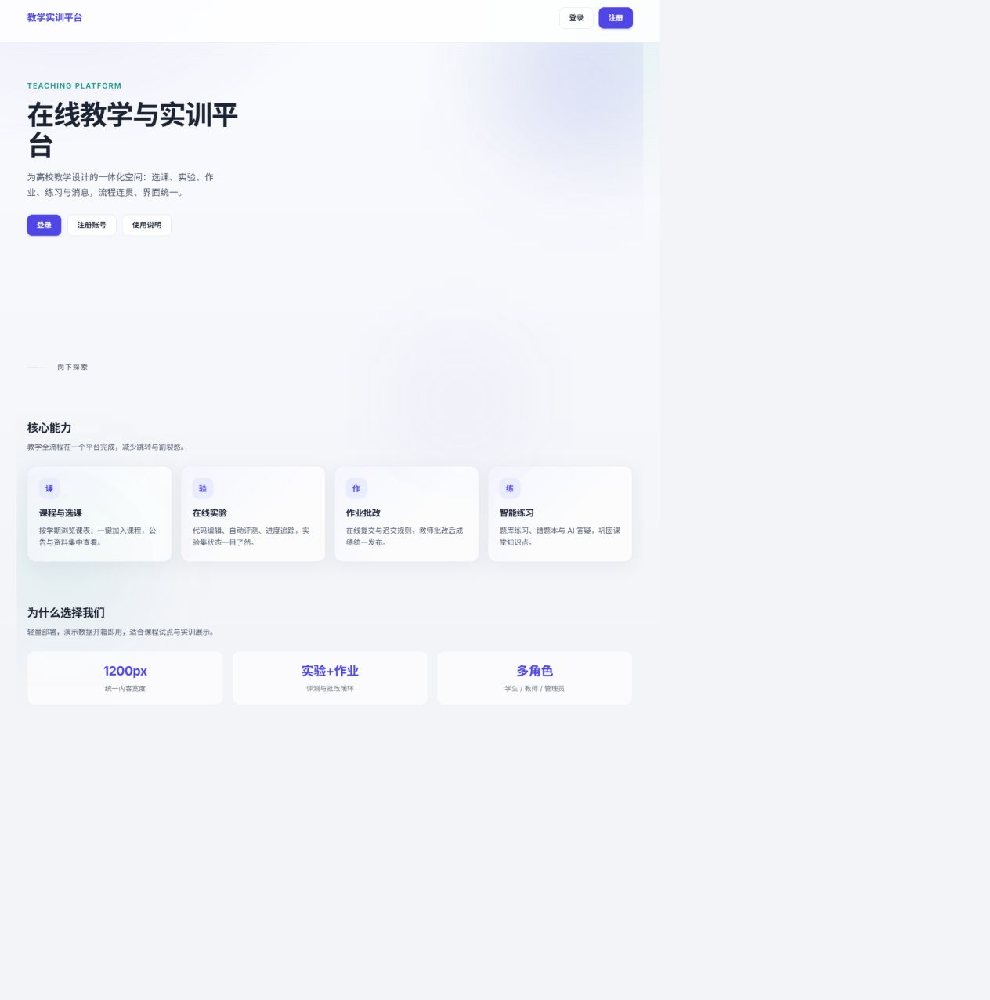

# D5 Kubernetes E2E回归报告

## 执行结论

2026-08-28 23:16（Asia/Shanghai），在Docker Desktop Kubernetes集群中完成UC-01～UC-10全量E2E回归：**10/10通过，0失败**。该结果来自K8s API与PostgreSQL实例，不以本机服务结果替代。

## 运行环境

| 项目 | 实测值 |
|---|---|
| kubectl上下文 | `docker-desktop` |
| Kubernetes客户端/服务端 | `v1.36.1 / v1.36.1` |
| 节点 | `desktop-control-plane` |
| 命名空间 | `teaching-platform` |
| 测试环境标识 | `E2E_ENVIRONMENT=kubernetes` |
| API入口 | `kubectl port-forward service/api 3001:3000` |
| Web入口 | `service/web`，NodePort `30080`；截图时临时转发至`8088` |

## 部署就绪状态

| 工作负载 | Ready | 状态 | 重启数 |
|---|---:|---|---:|
| api | 1/1 | Running | 0 |
| judge-worker | 1/1 | Running | 0 |
| postgres | 1/1 | Running | 0 |
| redis | 1/1 | Running | 0 |
| web | 1/1 | Running | 0 |

`api-uploads`（2Gi）与`postgres-data`（5Gi）两个PVC均为`Bound`。

## 回归结果

| 指标 | 结果 |
|---|---:|
| E2E总数 | 10 |
| E2E通过 | 10 |
| E2E失败 | 0 |
| 用例覆盖 | UC-01～UC-10，10/10 |
| 清理动作 | 5/5成功 |
| 最终结论 | 通过 |

执行命令：

```powershell
$env:E2E_BASE_URL='http://127.0.0.1:3001'
$env:E2E_ENVIRONMENT='kubernetes'
$env:E2E_REPORT_PATH='test-results/e2e-k8s.json'
npm run test:e2e
```

## 证据

- 机器可读报告：`e2e-k8s.json`，记录每个用例、步骤耗时、状态及清理结果。
- 页面证据：`K8s-Web页面.png`，来自K8s `web` Service，页面标题为“在线教学与实训平台”。
- 集群状态检查：5个工作负载全部`1/1 Running`，服务与PVC均正常。


