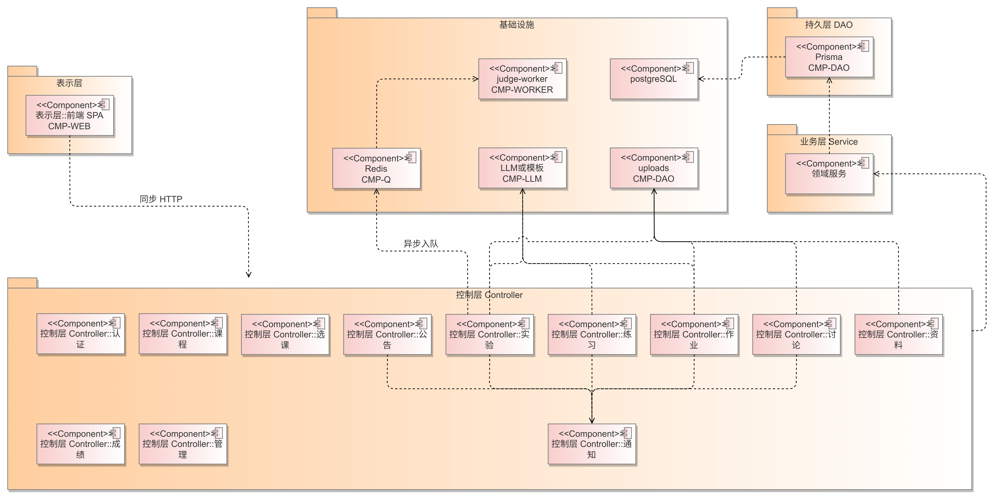

# 各用例组件图（DES-COMP-UC01 … UC10）

- 日期：2026-08-29
- 对应：`01-概要设计说明书.md` 第 3 节
- 画法：UML 组件图；虚线开口箭头 = 依赖

总图与分图均已导出到 `figures/组件图/`。

---

## DES-COMP-UC01 选课 / 退课 / 候补

主组件 `CMP-ENROLL`。课表同步走 `CMP-COURSE`。

---

## DES-COMP-UC02 创建并发布课程

主组件 `CMP-COURSE`。

---

## DES-COMP-UC03 公告发布与已读

主组件 `CMP-ANN`。

---

## DES-COMP-UC04 资料上传与下载

主组件 `CMP-MAT`。

---

## DES-COMP-UC05 作业发布 / 提交 / 批改 / 重做

主组件 `CMP-HW`。

---

## DES-COMP-UC06 实验发布 / 提交 / 自动评测

主组件 `CMP-LAB`。唯一使用异步队列。

---

## DES-COMP-UC07 练习组卷 / 答题 / 错题 / 辅导

主组件 `CMP-PRAC`。不入评测队列。

---

## DES-COMP-UC08 实验讨论与提及通知

主组件 `CMP-DISC`。

---

## DES-COMP-UC09 综合成绩

主组件 `CMP-GRADE`。

---

## DES-COMP-UC10 选课阶段与用户管理

主组件 `CMP-ADMIN`。

