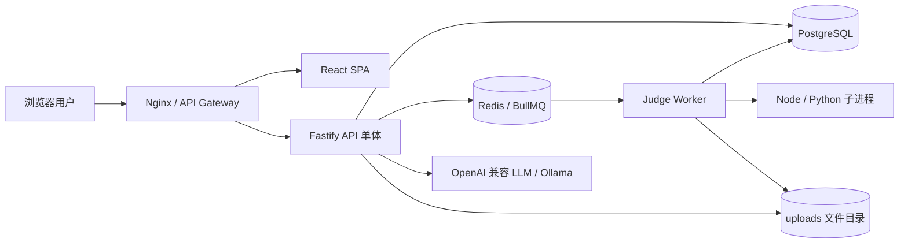

# 02 总体架构与模块设计

## 1. 运行架构

## 2. 分层结构

| 层 | 目录 | 责任 |
| --- | --- | --- |
| 表示层 | `frontend/src/pages`、`components`、`features` | 路由、页面、表单、状态展示和用户交互 |
| 前端应用层 | `AuthContext`、`CourseContext`、Hooks、`api/client.ts` | 会话、页面聚合状态、远程调用和缓存 |
| API 控制层 | `backend/src/routes` | HTTP 路由、认证、Zod 校验、响应序列化 |
| 领域服务层 | `backend/src/lib` | 选课、作业状态、实验状态、评测配置、练习批改等规则 |
| 持久层 | `backend/src/lib/prisma.ts`、`schema.prisma` | Prisma Client、模型与关系 |
| 异步执行层 | `judge-worker/src` | 消费评测任务、运行用户代码、回写结果 |
| 基础设施层 | Docker、Nginx、Redis、PostgreSQL、uploads | 部署、队列、数据库、文件 |

## 3. 后端启动与插件组合

`backend/src/index.ts` 创建 Fastify 实例并顺序注册：CORS、Helmet、multipart、全局限流、请求 ID Hook、19 个路由插件和实验提醒调度器。

讨论路由必须先于通配 `/labs/:id` 注册，否则 `/labs/:labId/discussions` 可能被通配路由抢占。关闭服务时 `onClose` 调用提醒调度器返回的停止函数。

## 4. 领域模块

| 模块 | 路由控制器 | 主要领域服务 | 主要实体 |
| --- | --- | --- | --- |
| 认证与用户 | `authRoutes`、`adminRoutes` | `jwt`、`password`、`authGuard` | `User` |
| 课程 | `coursesRoutes`、`dashboardRoutes` | `courseAccess`、`scheduleSlots`、`knowledge-graph` | `Course`、`Class` |
| 选课 | `enrollmentRoutes` | `enrollment-service`、`enrollment-labels` | `Enrollment*`、`EnrollmentPeriod` |
| 公告通知 | `announcementsRoutes`、`notificationsRoutes` | `announcements`、`notification-events` | `CourseAnnouncement`、`SiteNotification` |
| 资料 | `courseMaterialsRoutes` | `course-materials`、`uploads` | `CourseMaterial`、`MaterialFavorite` |
| 作业 | `homeworkRoutes`、`homeworkStudentRoutes` | `homework-settings`、`homework-student`、AI/知识分析 | 9 个 Homework 模型 |
| 成绩 | `gradesRoutes` | `lab-grades`、成绩聚合函数 | `Course` 权重、作业/实验成绩 |
| 实验 | `labSetsRoutes`、`labsRoutes`、`labFilesRoutes`、`labOverviewRoutes` | `lab-submit`、`lab-set-status`、`lab-judge-config` | `LabSet`、`Lab`、`Submission` 等 |
| 练习 | `practiceRoutes` | `practice-pick`、`practice-grade`、`practice-tutor` | `Practice*`、`WrongBookEntry` |
| 讨论 | `discussionsRoutes` | 提及通知、附件服务 | `Discussion*` |
| AI | `aiHelpRoutes` 及作业/练习服务 | `platform-llm`、`openai-chat` | 无独立实体 |

## 5. 前端模块

| 模块 | 入口 | 状态与依赖 |
| --- | --- | --- |
| 应用路由 | `App.tsx` | `RequireAuth`、`RequireRole`、React Router |
| 会话 | `AuthContext.tsx` | localStorage、`/auth/me`、Axios 拦截器 |
| 课程壳 | `CourseLayout`、`CourseContext` | 并行加载课程、实验、作业、讨论、资料 |
| 选课 | `EnrollmentPage` 及子组件 | 搜索条件、分类筛选、选课/候补/日志 |
| 作业 | `CourseHomework*`、homework 组件 | 草稿、版本、附件、批改、重做 |
| 实验 | `Lab`、labs features | 实验集导航、提交轮询、讨论、AI |
| 练习 | `CoursePractice`、`PracticeSession` | 题库/会话/反馈/辅导 |
| 成绩 | `CourseGrades`、`GradebookPanel` | 教师成绩册与学生汇总 |
| 管理 | admin pages | 用户、日志、选课阶段、作业完成情况 |

## 6. 横切关注点

- 认证：JWT Bearer；前端导航守卫仅改善体验，安全以服务端守卫为准。
- 输入校验：路由内 Zod Schema；Prisma 提供数据库约束。
- 错误处理：路由返回 400/403/404/409/500；前端统一处理 401 并跳转登录。
- 限流：Fastify 全局每分钟限流；AI 路径另有更细限制。
- 文件：元数据入库，文件写入 `UPLOAD_DIR`；API 与 Worker 必须共享目录。
- 实时通知：内存客户端集合由 `notification-events.ts` 管理；持久通知仍在 PostgreSQL。
- 可观测性：Fastify logger + `X-Request-ID`；Worker 监听 `failed` 事件。

## 7. 目标微服务演进

当前单体的路由层已按领域分文件，但 Prisma Client 和数据库关系仍跨域。拆分时保持公共 URL，通过网关转发；业务表只能由归属服务直接访问。课程权限、通知、实验成绩和错题写入需改为内部接口，跨服务外键改为业务 ID。
