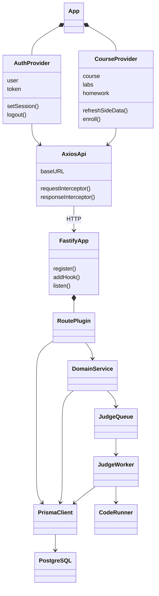
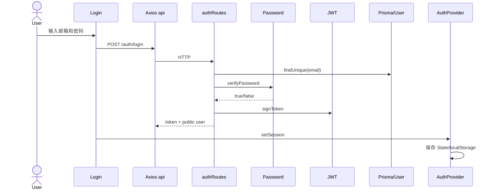
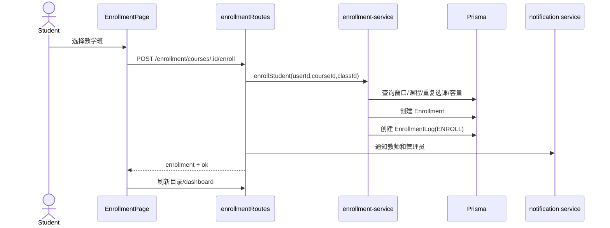
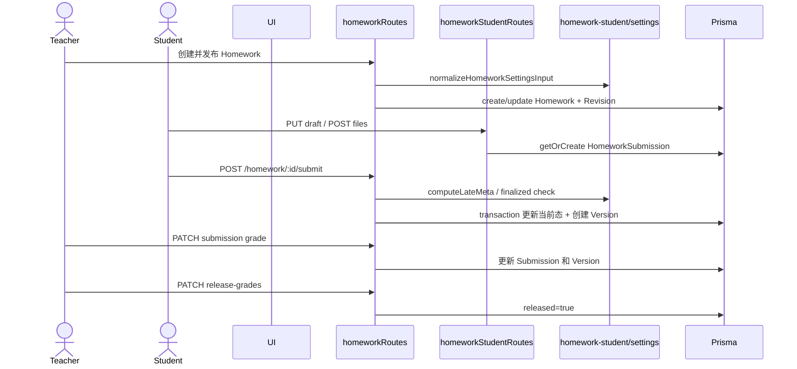
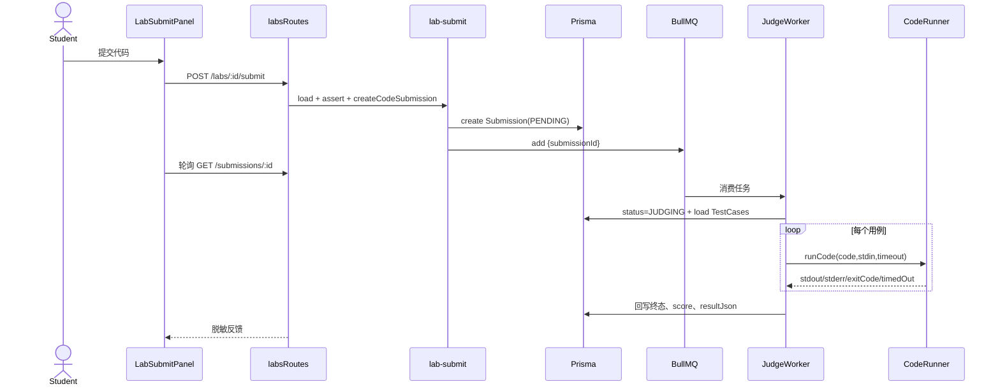
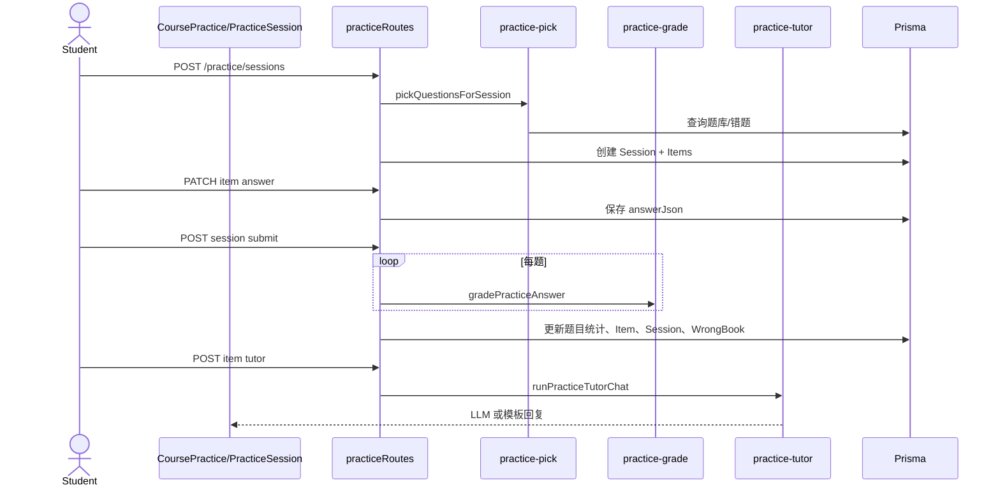
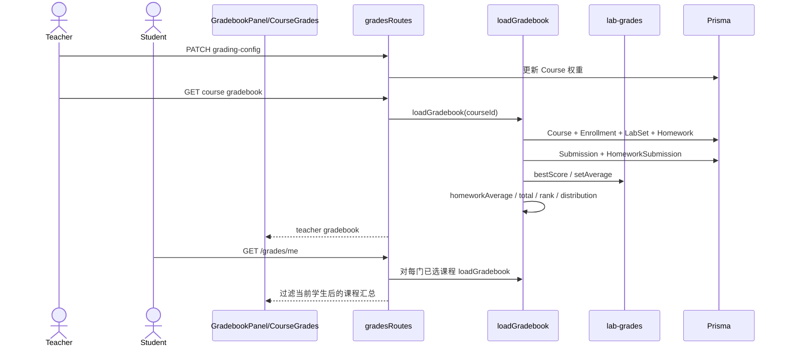
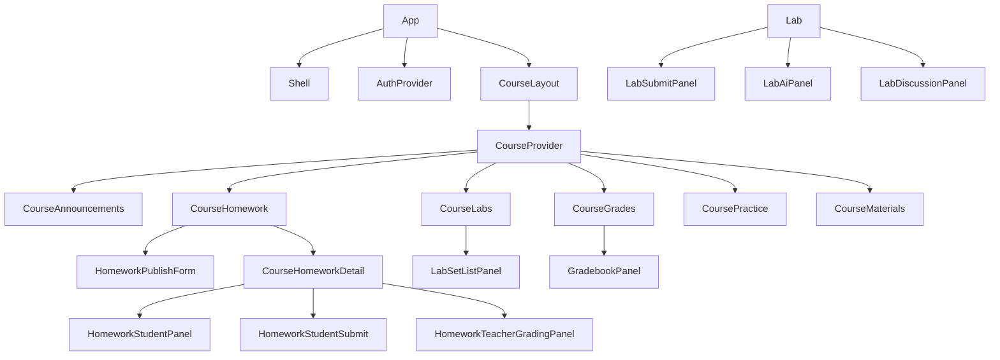

# 05 关键调用链与关系图

## 1. 总体类关系



说明：`RoutePlugin` 和 `DomainService` 是设计角色，不是源码中的抽象基类。

## 2. 核心实体关系

```mermaid
erDiagram
  User ||--o{ Course : teaches
  User ||--o{ Enrollment : enrolls
  Course ||--o{ Enrollment : contains
  Course ||--o{ Class : has
  Course ||--o{ Homework : assigns
  Homework ||--o{ HomeworkSubmission : receives
  User ||--o{ HomeworkSubmission : submits
  HomeworkSubmission ||--o{ HomeworkSubmissionVersion : versions
  HomeworkSubmission ||--o{ HomeworkStudentFile : files
  Homework ||--o{ HomeworkRedoRequest : redo
  Course ||--o{ LabSet : has
  LabSet ||--o{ Lab : groups
  Lab ||--o{ TestCase : tests
  Lab ||--o{ Submission : receives
  User ||--o{ Submission : submits
  Course ||--o{ PracticeQuestion : owns
  User ||--o{ PracticeSession : starts
  PracticeSession ||--o{ PracticeSessionItem : contains
  PracticeQuestion ||--o{ PracticeSessionItem : selected
  Course ||--o{ DiscussionPost : owns
  DiscussionPost ||--o{ DiscussionComment : comments
```

## 3. 认证调用链



后续请求由 Axios 拦截器附加 token；`authRequired` 调 `verifyToken`，再校验角色。

## 4. UC01 选课调用链



退课链在删除 Enrollment 后调用 `promoteWaitlistForCourse`，后者晋升首位候补并写 `WAITLIST_PROMOTED`。

## 5. UC05 作业调用链



## 6. UC06 自动评测调用链



## 7. UC07 练习调用链



## 8. UC09 成绩调用链



当前学生视图与教师视图共用 `loadGradebook`，因此数值设计上一致；但也导致未发布作业分数进入学生汇总。

## 9. 前端组件组合关系



## 10. 继承、实现和依赖总结

| 关系 | 项目中的表现 |
| --- | --- |
| 继承 | 几乎没有业务继承；没有控制器/服务基类 |
| 接口实现 | 路由函数满足 `FastifyPluginAsync`；DTO/Props 满足 TS 结构类型 |
| 组合 | Fastify 注册路由插件；React 页面组合组件；Provider 包裹消费者 |
| 聚合 | `CourseContext` 聚合多域页面状态；`loadGradebook` 聚合多个成绩来源 |
| 依赖 | 路由依赖领域函数和 Prisma；组件依赖 Context/Hook/api |
| 关联 | Prisma relation 描述实体一对一、一对多和自关联 |

项目应继续优先使用组合而非人为引入继承层级。若微服务拆分后需要替换外部实现，可为课程访问、通知、实验成绩定义 Port 接口，再由 HTTP Adapter 实现。
