# 07 系统总类图（Mermaid 竖版）

本图使用 Mermaid `flowchart TB` 模拟 UML 类图。三个领域由不可见布局连线强制自上而下排列，适合竖版 Markdown、Word 和 PDF。

> 类框第一栏为类名，`-` 表示私有/持久化属性，`+` 表示公有业务方法。每条关系标明关系类型、角色和多重性；Service 是领域职责，不要求源码使用 `class` 关键字。

```mermaid
flowchart TB

  subgraph COURSE[课程与用户域]
    direction TB
    C_LAYOUT[ ]:::anchor

    User["<b>User</b><br/>- id: String<br/>- email: String<br/>- name: String<br/>- role: Role<br/>────────<br/>+ login()<br/>+ updateProfile()"]
    Course["<b>Course</b><br/>- id: String<br/>- title: String<br/>- teacherId: String<br/>- published: Boolean<br/>- capacity: Int<br/>- labWeight: Float<br/>- homeworkWeight: Float<br/>────────<br/>+ publish()<br/>+ updateConfig()"]

    Class["<b>Class</b><br/>- id: String<br/>- courseId: String<br/>- name: String"]
    Enrollment["<b>Enrollment</b><br/>- id: String<br/>- userId: String<br/>- courseId: String<br/>- classId: String<br/>- createdAt: DateTime"]
    Waitlist["<b>EnrollmentWaitlist</b><br/>- id: String<br/>- userId: String<br/>- courseId: String<br/>- createdAt: DateTime"]
    Period["<b>EnrollmentPeriod</b><br/>- semesterKey: String<br/>- phase: EnrollmentPhase<br/>- openAt: DateTime<br/>- closeAt: DateTime<br/>────────<br/>+ isOpen()"]
    EnrollLog["<b>EnrollmentLog</b><br/>- id: String<br/>- userId: String<br/>- courseId: String<br/>- action: EnrollmentLogAction<br/>- operatorId: String"]
    Announcement["<b>CourseAnnouncement</b><br/>- id: String<br/>- courseId: String<br/>- authorId: String<br/>- title: String<br/>- body: String<br/>────────<br/>+ publish()"]
    Material["<b>CourseMaterial</b><br/>- id: String<br/>- courseId: String<br/>- uploaderId: String<br/>- fileName: String<br/>- visibility: String<br/>────────<br/>+ canView()"]
    Notification["<b>SiteNotification</b><br/>- id: String<br/>- userId: String<br/>- type: String<br/>- title: String<br/>- readAt: DateTime<br/>────────<br/>+ markRead()"]
    EnrollmentService["<b>EnrollmentService</b><br/>+ validateEnrollmentWindow()<br/>+ enrollStudent()<br/>+ dropStudent()<br/>+ joinWaitlist()<br/>+ promoteWaitlist()"]:::service

    C_LAYOUT ~~~ User
    User -->|"关联：任教 1 : 0..*"| Course
    User -->|"关联：选课 1 : 0..*"| Enrollment
    Course -->|"组合◆：班级 1 : 0..*"| Class
    Course -->|"组合◆：选课记录 1 : 0..*"| Enrollment
    Course -->|"组合◆：候补记录 1 : 0..*"| Waitlist
    Course -->|"组合◆：操作日志 1 : 0..*"| EnrollLog
    Course -->|"组合◆：公告 1 : 0..*"| Announcement
    Course -->|"组合◆：资料 1 : 0..*"| Material
    User -->|"组合◆：通知 1 : 0..*"| Notification
    Period -.->|"依赖：控制选课窗口"| Enrollment
    EnrollmentService -.->|"依赖：管理"| Enrollment
    EnrollmentService -.->|"依赖：校验"| Period
  end

  subgraph HOMEWORK[作业与成绩域]
    direction TB
    H_LAYOUT[ ]:::anchor

    Homework["<b>Homework</b><br/>- id: String<br/>- courseId: String<br/>- targetClassId: String<br/>- title: String<br/>- dueAt: DateTime<br/>- published: Boolean<br/>- allowLate: Boolean<br/>- allowRedo: Boolean<br/>────────<br/>+ publish()<br/>+ updateRequirements()"]
    HwSubmission["<b>HomeworkSubmission</b><br/>- id: String<br/>- homeworkId: String<br/>- userId: String<br/>- score: Float<br/>- graded: Boolean<br/>- released: Boolean<br/>- locked: Boolean<br/>────────<br/>+ submit()<br/>+ grade()<br/>+ release()"]
    HwVersion["<b>HomeworkSubmissionVersion</b><br/>- id: String<br/>- submissionId: String<br/>- version: Int<br/>- content: String<br/>- score: Float<br/>- submittedAt: DateTime"]
    Redo["<b>HomeworkRedoRequest</b><br/>- id: String<br/>- homeworkId: String<br/>- userId: String<br/>- status: RedoStatus<br/>- reviewedById: String<br/>────────<br/>+ approve()<br/>+ reject()"]
    HwQuestion["<b>HomeworkQuestion</b><br/>- id: String<br/>- homeworkId: String<br/>- userId: String<br/>- question: String<br/>- answer: String<br/>────────<br/>+ answerQuestion()"]
    HomeworkService["<b>HomeworkService</b><br/>+ createHomework()<br/>+ submitHomework()<br/>+ gradeSubmission()<br/>+ approveRedo()<br/>+ releaseGrades()"]:::service
    GradebookService["<b>GradebookService</b><br/>+ validateWeights()<br/>+ calculateLabAverage()<br/>+ calculateHomeworkAverage()<br/>+ calculateTotalScore()<br/>+ calculateRank()"]:::service

    H_LAYOUT ~~~ Homework
    Homework -->|"组合◆：提交 1 : 0..*"| HwSubmission
    HwSubmission -->|"组合◆：版本 1 : 1..*"| HwVersion
    Homework -->|"组合◆：重做申请 1 : 0..*"| Redo
    Homework -->|"组合◆：答疑 1 : 0..*"| HwQuestion
    HomeworkService -.->|"依赖：管理"| Homework
    HomeworkService -.->|"依赖：管理"| HwSubmission
    GradebookService -.->|"依赖：聚合"| HwSubmission
  end

  subgraph LAB[实验、练习与讨论域]
    direction TB
    L_LAYOUT[ ]:::anchor

    LabSet["<b>LabSet</b><br/>- id: String<br/>- courseId: String<br/>- title: String<br/>- startAt: DateTime<br/>- dueAt: DateTime<br/>- judgeMode: JudgeMode<br/>────────<br/>+ canBrowse()<br/>+ canSubmit()"]
    Lab["<b>Lab</b><br/>- id: String<br/>- labSetId: String<br/>- title: String<br/>- language: String<br/>- judgeMode: JudgeMode"]
    TestCase["<b>TestCase</b><br/>- id: String<br/>- labId: String<br/>- input: String<br/>- expected: String<br/>- hidden: Boolean<br/>- weight: Int"]
    LabSubmission["<b>Submission</b><br/>- id: String<br/>- labId: String<br/>- userId: String<br/>- status: SubmissionStatus<br/>- score: Float<br/>- resultJson: String<br/>────────<br/>+ enqueue()<br/>+ updateResult()"]

    PracticeQuestion["<b>PracticeQuestion</b><br/>- id: String<br/>- courseId: String<br/>- type: QuestionType<br/>- stem: String<br/>- answerJson: String<br/>- tagPath: String"]
    PracticeSession["<b>PracticeSession</b><br/>- id: String<br/>- userId: String<br/>- courseId: String<br/>- mode: SessionMode<br/>- status: SessionStatus<br/>- score: Float<br/>────────<br/>+ submit()<br/>+ calculateScore()"]
    SessionItem["<b>PracticeSessionItem</b><br/>- id: String<br/>- sessionId: String<br/>- questionId: String<br/>- answerJson: String<br/>- correct: Boolean<br/>- score: Float"]
    WrongBook["<b>WrongBookEntry</b><br/>- id: String<br/>- userId: String<br/>- homeworkId: String<br/>- practiceQuestionId: String<br/>- mastered: Boolean<br/>────────<br/>+ markMastered()"]

    Post["<b>DiscussionPost</b><br/>- id: String<br/>- courseId: String<br/>- labSetId: String<br/>- labId: String<br/>- userId: String<br/>- title: String<br/>- anonymous: Boolean<br/>────────<br/>+ publish()"]
    Comment["<b>DiscussionComment</b><br/>- id: String<br/>- postId: String<br/>- userId: String<br/>- parentId: String<br/>- body: String<br/>────────<br/>+ reply()"]

    LabService["<b>LabService</b><br/>+ createLabSet()<br/>+ submitCode()<br/>+ returnSubmission()<br/>+ calculateProgress()"]:::service
    PracticeService["<b>PracticeService</b><br/>+ createSession()<br/>+ selectQuestions()<br/>+ gradeAnswers()<br/>+ updateWrongBook()"]:::service
    JudgeWorker["<b>JudgeWorker</b><br/>- concurrency: Int<br/>- timeoutMs: Int<br/>────────<br/>+ consumeSubmission()<br/>+ runTestCases()<br/>+ calculateScore()<br/>+ updateSubmission()"]:::worker

    L_LAYOUT ~~~ LabSet
    LabSet -->|"组合◆：题目 1 : 1..*"| Lab
    Lab -->|"组合◆：测试用例 1 : 0..*"| TestCase
    Lab -->|"组合◆：提交 1 : 0..*"| LabSubmission
    PracticeSession -->|"组合◆：会话题目 1 : 1..*"| SessionItem
    PracticeQuestion -->|"关联：被选入 1 : 0..*"| SessionItem
    Post -->|"组合◆：评论 1 : 0..*"| Comment
    Comment -->|"关联：父评论/回复 0..1 : 0..*"| Comment
    LabService -.->|"依赖：管理"| LabSubmission
    PracticeService -.->|"依赖：管理"| PracticeSession
    PracticeService -.->|"依赖：更新"| WrongBook
    JudgeWorker -.->|"依赖：执行"| TestCase
    JudgeWorker -.->|"依赖：回写"| LabSubmission
  end

  C_LAYOUT ~~~ H_LAYOUT
  H_LAYOUT ~~~ L_LAYOUT

  Course -->|"组合◆：作业 1 : 0..*"| Homework
  User -->|"关联：提交作业 1 : 0..*"| HwSubmission
  Course -->|"组合◆：实验集 1 : 0..*"| LabSet
  User -->|"关联：提交实验 1 : 0..*"| LabSubmission
  Course -->|"组合◆：练习题 1 : 0..*"| PracticeQuestion
  Course -->|"组合◆：练习会话 1 : 0..*"| PracticeSession
  User -->|"关联：拥有错题 1 : 0..*"| WrongBook
  Course -->|"组合◆：讨论帖 1 : 0..*"| Post
  GradebookService -.->|"依赖：读取权重"| Course
  GradebookService -.->|"依赖：聚合实验分"| LabSubmission

  classDef anchor fill:transparent,stroke:transparent,color:transparent,width:1px,height:1px;
  classDef service fill:#eef2ff,stroke:#4f46e5,stroke-width:2px,color:#1e1b4b;
  classDef worker fill:#fff7ed,stroke:#ea580c,stroke-width:2px,color:#7c2d12;
```

## 图例

| 表示 | 含义 |
| --- | --- |
| `A --> B`，标注“关联” | 普通关联；对象互相知道，但不共同决定生命周期 |
| `A --> B`，标注“组合◆” | 组合；A 强拥有 B，A 删除时 B 通常级联删除 |
| `A -.-> B`，标注“依赖” | A 临时调用、管理、校验或聚合 B |
| `1`、`0..1`、`0..*`、`1..*` | UML 多重性 |
| 蓝色类框 | 领域服务 |
| 橙色类框 | 异步评测 Worker |

## UML 关系类型审计

| 关系类型 | 当前总图是否使用 | 代码依据/说明 |
| --- | --- | --- |
| 关联 Association | 是 | 用户任教课程、用户提交作业/实验、练习题被选入会话项等；双方存在业务联系，但不共同决定生命周期 |
| 聚合 Aggregation | 否 | 当前核心 Prisma 关系要么是普通关联，要么配置 `onDelete: Cascade` 表现为强拥有，没有适合单独标为共享聚合的核心关系 |
| 组合 Composition | 是 | `Course→Homework`、`Homework→HomeworkSubmission`、`LabSet→Lab` 等父子对象具有级联生命周期 |
| 依赖 Dependency | 是 | Service 或 Worker 调用、管理、校验或聚合实体，但不拥有实体生命周期 |
| 继承 Generalization | 否 | 当前业务代码没有父类—子类继承树；学生、教师、管理员使用 `Role` 枚举区分，不建立 `Student/Teacher/Admin extends User` |
| 实现 Realization | 否 | 当前领域服务由函数模块实现，没有显式 `IService` 接口和 `implements`；Fastify/React 框架契约已从课程核心类图省略 |

图中没有为了凑齐 UML 符号而虚构聚合、继承或实现关系。若后续引入 `IGradebookService` 等端口接口，再使用虚线空心三角箭头标注“实现”。

## 竖向布局实现

- 顶层采用 `flowchart TB`。
- `C_LAYOUT ~~~ H_LAYOUT ~~~ L_LAYOUT` 使用 Mermaid 不可见连线，强制三个领域依次向下排列。
- 每个领域内部使用 `direction TB`，优先形成纵向树。
- 跨领域只保留 `Course`、`User`、`GradebookService` 必需的关系，避免重新拉成横向网状图。
- 当前成绩权重仍位于 `Course.labWeight` 和 `Course.homeworkWeight`，没有画尚未实现的 `GradingConfig`。
