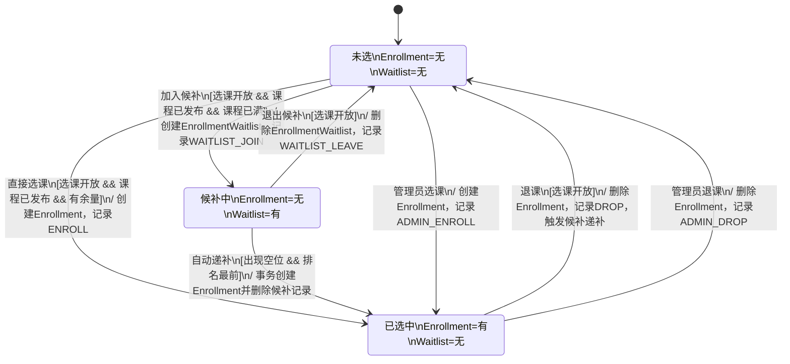
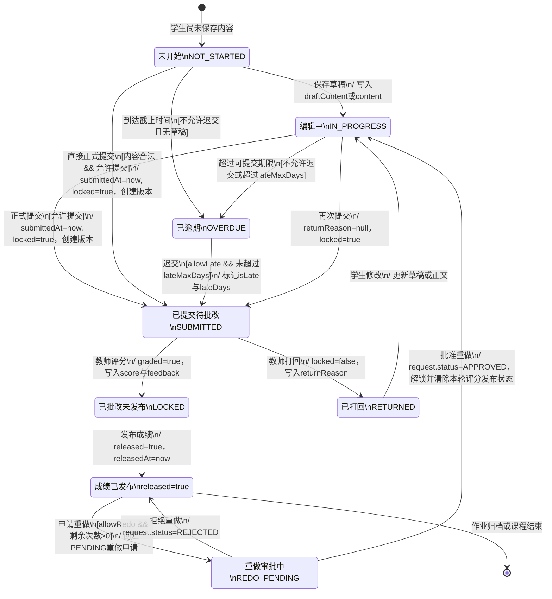
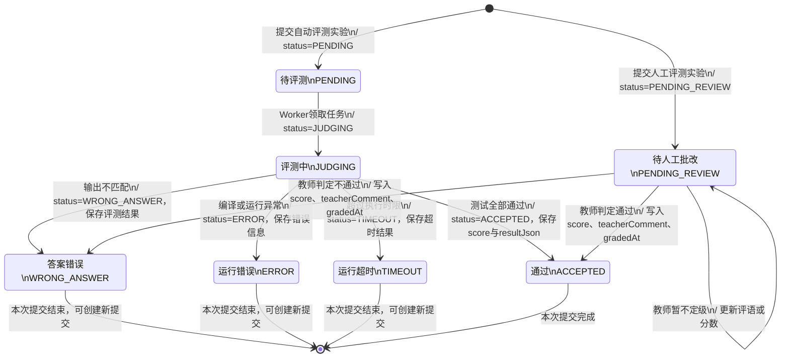

# 对象级状态图（第一批）

- 完成进度：**3/9 张（总数的 1/3）**
- 图示范围：选课关系、作业提交、实验提交三个具有代表性的生命周期对象
- 表示方法：Mermaid `stateDiagram-v2`
- 建模原则：状态和转换均来自当前源码；不把页面文案误当作数据库字段

## 1. 图示约定

- `[*]` 表示对象生命周期的起点或终点。
- `事件 [守卫条件] / 动作` 表示触发转换的操作、必须满足的条件和转换时执行的数据更新。
- “持久化状态”直接对应数据库枚举或字段；“推导状态”由若干字段和时间条件计算得到。
- 选课业务没有单一 `status` 字段，因此第一张图以“学生—课程选课关系对象”为状态主体，由 `Enrollment` 与 `EnrollmentWaitlist` 是否存在共同判定。

---

## 2. 选课关系对象状态图

**对象实例：** `studentCourseRelation:EnrollmentRelation`

**状态来源：**

- 未选：不存在对应的 `Enrollment` 和 `EnrollmentWaitlist` 记录；
- 候补中：存在 `EnrollmentWaitlist(userId, courseId)`；
- 已选中：存在 `Enrollment(userId, courseId)`；
- 选课日志 `EnrollmentLog` 只记录事件，不决定当前状态。

### 2.1 转换说明

| 当前状态 | 触发事件 | 守卫条件 | 下一状态 | 核心动作 |
| --- | --- | --- | --- | --- |
| 未选 | 直接选课 | 阶段开放、课程已发布、人数未满、未重复选课 | 已选中 | 创建 `Enrollment`，清理同课程候补记录 |
| 未选 | 加入候补 | 阶段开放、课程已发布、课程已满 | 候补中 | 创建 `EnrollmentWaitlist` |
| 候补中 | 退出候补 | 阶段开放且候补记录存在 | 未选 | 删除候补记录 |
| 候补中 | 系统递补 | 课程出现空位且该对象排在候补队首 | 已选中 | 在事务中创建选课记录并删除候补记录，发送通知 |
| 已选中 | 学生或管理员退课 | 选课记录存在；学生操作还要求阶段开放 | 未选 | 删除选课记录，并调用候补递补服务 |

> `Enrollment` 本身被删除后生命周期即结束，但从业务视角看，“学生—课程关系”仍回到未选状态，之后可以再次选课。

---

## 3. 作业提交对象状态图

**对象实例：** `homeworkSubmission:HomeworkSubmission`

**状态类型：** 推导状态。`computeStudentStatus()` 根据 `draftContent`、`submittedAt`、`locked`、`graded`、`returnReason`、截止时间及待处理重做申请共同计算状态。

### 3.1 状态判定与关键字段

| 图中状态 | 判定依据 |
| --- | --- |
| 未开始 | 没有有效草稿，且当前仍可提交 |
| 编辑中 | 有 `draftContent`，或尚未正式提交但 `content` 非空 |
| 已逾期 | 无草稿、已过截止时间且 `computeLateMeta().canSubmit=false` |
| 已提交待批改 | `submittedAt` 非空或 `locked=true`，且 `graded=false` |
| 已批改未发布 | `graded=true`、`released=false` |
| 成绩已发布 | `released=true`，通常同时具有 `releasedAt` |
| 已打回 | `returnReason` 非空且 `locked=false` |
| 重做审批中 | 存在状态为 `PENDING` 的 `HomeworkRedoRequest` |

> 页面层把“已提交待批改”和“已批改”都显示为已提交/锁定，但详细设计图将二者拆开，以明确教师评分和发布成绩是两个独立事件。

---

## 4. 实验提交对象状态图

**对象实例：** `labSubmission:Submission`

**状态类型：** 持久化状态，直接对应 Prisma 枚举 `SubmissionStatus`。

### 4.1 转换说明

| 当前状态 | 处理对象 | 下一状态 | 说明 |
| --- | --- | --- | --- |
| 新建 | API/`createSubmission()` | `PENDING` | 自动评测模式，随后投递 BullMQ 任务 |
| 新建 | API/`createSubmission()` | `PENDING_REVIEW` | 人工评测模式，不进入自动评测队列 |
| `PENDING` | Judge Worker | `JUDGING` | Worker 开始编译、运行测试用例 |
| `JUDGING` | Judge Worker | `ACCEPTED` / `WRONG_ANSWER` / `ERROR` / `TIMEOUT` | 根据评测结果写回终态 |
| `PENDING_REVIEW` | 教师批改接口 | `ACCEPTED` / `WRONG_ANSWER` / `PENDING_REVIEW` | 教师可判定结果，或暂时保持待批改 |

> 一次重新提交会创建新的 `Submission` 对象，而不是让原对象从失败终态回到 `PENDING`。因此图中失败状态指向生命周期终点。

---

## 5. 三张图之间的业务联系

1. `EnrollmentRelation` 处于“已选中”时，学生才具备访问课程作业和实验的业务资格。
2. `HomeworkSubmission` 用多个字段推导状态，强调草稿、提交、批改、发布和重做流程。
3. `Submission` 使用枚举保存状态，强调 API、消息队列和 Judge Worker 之间的异步评测流程。
4. 两类提交最终形成成绩数据，由 UC09 的成绩汇总逻辑按课程权重计算学生总评。

## 6. 源码追溯

| 状态图 | 主要源码 |
| --- | --- |
| 选课关系 | `backend/prisma/schema.prisma`：`Enrollment`、`EnrollmentWaitlist`、`EnrollmentLog`；`backend/src/lib/enrollment-service.ts` |
| 作业提交 | `backend/prisma/schema.prisma`：`HomeworkSubmission`、`HomeworkSubmissionVersion`、`HomeworkRedoRequest`；`backend/src/lib/homework-student.ts`；`backend/src/routes/homework.ts`；`backend/src/routes/homework-student.ts` |
| 实验提交 | `backend/prisma/schema.prisma`：`SubmissionStatus`、`Submission`；`backend/src/lib/lab-submit.ts`；`backend/src/routes/labs.ts`；`judge-worker/src` |

## 7. 后续状态图建议

剩余对象可按以下顺序继续绘制：

1. `HomeworkRedoRequest`：`PENDING → APPROVED / REJECTED`；
2. `PracticeSession`：`IN_PROGRESS → SUBMITTED → GRADED`；
3. `PracticeFeedback`：待处理、已处理等反馈状态；
4. `PracticeQuestion` 审核状态；
5. `EnrollmentPeriod`：预选、正选、补退选、关闭；
6. 课程资料或通知对象的发布与阅读状态。
