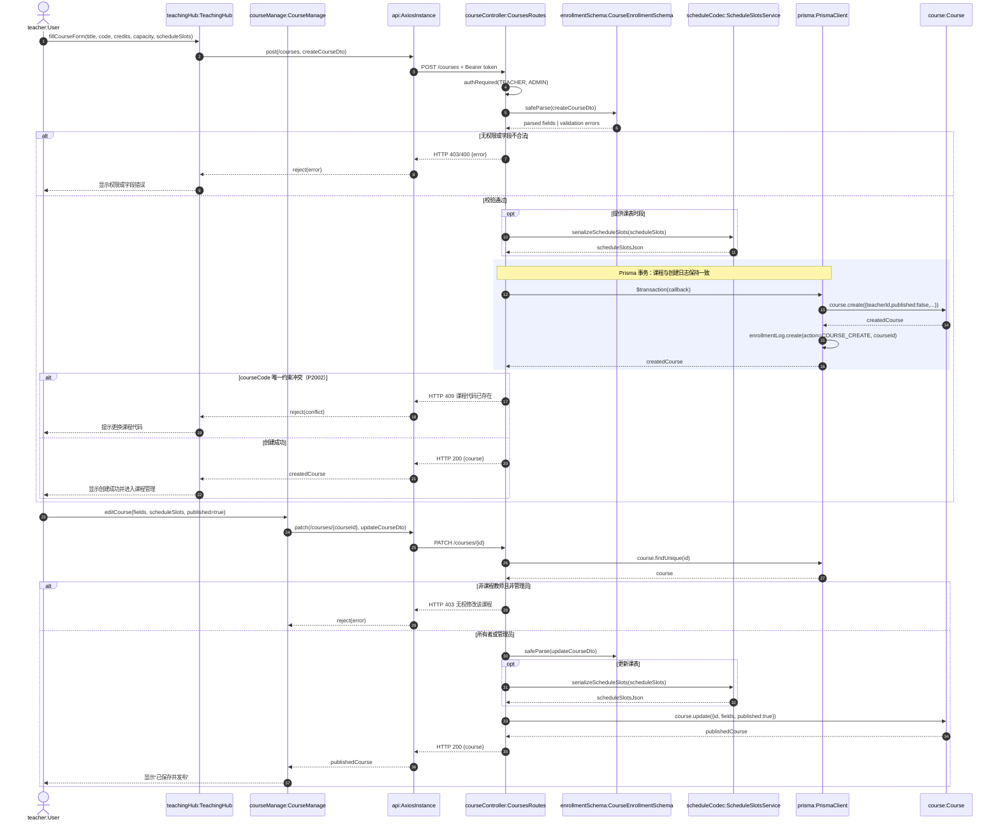
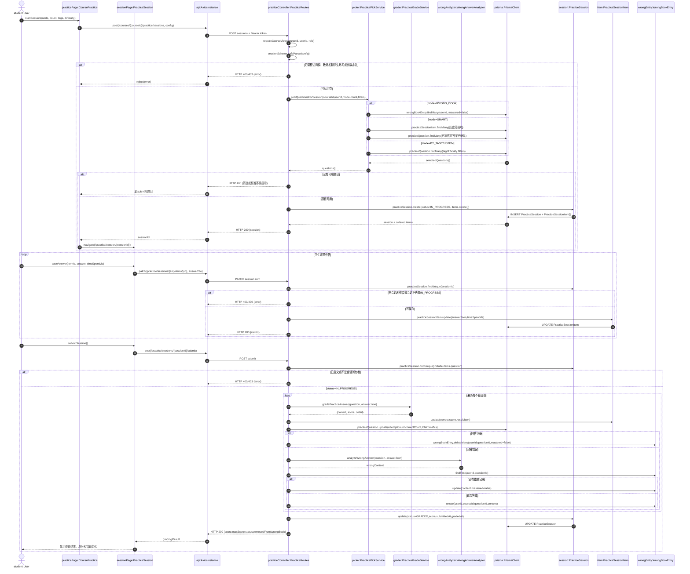
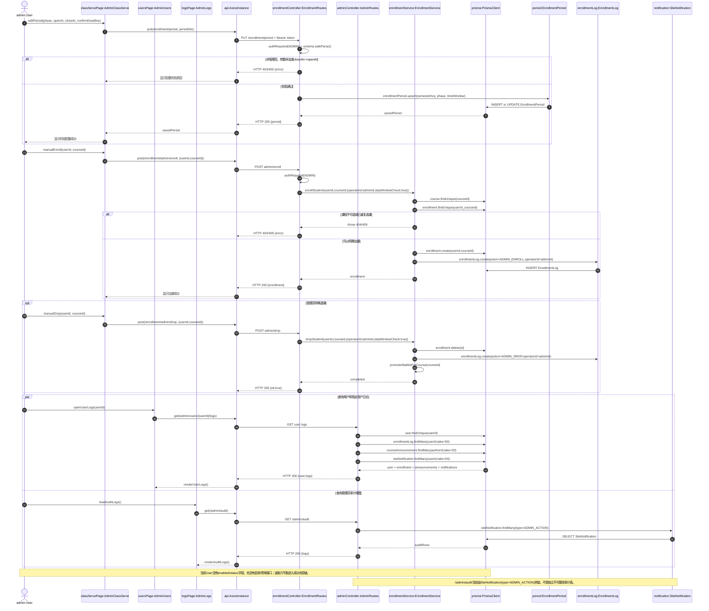

# 10 对象级顺序图（第二批）

- 任务：基于组件级交互细化到具体对象（类实例）之间的消息传递
- 用例总数：10
- 本批完成：**3 张**（UC02、UC07、UC10）
- 累计完成：**7/10 张**（达到累计 2/3 的阶段目标）
- 组件级输入：[`05-关键调用链与关系图.md`](./05-关键调用链与关系图.md) 及各用例说明中的组件级流程

## 1. 建模约定

- 参与者使用 `对象名:类名` 表示，明确同一类在运行时的具体实例。
- React 函数组件按边界对象建模，Fastify 路由插件按控制对象建模，函数模块按领域服务对象建模。
- `prisma:PrismaClient` 代表数据访问对象，消息中写出实际 Prisma Model 方法。
- `alt` 表示互斥分支，`opt` 表示可选流程，`loop` 表示迭代处理，`par` 表示并行查询，`rect` 表示事务边界。
- 图中只描述当前代码已经存在的行为；未实现的能力以 `Note` 明确标识。

---

## 2. OBJ-UC02 创建、配置并发布课程

### 2.1 对象映射

| 对象实例 | 类/模块 | 类型 | 职责 |
| --- | --- | --- | --- |
| `teacher` | `User` | Actor/Entity | 创建并管理本人课程的教师 |
| `teachingHub` | `TeachingHub` | Boundary | 收集课程基础信息并发起创建请求 |
| `courseManage` | `CourseManage` | Boundary | 编辑课程配置、课表和发布状态 |
| `api` | `AxiosInstance` | Gateway | 附加 JWT，调用课程 API |
| `courseController` | `CoursesRoutes` | Control | 角色校验、Zod 校验、权限判断和响应映射 |
| `enrollmentSchema` | `CourseEnrollmentSchema` | Value/Validator | 校验课程代码、容量、学分和选课属性 |
| `scheduleCodec` | `ScheduleSlotsService` | Service | 校验并序列化 `ScheduleSlot[]` |
| `prisma` | `PrismaClient` | Repository | 事务写入 `Course` 和 `EnrollmentLog` |
| `course` | `Course` | Entity | 保存课程配置和发布状态 |

### 2.2 关键方法逻辑

1. `TeachingHub` 使用 `POST /courses` 创建课程，创建时默认 `published=false`，也允许请求显式给出发布值。
2. `CoursesRoutes` 将基础字段校验与 `courseEnrollmentFieldsSchema` 合并，并通过 `scheduleSlotsBodySchema` 校验课表结构。
3. `serializeScheduleSlots()` 把 `ScheduleSlot[]` 转为 `Course.scheduleSlotsJson`。
4. `course.create()` 与 `enrollmentLog.create(COURSE_CREATE)` 位于同一 Prisma 事务中，任一失败则整体回滚。
5. `PATCH /courses/:id` 先检查课程所有者；教师只能修改本人课程，管理员可以修改任意课程。

---

## 3. OBJ-UC07 练习组卷、作答、批改与错题更新

### 3.1 对象映射

| 对象实例 | 类/模块 | 类型 | 职责 |
| --- | --- | --- | --- |
| `student` | `User` | Actor/Entity | 选择组卷模式、作答并提交 |
| `practicePage` | `CoursePractice` | Boundary | 选择模式、标签、难度和题量 |
| `sessionPage` | `PracticeSession` | Boundary | 展示题目、保存答案并展示结果 |
| `api` | `AxiosInstance` | Gateway | 调用练习相关 HTTP API |
| `practiceController` | `PracticeRoutes` | Control | 课程访问校验、会话权限和状态控制 |
| `picker` | `PracticePickService` | Service | 按 SMART/BY_TAG/WRONG_BOOK/CUSTOM 选择题目 |
| `grader` | `PracticeGradeService` | Service | 按题型判定答案并生成得分明细 |
| `wrongAnalyzer` | `WrongAnswerAnalyzer` | Service | 生成错因摘要和错题内容 |
| `prisma` | `PrismaClient` | Repository | 保存会话、题目项、统计和错题本 |
| `session` | `PracticeSession` | Entity | 保存本次练习状态和总分 |
| `item` | `PracticeSessionItem` | Entity | 保存单题答案、耗时和批改结果 |
| `wrongEntry` | `WrongBookEntry` | Entity | 保存学生尚未掌握的错题 |

### 3.2 关键方法逻辑

1. `pickQuestionsForSession()` 根据模式选择题库来源；SMART 使用历史薄弱项，WRONG_BOOK 使用未掌握错题，标签模式使用标签过滤。
2. 会话创建时通过嵌套 `items.create` 一次生成 `PracticeSession` 与有序的 `PracticeSessionItem[]`。
3. 作答接口同时验证 `session.userId` 和 `session.status===IN_PROGRESS`，防止越权修改或重复作答。
4. `gradePracticeAnswer()` 逐题返回正确性、分数和结果明细；控制器累计总分并更新题目尝试次数、正确次数和总耗时。
5. 正确题从未掌握错题本删除；错误题按“学生+题目”更新或创建 `WrongBookEntry`。
6. 全部题目处理完成后，会话统一变为 `GRADED` 并写入 `submittedAt`、`gradedAt` 和总分。

---

## 4. OBJ-UC10 管理选课阶段、特殊加退课与操作记录

### 4.1 对象映射

| 对象实例 | 类/模块 | 类型 | 职责 |
| --- | --- | --- | --- |
| `admin` | `User` | Actor/Entity | 配置阶段、执行特殊加退课并查看日志 |
| `classServePage` | `AdminClassServe` | Boundary | 编辑选课阶段并提交特殊加退课请求 |
| `usersPage` | `AdminUsers` | Boundary | 查询用户列表和指定用户操作记录 |
| `logsPage` | `AdminLogs` | Boundary | 查询管理员操作日志 |
| `api` | `AxiosInstance` | Gateway | 附加管理员 JWT 并调用 API |
| `enrollmentController` | `EnrollmentRoutes` | Control | 校验阶段配置，调度管理员加退课 |
| `adminController` | `AdminRoutes` | Control | 查询用户、用户日志和审计视图 |
| `enrollmentService` | `EnrollmentService` | Service | 复用选课、退课、日志和候补递补规则 |
| `prisma` | `PrismaClient` | Repository | 读写阶段、用户、选课、日志和通知 |
| `period` | `EnrollmentPeriod` | Entity | 保存学期选课阶段和开放时间窗 |
| `enrollmentLog` | `EnrollmentLog` | Entity | 保存选课及管理员特殊加退课事件 |
| `notification` | `SiteNotification` | Entity | 当前管理员审计视图的数据来源 |

### 4.2 关键方法逻辑与实现边界

1. `PUT /enrollment/period` 只允许管理员访问，并拒绝 `closeAt<=openAt` 的时间窗。
2. 管理员加退课复用 `enrollStudent()` 和 `dropStudent()`，通过 `skipWindowCheck=true` 绕过普通选课窗口，通过 `operatorId` 写入 `ADMIN_ENROLL/ADMIN_DROP`。
3. 特殊退课后仍调用 `promoteWaitlistForCourse()`，保证释放名额后候补队首能够自动入选。
4. 用户日志接口聚合 `EnrollmentLog`、公告和 `SiteNotification`，并不是只查询单一日志表。
5. `/admin/audit` 当前从 `SiteNotification(type=ADMIN_ACTION)` 形成展示数据，没有独立 `AuditLog` 实体。
6. 当前 `User` 没有启用/禁用状态字段和对应接口，因此 UC10 仍是部分实现；顺序图不虚构该调用。

---

## 5. 累计进度

| 对象图编号 | 用例 | 状态 | 所在文档 |
| --- | --- | --- | --- |
| `OBJ-UC01` | 选课、候补与课表同步 | 已完成 | 第一批 |
| `OBJ-UC02` | 创建、配置并发布课程 | **本批完成** | 第二批 |
| `OBJ-UC03` | 公告发布、通知与阅读 | 已完成 | 第三批 |
| `OBJ-UC04` | 资料上传、可见性、下载与收藏 | 已完成 | 第三批 |
| `OBJ-UC05` | 作业提交、批改、发布与重做 | 已完成 | 第一批 |
| `OBJ-UC06` | 实验提交与 Worker 自动评测 | 已完成 | 第一批 |
| `OBJ-UC07` | 练习组卷、批改与错题更新 | **本批完成** | 第二批 |
| `OBJ-UC08` | 讨论、提及与通知 | 已完成 | 第三批 |
| `OBJ-UC09` | 权重配置、成绩汇总与学生查看 | 已完成 | 第一批 |
| `OBJ-UC10` | 选课阶段、特殊加退课与日志 | **本批完成** | 第二批 |

第三批已完成 `OBJ-UC03`、`OBJ-UC04`、`OBJ-UC08`；当前累计完成 **10/10**，详见 `11-对象级顺序图-第三批.md`。

## 6. 源码追溯

| 对象图 | 前端入口 | 控制器与服务 | 核心实体 |
| --- | --- | --- | --- |
| `OBJ-UC02` | `frontend/src/pages/teaching/TeachingHub.tsx`、`frontend/src/pages/CourseManage.tsx` | `backend/src/routes/courses.ts`、`course-enrollment-schema.ts`、`scheduleSlots.ts` | `Course`、`EnrollmentLog` |
| `OBJ-UC07` | `frontend/src/pages/course/sections/CoursePractice.tsx`、`frontend/src/pages/course/PracticeSession.tsx` | `backend/src/routes/practice.ts`、`practice-pick.ts`、`practice-grade.ts` | `PracticeSession`、`PracticeSessionItem`、`PracticeQuestion`、`WrongBookEntry` |
| `OBJ-UC10` | `frontend/src/pages/admin/AdminClassServe.tsx`、`AdminUsers.tsx`、`AdminLogs.tsx` | `backend/src/routes/enrollment.ts`、`admin.ts`、`enrollment-service.ts` | `EnrollmentPeriod`、`Enrollment`、`EnrollmentLog`、`SiteNotification` |
