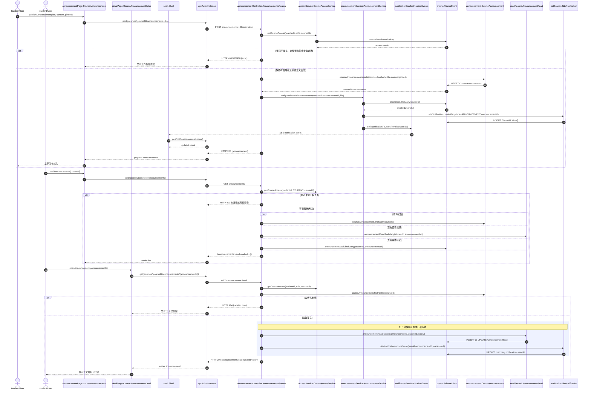
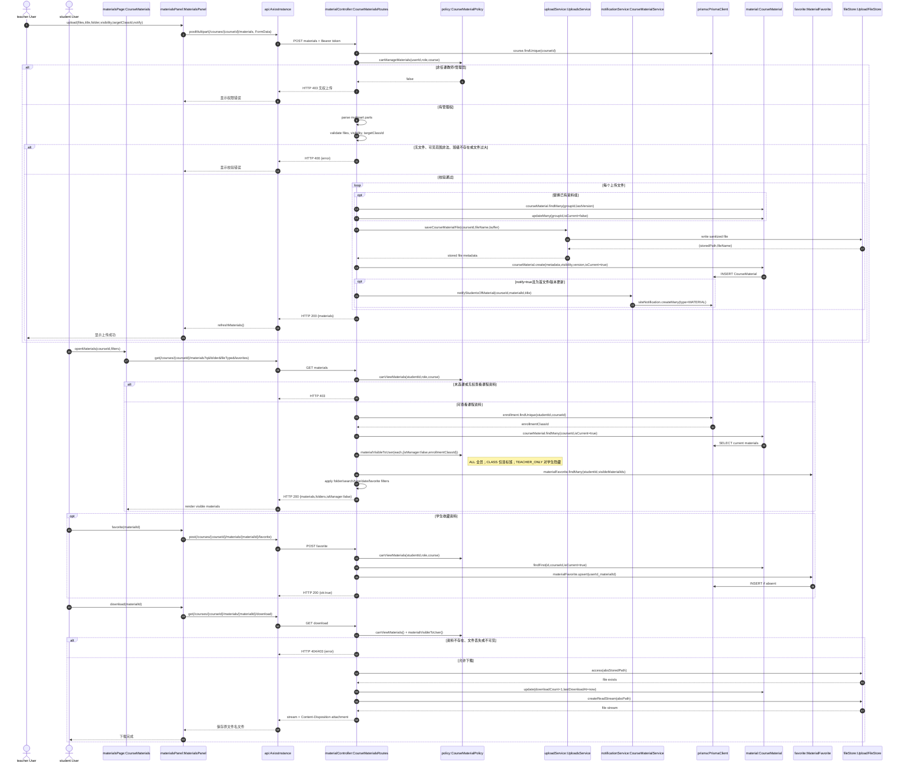
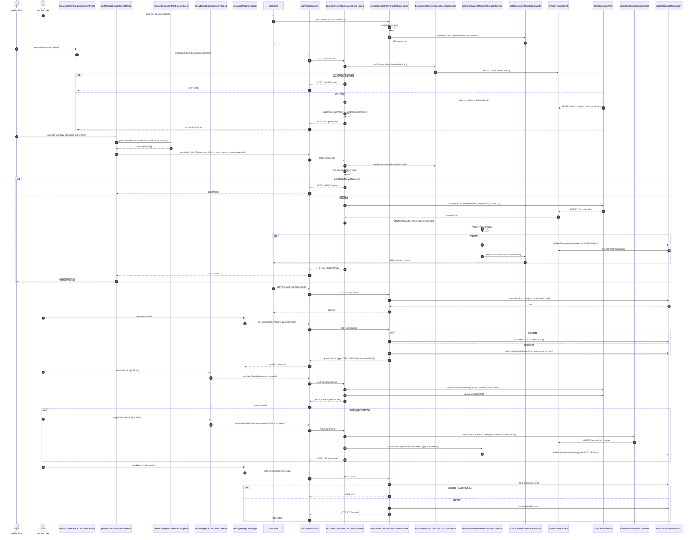

# 11 对象级顺序图（第三批·最终批）

- 任务：完成剩余对象级顺序图，并细化到具体对象（类实例）之间的消息传递
- 本批完成：**3 张**（`OBJ-UC03`、`OBJ-UC04`、`OBJ-UC08`）
- 累计完成：**10/10 张（全部完成）**
- 组件级输入：[`05-关键调用链与关系图.md`](./05-关键调用链与关系图.md) 及对应业务用例说明

## 1. 建模约定

- 对象统一写为 `对象名:类名`；React 函数组件视为边界对象，Fastify 路由插件视为控制对象。
- Prisma Model 作为实体对象，`prisma:PrismaClient` 作为仓储对象；文件系统和 SSE 连接分别作为外部资源对象。
- `alt` 表示互斥分支，`opt` 表示可选流程，`loop` 表示循环，`par` 表示并行，`rect` 表示一个需要整体理解的处理边界。
- 图中消息使用当前代码中的真实 API、服务函数和数据模型名称。

---

## 2. OBJ-UC03 公告发布、通知与阅读

### 2.1 对象映射

| 对象实例 | 类/模块 | 类型 | 职责 |
| --- | --- | --- | --- |
| `teacher`、`student` | `User` | Actor/Entity | 发布公告或阅读公告的课程成员 |
| `announcementPage` | `CourseAnnouncements` | Boundary | 展示公告列表并提交发布表单 |
| `detailPage` | `CourseAnnouncementDetail` | Boundary | 打开详情并展示正文、已读和标记状态 |
| `shell` | `Shell` | Boundary | 通过 SSE/未读计数刷新消息角标 |
| `api` | `AxiosInstance` | Gateway | 附加 JWT 并发送公告、通知请求 |
| `announcementController` | `AnnouncementsRoutes` | Control | 课程访问校验、参数校验和公告 CRUD |
| `accessService` | `CourseAccessService` | Service | 判断教师管理权或学生选课关系 |
| `announcementService` | `AnnouncementService` | Service | 批量通知学生、序列化公告和统计未读 |
| `notificationBus` | `NotificationEvents` | Service | 向在线用户发送 SSE 刷新事件 |
| `prisma` | `PrismaClient` | Repository | 读写公告、选课、已读和通知记录 |
| `announcement` | `CourseAnnouncement` | Entity | 保存公告标题、正文、置顶和编辑历史 |
| `readRecord` | `AnnouncementRead` | Entity | 保存用户对公告的阅读时间 |
| `notification` | `SiteNotification` | Entity | 保存公告通知及其已读时间 |

### 2.2 关键方法逻辑

1. 发布接口通过 `getCourseAccess()` 判断 `isTeacher`，不能仅依赖前端隐藏按钮。
2. 公告创建成功后，`notifyStudentsOfAnnouncement()` 查询课程全部选课学生，批量创建 `ANNOUNCEMENT` 通知并发送 SSE 刷新事件。
3. 打开公告详情调用 `markAnnouncementRead()`，以 `(announcementId,userId)` 唯一键 upsert `AnnouncementRead`。
4. 同一次阅读还会更新对应 `SiteNotification.readAt`，保证公告列表状态与消息中心状态一致。
5. 公告被删除时详情接口返回 HTTP 404 和 `deleted=true`，前端展示明确的已删除状态。

---

## 3. OBJ-UC04 资料上传、可见性、收藏与下载

### 3.1 对象映射

| 对象实例 | 类/模块 | 类型 | 职责 |
| --- | --- | --- | --- |
| `teacher`、`student` | `User` | Actor/Entity | 上传管理资料或查看、收藏、下载资料 |
| `materialsPage` | `CourseMaterials` | Boundary | 承载课程资料页面 |
| `materialsPanel` | `MaterialsPanel` | Boundary | 上传文件、筛选、收藏和下载操作 |
| `api` | `AxiosInstance` | Gateway | 发送 multipart 和普通 HTTP 请求 |
| `materialController` | `CourseMaterialsRoutes` | Control | 权限、multipart、版本、下载响应控制 |
| `policy` | `CourseMaterialPolicy` | Service | `canViewMaterials()`、`materialVisibleToUser()` 等授权策略 |
| `uploadService` | `UploadsService` | Service | 校验大小、安全命名并保存文件 |
| `notificationService` | `CourseMaterialService` | Service | 创建资料通知并推送 SSE 事件 |
| `prisma` | `PrismaClient` | Repository | 读写资料元数据、收藏和下载计数 |
| `fileStore` | `UploadFileStore` | External Resource | 保存和流式读取物理文件 |
| `material` | `CourseMaterial` | Entity | 保存文件元数据、可见性、版本和统计 |
| `favorite` | `MaterialFavorite` | Entity | 保存用户与资料的收藏关系 |

### 3.2 关键方法逻辑

1. 上传使用 multipart；控制器逐个读取文件到 Buffer，并按文件类型调用 `maxBytesForFile()` 限制大小。
2. `saveCourseMaterialFile()` 负责安全文件名和物理存储，`CourseMaterial` 保存 `storedPath`、MIME、大小、可见性和版本信息。
3. 替换资料时复用 `groupId`、版本号加一，并把旧版本置为 `isCurrent=false`。
4. 列表查询先进行课程访问检查，再使用 `materialVisibleToUser()` 执行 `ALL/CLASS/TEACHER_ONLY` 细粒度过滤。
5. 收藏使用 `(userId,materialId)` 唯一键 upsert，重复收藏保持幂等。
6. 下载前重新执行可见性和物理文件存在性检查；成功后增加 `downloadCount`、更新 `lastDownloadAt` 并流式返回文件。

---

## 4. OBJ-UC08 实验讨论、提及通知与已读

### 4.1 对象映射

| 对象实例 | 类/模块 | 类型 | 职责 |
| --- | --- | --- | --- |
| `student`、`teacher` | `User` | Actor/Entity | 发帖/评论或接收提及通知 |
| `discussionPanel` | `LabDiscussionPanel` | Boundary | 展示实验讨论列表和热门帖子 |
| `postModal` | `DiscussionPostModal` | Boundary | 编辑帖子并收集提及用户 ID |
| `mentionComposer` | `MentionComposer` | Boundary | 查询课程成员、解析 `@` 文本并合并 ID |
| `threadPage` | `LabDiscussionThread` | Boundary | 展示帖子详情、评论和附件 |
| `messagesPage` | `Messages` | Boundary | 展示通知并标记已读 |
| `shell` | `Shell` | Boundary | 维护 SSE 连接和未读角标 |
| `api` | `AxiosInstance` | Gateway | 调用讨论及通知 API |
| `discussionController` | `DiscussionsRoutes` | Control | 讨论权限、输入校验、帖子与评论写入 |
| `notificationController` | `NotificationsRoutes` | Control | 通知列表、未读数、SSE 和已读操作 |
| `discussionAccess` | `DiscussionAccessService` | Service | 判断实验存在性及课程讨论资格 |
| `mentionService` | `MentionNotificationService` | Service | 提及去重、排除作者并创建通知 |
| `notificationBus` | `NotificationEvents` | Service | 管理在线 SSE 客户端并发送刷新事件 |
| `prisma` | `PrismaClient` | Repository | 持久化帖子、评论、通知和浏览次数 |
| `post` | `DiscussionPost` | Entity | 保存讨论主题、正文、匿名和状态 |
| `comment` | `DiscussionComment` | Entity | 保存回复内容及父评论关系 |
| `notification` | `SiteNotification` | Entity | 保存 `DISCUSSION` 类型提及通知 |

### 4.2 关键方法逻辑与边界

1. `canDiscussLab()` 校验实验存在以及当前用户是否为管理员、任课教师或已选课学生。
2. `MentionComposer` 从 `/courses/:courseId/discussion-members` 获取候选人并解析 `@`；后端 Zod 仅验证 ID 为 UUID。
3. `notifyMentions()` 使用 `Set` 去重并排除作者本人，随后批量创建 `DISCUSSION` 通知。
4. 通知写入后调用 `emitNotificationToUsers()`；在线接收人的 `Shell` 收到 SSE 事件后刷新未读数。
5. 帖子详情查询同时加载评论和附件，并把 `viewCount` 加一；返回结果按作者、教师和管理员计算编辑、删除、置顶权限。
6. 通知已读接口先以 `(notificationId,currentUserId)` 查询，防止用户修改他人的通知。
7. 当前后端没有再次校验 `mentionUserIds` 是否属于该课程，主要依赖前端成员列表；若需要更强安全约束，应在 `notifyMentions()` 前增加课程成员过滤。

---

## 5. 全部对象级顺序图完成清单

| 对象图编号 | 用例 | 状态 | 文档 |
| --- | --- | --- | --- |
| `OBJ-UC01` | 选课、候补与课表同步 | 已完成 | 第一批 |
| `OBJ-UC02` | 创建、配置并发布课程 | 已完成 | 第二批 |
| `OBJ-UC03` | 公告发布、通知与阅读 | **本批完成** | 第三批 |
| `OBJ-UC04` | 资料上传、可见性、收藏与下载 | **本批完成** | 第三批 |
| `OBJ-UC05` | 作业提交、批改、发布与重做 | 已完成 | 第一批 |
| `OBJ-UC06` | 实验提交与 Worker 自动评测 | 已完成 | 第一批 |
| `OBJ-UC07` | 练习组卷、批改与错题更新 | 已完成 | 第二批 |
| `OBJ-UC08` | 实验讨论、提及通知与已读 | **本批完成** | 第三批 |
| `OBJ-UC09` | 权重配置、成绩汇总与学生查看 | 已完成 | 第一批 |
| `OBJ-UC10` | 选课阶段、特殊加退课与日志 | 已完成 | 第二批 |

累计完成 **10/10**，对象级顺序图阶段全部完成。

## 6. 源码追溯

| 对象图 | 前端入口 | 后端控制器/服务 | 核心实体 |
| --- | --- | --- | --- |
| `OBJ-UC03` | `CourseAnnouncements.tsx`、`CourseAnnouncementDetail.tsx`、`Shell.tsx` | `routes/announcements.ts`、`lib/announcements.ts`、`notification-events.ts` | `CourseAnnouncement`、`AnnouncementRead`、`AnnouncementMark`、`SiteNotification` |
| `OBJ-UC04` | `CourseMaterials.tsx`、`features/materials/MaterialsPanel.tsx` | `routes/course-materials.ts`、`lib/course-materials.ts`、`lib/uploads.ts` | `CourseMaterial`、`MaterialFavorite`、`Class`、`Enrollment` |
| `OBJ-UC08` | `LabDiscussionPanel.tsx`、`DiscussionPostModal.tsx`、`LabDiscussionThread.tsx`、`Messages.tsx` | `routes/discussions.ts`、`routes/notifications.ts`、`notification-events.ts` | `DiscussionPost`、`DiscussionComment`、`DiscussionAttachment`、`SiteNotification` |
