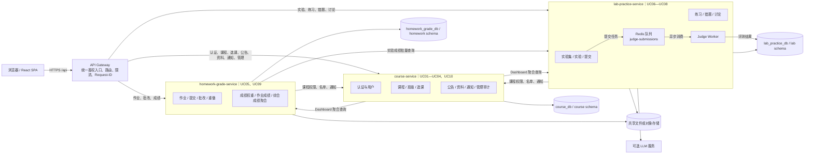

# D6 微服务划分图（最终版）

- 日期：2026-08-29
- 范围：由当前 Fastify 单体演进为 3 个业务微服务
- 业务服务：`course-service`、`homework-grade-service`、`lab-practice-service`
- 非业务服务：API Gateway、PostgreSQL、Redis、Judge Worker、对象/文件存储

## 1. 目标划分图

## 2. 用例归属

| 服务 | 用例 | 核心职责 |
| --- | --- | --- |
| course-service | UC01、UC02、UC03、UC04、UC10 | 用户与角色、课程、班级、选课/候补、公告、资料、通知、选课阶段和管理审计 |
| homework-grade-service | UC05、UC09 | 作业、提交版本、批改、成绩发布、重做、成绩权重、作业成绩和综合成绩聚合 |
| lab-practice-service | UC06、UC07、UC08 | 实验与用例、提交评测、练习、错题、讨论；向 UC09 提供实验成绩 |

## 3. 数据边界

| 服务 | 独占数据 |
| --- | --- |
| course-service | User、Course、Class、Enrollment、EnrollmentWaitlist、EnrollmentLog、EnrollmentPeriod、TimetableConfirmation、CourseAnnouncement、AnnouncementMark、AnnouncementRead、CourseMaterial、MaterialFavorite、SiteNotification |
| homework-grade-service | Homework、HomeworkAttachment、HomeworkRevision、HomeworkSubmission、HomeworkSubmissionVersion、HomeworkStudentFile、HomeworkRedoRequest、HomeworkKnowledgeAnalysis、HomeworkQuestion、GradingConfig |
| lab-practice-service | PracticeKnowledgeTag、LabSet、LabReminderSent、Lab、LabFile、TestCase、Submission、PracticeQuestion、PracticeSession、PracticeSessionItem、PracticeQuestionFeedback、WrongBookEntry、DiscussionPost、DiscussionComment、DiscussionAttachment |

约束：一张业务表只能由一个服务直接读写。跨服务关系只保存业务 ID，不保留数据库级跨服务外键；读取其他领域数据必须调用内部接口或消费事件。

## 4. 关键边界决议

1. `SiteNotification` 唯一归 `course-service`；其他服务通过通知内部接口写入，使用幂等键。
2. `WrongBookEntry` 唯一归 `lab-practice-service`；作业错题通过内部接口幂等写入。
3. `GradingConfig` 归 `homework-grade-service`，不再把成绩权重放在课程数据库中。
4. Judge Worker 不是第四个业务微服务，是 `lab-practice-service` 的异步执行组件。
5. 文件由归属服务完成权限校验；拆分初期可共享对象存储，但禁止跨服务直接读取对方数据库路径字段。
6. Dashboard 和管理统计采用接口聚合，不允许直接跨库联表。

## 5. 部署演进顺序

1. 保持外部 `/api` URL 不变，先在网关按路由族转发。
2. 优先拆出 `lab-practice-service` 与 Worker，再拆 `homework-grade-service`。
3. 将课程权限、名单、通知抽成 `course-service` 内部接口。
4. 完成每服务独立 Prisma schema、迁移、Dockerfile、健康检查和测试命令。
5. 最后停止单体中的对应路由，禁止双写。
