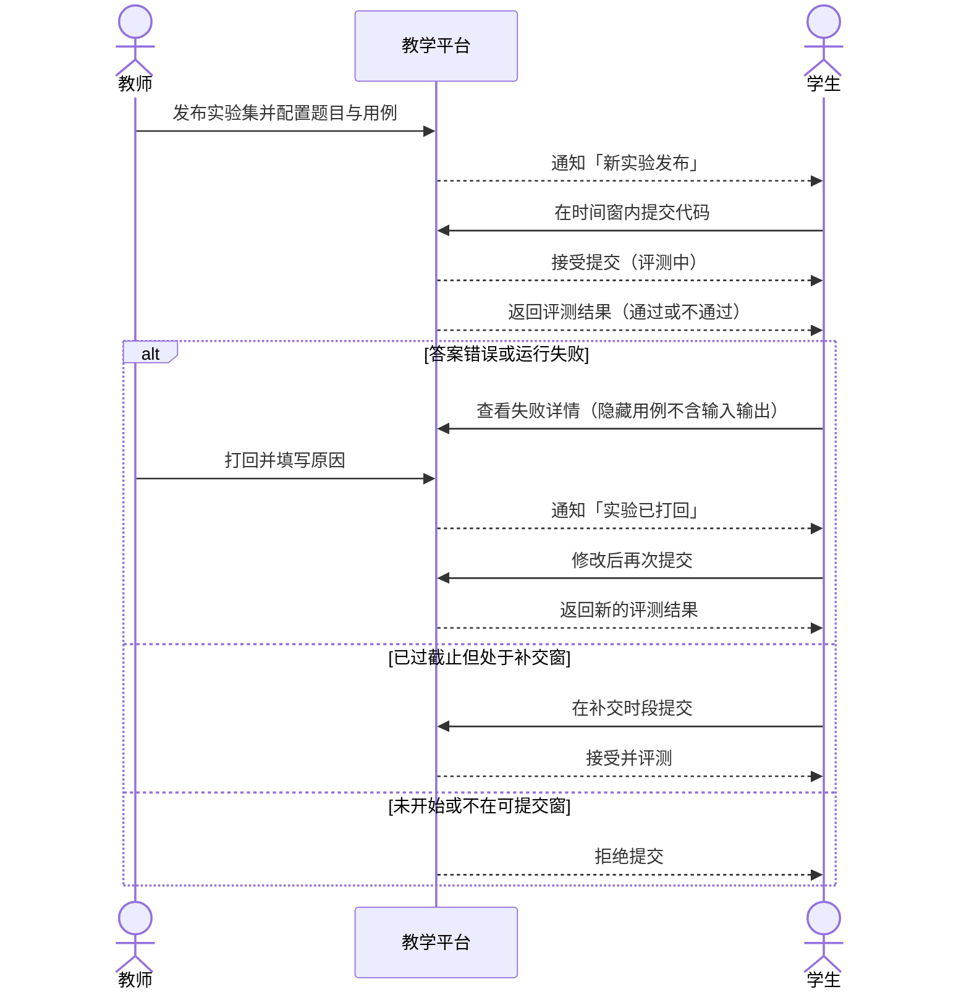
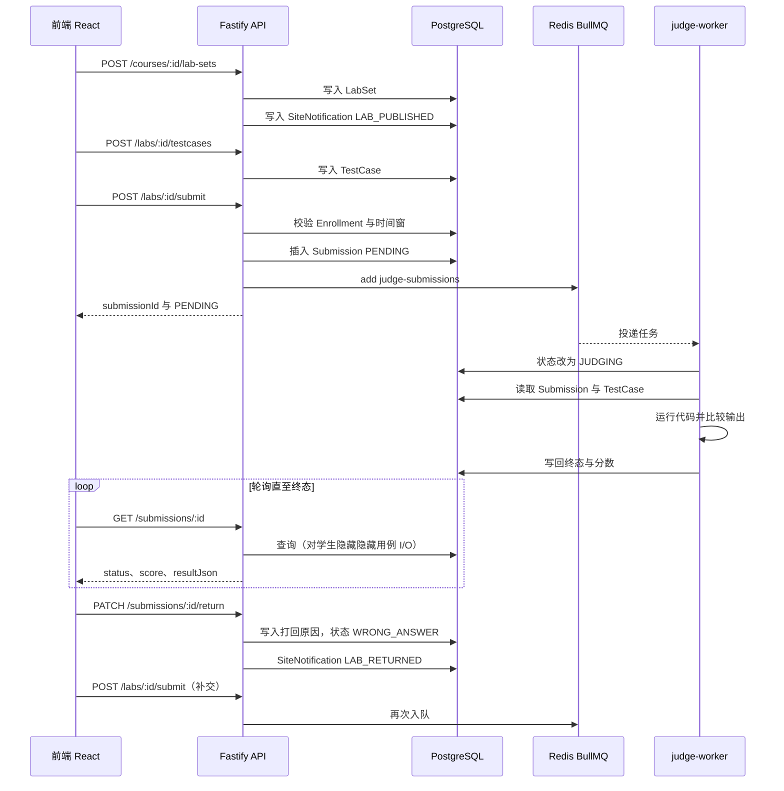
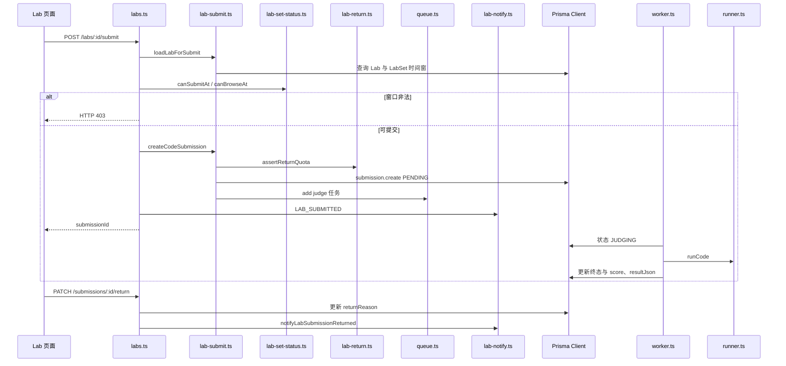

# UC06 完成实验发布、提交和自动评测

- 日期：2026-08-26
- 负责人：吴本昭
- 对应任务：D2-S06
- 用例编号：UC06
- 对应服务（拆分后）：`lab-practice-service`（评测 Worker 为异步执行组件，不计入 3 个业务微服务）

## 1. 用例概述

教师发布实验集并配置题目与测试用例；已选课学生在可提交时间窗内提交代码或文件；评测 Worker 异步判题并写回结果；教师可打回不合格提交；学生可在打回后或补交时间窗内再次提交。

本用例必须覆盖当日验收中的 **评测、失败、补交** 三条路径。讨论提及见 UC08；实验发布与打回产生的站内通知在本用例中说明。

## 2. 参与者

| 参与者 | 类型 | 职责 |
| --- | --- | --- |
| 教师 | 主执行者 | 发布实验集、创建题目、配置公开/隐藏用例、查看进度、打回、手动批改 |
| 学生 | 主执行者 | 查看实验、提交代码或文件、查看评测结果、按打回原因或补交窗再次提交 |
| 评测 Worker | 辅助执行者 | 消费 `judge-submissions` 队列，运行代码，写回状态与分数 |
| 管理员 | 次要执行者 | 可代行教师侧发布、打回等权限 |

## 3. 条件

### 3.1 前置条件

1. 课程已发布，学生对该课程存在有效选课记录（`Enrollment`）。
2. 教师、学生已登录并持有 JWT。
3. Redis 可用，`judge-worker` 正在监听队列 `judge-submissions`。
4. 题目评测模式为 `AUTO`（默认继承实验集 `judgeMode`）。演示优先使用 JavaScript，避免 Windows 上 `python3` 不可用导致误判。

### 3.2 后置条件（成功）

1. 存在 `LabSet`、`Lab`、`TestCase` 与至少一条 `Submission`。
2. 正确代码终态为 `ACCEPTED`，分数为通过用例权重占比（全过为 100）。
3. 错误代码终态为 `WRONG_ANSWER`（或 `ERROR` / `TIMEOUT`）。
4. 教师打回后，提交带 `returnReason`、`returnedAt`，状态为 `WRONG_ANSWER`；学生可再次提交。
5. 发布实验集时，选课学生收到 `LAB_PUBLISHED` 通知；打回时学生收到 `LAB_RETURNED` 通知。

### 3.3 触发条件

教师在教学台或课程实验页选择发布实验集；或学生在实验详情页点击提交评测。

## 4. 页面与接口追溯

| 角色 | 前端路由 | 关键 API |
| --- | --- | --- |
| 教师实验列表 | `/teacher/courses/:courseId/labs` | `GET /courses/:courseId/lab-sets` |
| 教师管理实验集 | `/teacher/courses/:courseId/lab-sets/:labSetId/manage` | `POST/PATCH /courses/:courseId/lab-sets` |
| 学生实验列表 | `/student/courses/:courseId/labs` | `GET /courses/:courseId/lab-sets` |
| 做题页 | `/student/courses/:courseId/labs/:labId` | `GET /labs/:id`、`POST /labs/:id/submit`、`GET /submissions/:id` |

关键代码：`backend/src/routes/lab-sets.ts`、`labs.ts`、`backend/src/lib/lab-submit.ts`、`lab-set-status.ts`、`lab-return.ts`、`lab-notify.ts`、`queue.ts`、`judge-worker/src/worker.ts`。

## 5. 主流程（评测成功）

| 编号 | 步骤 | 说明 |
| --- | --- | --- |
| M-01 | 教师发布实验集 | `POST /courses/:courseId/lab-sets`。可设置 `startAt`、`dueAt`、`allowMakeup`、`makeupDueAt`、`outsideAccessMode`（`BLOCK` / `VIEW_ONLY`）、`judgeMode`、`allowedLanguages`、`maxReturnCount`。 |
| M-02 | 系统通知学生 | 写入 `LabSet` 后，向选课学生创建 `SiteNotification`，`type=LAB_PUBLISHED`。 |
| M-03 | 教师创建题目 | `POST /courses/:courseId/labs`，必须带 `labSetId`。可写题干、起始代码、语言。 |
| M-04 | 教师配置用例 | `POST /labs/:id/testcases` 或批量接口。字段含 `input`、`expected`、`hidden`、`weight`。 |
| M-05 | 学生打开题目 | `GET /labs/:id`。学生响应中不包含隐藏用例的输入输出。 |
| M-06 | 学生提交代码 | `POST /labs/:id/submit`，请求体 `{ code, language? }`。亦可 `POST /labs/:id/submit-file`（multipart）。 |
| M-07 | 权限与时间窗校验 | 校验选课；`canBrowseAt` / `canSubmitAt`：正式窗口 `[startAt, dueAt]` 或补交窗口 `(dueAt, makeupDueAt]`。教师不受窗口限制。 |
| M-08 | 入队 | `judgeMode=AUTO` 时插入 `Submission(status=PENDING)`，并向队列投递 `{ submissionId }`。学生提交时向教师/管理员发 `LAB_SUBMITTED`。 |
| M-09 | Worker 评测 | Worker 将状态改为 `JUDGING`，按测试用例运行代码，用 `normalizeOutput` 比较标准输出。 |
| M-10 | 写回结果 | 全部通过：`ACCEPTED`，分数 = 通过权重 / 总权重 × 100。无测试用例时默认 `ACCEPTED` 100，并注明教师尚未配置用例。 |
| M-11 | 学生查看结果 | 前端轮询 `GET /submissions/:id` 或 `GET /submissions/:id/feedback`。公开用例显示期望/实际输出；隐藏用例仅显示通过与否。 |

**D1 可验证结果（主流程）**：JavaScript Hello 提交 `submissionId=9681e3d6-4e8c-4fef-a143-1a2132cecfe3`，终态 **ACCEPTED / 100**。证据：`docs/吴本昭/2026-8-25/02-D1-UC06-UC08验证记录.md`。

## 6. 异常与备选流程

| 编号 | 名称 | 触发 | 系统行为 |
| --- | --- | --- | --- |
| A1 | 评测失败：答案错误 | 标准输出与期望不符 | 状态 `WRONG_ANSWER`；分数按已通过权重计算。公开用例返回期望与实际；隐藏用例不返回 I/O。 |
| A2 | 评测失败：运行错误 | 进程退出码非 0 | 状态 `ERROR`；`resultJson` 截断保存 stderr（最多约 4000 字符）。 |
| A3 | 评测失败：超时 | 运行超时（默认 8s）或 `exitCode` 为空 | 状态 `TIMEOUT`。 |
| A4 | 未开始 / 窗口外不可访问 | `now < startAt`，且 `outsideAccessMode=BLOCK` | HTTP 403，文案「不在可访问时间内」。 |
| A5 | 可浏览不可提交 | 不在正式窗也不在补交窗，但 `VIEW_ONLY` | 可看题；提交 403「当前不在可提交时间窗内（正式或补交时段），无法提交」。 |
| A6 | 打回后补交 | 教师 `PATCH /submissions/:id/return`，body 含 `returnReason` | 提交改为 `WRONG_ANSWER`，写入 `returnReason`、`returnedAt`，`returnCount+1`；通知 `LAB_RETURNED`。学生修改后再走 M-06～M-11。 |
| A7 | 补交时间窗内提交 | `allowMakeup=true` 且 `now ∈ (dueAt, makeupDueAt]` | 教师侧状态 `MAKEUP`；未全部 AC 的学生侧 `NEEDS_MAKEUP`；`canSubmitAt` 为真，允许提交并评测。 |
| A8 | 打回次数用尽 | `maxReturnCount` 非空且已达上限 | 教师再打回 400；学生再提交时抛「已达最大打回次数」。 |
| A9 | 手动批改 | 实验集或题目 `judgeMode=MANUAL` | 不入队，状态 `PENDING_REVIEW`。教师 `PATCH /submissions/:id/grade` 后，才可能发送 `LAB_GRADED`。 |
| A10 | 未配置测试用例 | `testCases.length=0` | Worker 直接 `ACCEPTED` 100。 |
| A11 | 运行环境异常 | Redis/Worker 未启动，或本机无 `python3` | 提交保持 `PENDING`，或 Python 题终态 `ERROR`。D1：Windows 无可用 `python3`（ENV-D1-02）。 |

说明：

- **失败路径**以 A1 为验收代表（D1 已跑通错误代码 **WRONG_ANSWER / 0**），A2～A5、A11 为同类失败/拒绝。
- **补交路径**必须同时写 A6 与 A7。A6 已有 D1 接口证据；A7 的状态机由 `lab-set-status.ts` 单测覆盖，接口级用例列入 D3 缺口 `GAP-UC06-07`。
- 自动评测写回 `ACCEPTED` **不会**创建 `LAB_GRADED` 通知。学生通过轮询提交记录获知结果。`LAB_GRADED` 仅出现在教师手动批改（A9）。

**D1 可验证结果（失败与补交）**

| 路径 | 结果 | 证据 |
| --- | --- | --- |
| 错误代码 | **WRONG_ANSWER / 0** | D1 验证记录 UC06 |
| 教师打回 | `returnReason` 已写入 | 同上 |
| 打回后补交 | 新提交 **ACCEPTED**，`submissionId=c5cfe5c5-9c68-4e9c-b107-9b44404ce23e` | 同上 |
| 未开始窗口 | fixture `00000000-0000-4000-8000-000000090021` 提交 **403**「不在可访问时间内」 | 同上 |

## 7. 业务规则摘要

| 规则 | 约定 |
| --- | --- |
| 提交状态机 | `PENDING` → `JUDGING` → `ACCEPTED` / `WRONG_ANSWER` / `ERROR` / `TIMEOUT`；手动批改为 `PENDING_REVIEW` |
| 正式窗口 | `[startAt ?? createdAt, dueAt]`；未设 `dueAt` 则截止不限 |
| 补交窗口 | 须 `allowMakeup` 且已设 `dueAt`；区间为 `(dueAt, makeupDueAt]`；未设 `makeupDueAt` 则补交不限截止 |
| 窗口外访问 | `BLOCK` 不可进入；`VIEW_ONLY` 可浏览不可提交 |
| 成绩（供 UC09） | 每题取该生各次提交最高分；实验集均分为集内已有分数题目的算术平均 |
| 隐藏用例 | 学生接口不返回隐藏用例的 input/expected/got |
| 队列 | BullMQ 名 `judge-submissions`；任务 `{ submissionId }`；默认 `attempts=2`，指数退避 1500ms |
| 运行器 | JS 用 `node`；Python 用 `python3`；超时默认 `JUDGE_TIMEOUT_MS=8000` |

## 8. 涉及数据

`LabSet`、`Lab`、`TestCase`、`Submission`、`LabFile`、`LabReminderSent`。通知写入 `SiteNotification`（拆分后改调 course-service 内部接口，本域不拥有该表）。

## 9. 三层图

### 9.1 系统级

教学平台视为黑盒。覆盖评测成功、评测失败、打回补交、补交时间窗与窗口拒绝。

### 9.2 组件级

当前仍为 Fastify 单体。组件划分为前端、API、PostgreSQL、Redis、独立 Worker，与拆分后的 `lab-practice-service` + Worker 一致。本图与概要设计 **DES-SD-UC06**、`figures/组件级/UC06 组件级.jpg` 为同一套。

### 9.3 对象级

对象与源文件对应，便于 D3 测试追溯。

对象清单：`LabsRoutes`、`createCodeSubmission`、`computeLabSetAccess`、`assertReturnQuota`、`getJudgeQueue`、`JudgeWorker`、`runCode`、`Submission`、`TestCase`、`notifyLabSetPublished`、`notifyLabSubmissionReturned`。

## 10. 结果与未纳入本用例的内容

| 项目 | 结论 |
| --- | --- |
| 评测 | 主流程已由 D1 证明 Worker 消费队列并给出 ACCEPTED |
| 失败 | 错误代码 WRONG_ANSWER；未开始 403 |
| 补交 | 打回后重评 ACCEPTED；补交窗规则见 `lab-set-status.ts` |
| 讨论与 @ 通知 | 见 UC08，不在本用例展开 |
| 练习组卷 | 见 UC07 |

已知缺口（不阻塞本说明，供 D3）：文件提交无自动脚本（GAP-UC06-04）、补交窗无独立 API 测试（GAP-UC06-07）、Python 运行器在 Windows 不可重复（GAP-UC06-03）。
