# 在线教学与实训平台 · 概要设计说明书

| 项目   | 内容                                                         |
| ---- | ---------------------------------------------------------- |
| 文档编号 | DES-ARCH-2026-D4                                           |
| 版本   | V2.0（8.29 定稿，正文嵌入已导出图）                                     |
| 日期   | 2026-08-29                                                 |
| 作者   | 吴本昭                                                        |
| 角色   | B：概要设计 + 组件级图                                              |
| 需求基线 | REQ01—REQ10 / UC01—UC10                                    |
| 当前实现 | Fastify 单体 + 独立评测 Worker                                   |
| 目标演进 | course-service、homework-grade-service、lab-practice-service |

本文粒度停在 **Controller / 领域服务 / DAO**。类内部字段与方法见闾玥《详细设计说明书》，不在此展开。

---

## 1. 引言

### 1.1 目的

说明系统如何由前端、API 控制层、领域服务、持久层和异步执行组件组成，以及每个业务用例在组件间如何协作。供详细设计、测试追溯和后续微服务拆分使用。

### 1.2 范围

覆盖已确认的 10 个业务用例。登录、健康检查、单个按钮和普通查询不单独作为用例，只作为横切能力出现。

| 需求    | 用例   | 名称              |
| ----- | ---- | --------------- |
| REQ01 | UC01 | 完成选课、退课或候补并同步课表 |
| REQ02 | UC02 | 创建、配置并发布课程      |
| REQ03 | UC03 | 发布并阅读课程公告       |
| REQ04 | UC04 | 发布并获取课程资料       |
| REQ05 | UC05 | 完成作业发布、提交、批改和重做 |
| REQ06 | UC06 | 完成实验发布、提交和自动评测  |
| REQ07 | UC07 | 完成练习组卷、答题和错题反馈  |
| REQ08 | UC08 | 参与实验讨论并接收提醒     |
| REQ09 | UC09 | 配置并查看课程综合成绩     |
| REQ10 | UC10 | 管理选课阶段、用户和操作记录  |

### 1.3 设计原则

1. **现实现状如实写**：仓库当前是单体后端，按领域拆路由文件，共用一个 Prisma Schema 和同一 PostgreSQL。
2. **目标架构可演进**：三个业务微服务 + 网关；Worker、Redis、PostgreSQL 不计入三个业务服务。
3. **同步为主、异步为辅**：业务读写默认 HTTP 同步；实验评测走 BullMQ；通知推送可走 SSE。
4. **权限在服务端**：JWT + `authGuard`；前端路由守卫只改善体验。

### 1.4 参考

- `docs/公共/03-D1-完整业务用例清单.md`
- `docs/胡思琪/2026-08-25/01-UC01-UC10-用例说明.md`
- `docs/范文歆/2026-8-25/02-D1-微服务拆分输入.md`
- `docs/李璐曼/2026-8-25/02-课程域数据表清单.md`
- `docs/闾玥2026-8-25/01-D1-作业成绩域表与外部接口清单.md`
- `docs/吴本昭/2026-8-25/05-D1-实验练习域表与外部接口清单.md`
- `docs/闾玥2026-8-26/详细设计说明书/`（对象级，本文不重复）
- `backend/src/index.ts`、`backend/src/routes/`、`backend/src/lib/`、`judge-worker/src/`

### 1.5 图目录（已导出）

| 编号                         | 类型     | 文件                         |
| -------------------------- | ------ | -------------------------- |
| DES-COMP-001               | 总体组件图  | `figures/组件图/总体组件图.jpg`    |
| DES-COMP-UC01 … UC10       | 分用例组件图 | `figures/组件图/UCxx.svg`     |
| DES-SD-UC01 … UC10         | 组件级顺序图 | `figures/组件级/UCxx 组件级.jpg` |
| DES-ST-UC01/05/06/07       | 状态图    | `figures/活动图/UCxx.svg`     |
| DES-AD-UC02/03/04/08/09/10 | 活动图    | `figures/活动图/UCxx.svg`     |

系统级、对象级图仅保留 UC06—UC08，供对照角色 A / C，不纳入本文正文。

---

## 2. 总体架构

### 2.1 运行结构

浏览器访问 Vite/Nginx 提供的 React SPA。前端通过同源或代理访问 Fastify。Fastify 使用 Prisma 访问 PostgreSQL，文件写入 `UPLOAD_DIR`。实验自动评测：API 向 Redis 队列 `judge-submissions` 投递 `{ submissionId }`，独立进程 `judge-worker` 消费后回写 `Submission`。可选大模型（DeepSeek / OpenAI 兼容 / Ollama）用于辅导与识题，失败则本地模板。

### 2.2 分层（对应 Controller–Service–DAO）

| 层     | 目录                                           | 职责                  |
| ----- | -------------------------------------------- | ------------------- |
| 表示层   | `frontend/src/pages`、`components`、`features` | 页面与交互               |
| 前端应用层 | `AuthContext`、`api/client.ts`                | JWT、请求封装            |
| 控制层   | `backend/src/routes/*.ts`                    | HTTP、Zod、鉴权、序列化     |
| 领域服务层 | `backend/src/lib/*.ts`                       | 选课、时间窗、评测入队、练习批改等规则 |
| 持久层   | `prisma.ts`、`schema.prisma`                  | DAO，38 个模型          |
| 异步执行层 | `judge-worker/src`                           | 运行用户代码、写回评测结果       |
| 基础设施  | PostgreSQL、Redis、uploads、Docker              | 数据、队列、文件、部署         |

`backend/src/index.ts` 注册 CORS、Helmet、multipart、限流和 19 个路由插件。讨论路由必须先于通配 `/labs/:id` 注册。

### 2.3 现状与目标

| 项    | 现状（D4 基线）                | 拆分后                       |
| ---- | ------------------------ | ------------------------- |
| 后端进程 | 1 个 Fastify              | 3 个业务服务 + 网关              |
| 数据   | 同一 Schema，可跨表联查          | 每张表一个服务；禁止跨 Schema 联表     |
| 通知   | 各路由直写 `SiteNotification` | course-service 内部接口，幂等键   |
| 实验成绩 | `grades.ts` 直读实验表        | homework-grade 调 lab 内部接口 |
| 评测   | Worker 直连同一数据库           | 仍属 lab-practice 的异步组件     |

---

## 3. 总体组件图

**图编号：DES-COMP-001**

组件之间只用**依赖**（虚线开口箭头）。前端只依赖控制层；实验评测经 Redis 异步入队，Worker 不对外提供 HTTP。

| 线            | 含义                                               |
| ------------ | ------------------------------------------------ |
| 虚线 + 同步 HTTP | 前端调用控制层                                          |
| 虚线 + 异步入队    | 仅实验 → Redis → Worker                             |
| 其余虚线         | Controller → 领域服务 → DAO → PostgreSQL，以及文件、通知、LLM |

拆分后：控制层按三个部署单元切开——认证/课程/选课/公告/资料/管理/通知 → `course-service`；作业/成绩 → `homework-grade-service`；实验/练习/讨论 + Worker → `lab-practice-service`。WEB 只对网关。成绩（CMP-GRADE）、管理（CMP-ADMIN）的职责与协同见第 4、5 节。

### 3.1 各用例组件图

每个用例只画出用到的组件。导出文件：`figures/组件图/UC01.svg` … `UC10.svg`。

#### DES-COMP-UC01 选课 / 退课 / 候补

#### DES-COMP-UC02 创建并发布课程

#### DES-COMP-UC03 公告发布与已读

#### DES-COMP-UC04 资料上传与下载

#### DES-COMP-UC05 作业闭环

#### DES-COMP-UC06 实验提交与评测

#### DES-COMP-UC07 练习组卷与批改

#### DES-COMP-UC08 讨论与提及通知

#### DES-COMP-UC09 综合成绩

#### DES-COMP-UC10 选课阶段与用户管理

---

## 4. 组件职责

| 编号         | 组件     | 主要路由/代码                                              | 同步/异步                                     |
| ---------- | ------ | ---------------------------------------------------- | ----------------------------------------- |
| CMP-WEB    | 前端 SPA | `frontend/src/App.tsx`                               | 同步调用 API；通知可接 SSE                         |
| CMP-AUTH   | 认证     | `routes/auth.ts`、`jwt.ts`、`authGuard.ts`             | 同步                                        |
| CMP-COURSE | 课程     | `routes/courses.ts`、`dashboard.ts`                   | 同步                                        |
| CMP-ENROLL | 选课     | `routes/enrollment.ts`、`enrollment-service.ts`       | 同步                                        |
| CMP-ANN    | 公告     | `routes/announcements.ts`                            | 同步写库；通知同步写入、SSE 可选异步推送                    |
| CMP-MAT    | 资料     | `routes/course-materials.ts`、`uploads.ts`            | 同步，含文件 I/O                                |
| CMP-HW     | 作业     | `homework.ts`、`homework-student.ts`                  | 同步                                        |
| CMP-GRADE  | 成绩     | `routes/grades.ts`、`lab-grades.ts`                   | 同步；拆分后调实验服务可超时降级                          |
| CMP-LAB    | 实验     | `lab-sets.ts`、`labs.ts`、`lab-submit.ts`              | 提交入队为**异步**；查询为同步                         |
| CMP-PRAC   | 练习     | `practice.ts`、`practice-pick.ts`、`practice-grade.ts` | 同步（练习 CODE 题在 API 进程跑，不入评测队列）             |
| CMP-DISC   | 讨论     | `discussions.ts`                                     | 同步写帖；提及通知同步写表                             |
| CMP-ADMIN  | 管理     | `admin.ts`                                           | 同步                                        |
| CMP-NOTIFY | 通知     | `notifications.ts`、`notification-events.ts`          | 列表同步；SSE 异步推送                             |
| CMP-DAO    | Prisma | `lib/prisma.ts`                                      | 同步 SQL                                    |
| CMP-Q      | 评测队列   | `lib/queue.ts`                                       | **异步**，队列名 `judge-submissions`，attempts=2 |
| CMP-WORKER | 评测进程   | `judge-worker/src/worker.ts`                         | **异步**消费                                  |
| CMP-FS     | 文件     | `UPLOAD_DIR`                                         | API 与 Worker 必须同一目录                       |
| CMP-LLM    | 模型     | `platform-llm.ts` 等                                  | 同步 HTTP；失败降级模板                            |

---

## 5. 模块分配表（用例 → 组件）

供追溯表（角色 D）直接抄编号。

| 用例   | 需求    | 主组件        | 协同组件                               | 前端入口                               | 测试前缀                 |
| ---- | ----- | ---------- | ---------------------------------- | ---------------------------------- | -------------------- |
| UC01 | REQ01 | CMP-ENROLL | CMP-COURSE、CMP-NOTIFY、CMP-DAO      | `EnrollmentPage`、`Dashboard`       | TC-ENROLL、TC-DASH    |
| UC02 | REQ02 | CMP-COURSE | CMP-AUTH、CMP-DAO                   | `TeachingHub`、`CourseManage`       | TC-COURSE            |
| UC03 | REQ03 | CMP-ANN    | CMP-NOTIFY、CMP-ENROLL、CMP-DAO      | `CourseAnnouncements`              | TC-ANN、TC-NOTIFY     |
| UC04 | REQ04 | CMP-MAT    | CMP-FS、CMP-NOTIFY、CMP-DAO          | `CourseMaterials`                  | TC-MAT               |
| UC05 | REQ05 | CMP-HW     | CMP-NOTIFY、CMP-FS、CMP-LLM、CMP-DAO  | `CourseHomework*`                  | TC-HW                |
| UC06 | REQ06 | CMP-LAB    | CMP-Q、CMP-WORKER、CMP-NOTIFY、CMP-FS | `CourseLabs`、`Lab`                 | TC-LAB               |
| UC07 | REQ07 | CMP-PRAC   | CMP-LLM、CMP-DAO                    | `CoursePractice`、`PracticeSession` | TC-PRACTICE          |
| UC08 | REQ08 | CMP-DISC   | CMP-NOTIFY、CMP-LAB、CMP-DAO         | `LabDiscussionThread`              | TC-LAB-006、TC-NOTIFY |
| UC09 | REQ09 | CMP-GRADE  | CMP-HW、CMP-LAB、CMP-COURSE          | `CourseGrades`、`Gradebook`         | TC-GRADE             |
| UC10 | REQ10 | CMP-ADMIN  | CMP-ENROLL、CMP-AUTH、CMP-DAO        | `AdminDashboard` 等                 | TC-ADMIN             |

目标微服务：UC01—UC04、UC10 → course-service；UC05、UC09 → homework-grade-service；UC06—UC08 → lab-practice-service。

---

## 6. 组件间通信

| 方式           | 场景                | 约定                                |
| ------------ | ----------------- | --------------------------------- |
| 同步 HTTP JSON | 除评测外的业务请求         | JWT；失败 4xx/5xx；校验 Zod             |
| 同步文件流        | 资料、作业附件、实验附件、讨论附件 | multipart；大小上限见 Fastify multipart |
| 异步队列         | UC06 自动评测         | 载荷仅 `submissionId`；Worker 再查库     |
| 异步 SSE       | 未读通知推送            | `/notifications/events`           |
| 定时扫描         | 实验开始/截止前提醒        | `lab-reminders.ts` 约 5 分钟         |
| 同步 LLM       | 辅导、识题、作业分析        | 无密钥则模板；不得阻断主事务提交                  |

拆分后内部调用：超时 1–2 秒；通知失败不回滚已成功的核心写入；实验服务不可用时成绩返回「实验成绩暂不可用」。

---

## 7. 数据归属（38 模型）

| 目标服务                   | 模型                                                                                                                                                                                                                             |
| ---------------------- | ------------------------------------------------------------------------------------------------------------------------------------------------------------------------------------------------------------------------------ |
| course-service         | User、Course、CourseAnnouncement、AnnouncementMark、AnnouncementRead、SiteNotification、CourseMaterial、MaterialFavorite、Class、Enrollment、EnrollmentWaitlist、EnrollmentLog、EnrollmentPeriod、TimetableConfirmation                     |
| homework-grade-service | Homework、HomeworkAttachment、HomeworkRevision、HomeworkSubmission、HomeworkSubmissionVersion、HomeworkStudentFile、HomeworkRedoRequest、HomeworkKnowledgeAnalysis、HomeworkQuestion；新增 GradingConfig                                  |
| lab-practice-service   | PracticeKnowledgeTag、LabSet、LabReminderSent、Lab、LabFile、TestCase、Submission、PracticeQuestion、PracticeSession、PracticeSessionItem、PracticeQuestionFeedback、WrongBookEntry、DiscussionPost、DiscussionComment、DiscussionAttachment |

`Course.labWeight` / `homeworkWeight` 现状在课程表，拆分后迁到 `GradingConfig`。

---

## 8. 组件级顺序图（N=10）

粒度：前端、Fastify API、PostgreSQL，以及 Redis / Worker / 文件 / 通知。**不**把源文件画成参与者（对象级归角色 C）。编号 **DES-SD-UCxx**，图为已导出 jpg。

| 顺序图中的框                                                  | 组件编号                   |
| ------------------------------------------------------- | ---------------------- |
| 前端 React / 教师端 / 学生端 / 管理端                              | CMP-WEB                |
| Fastify 选课 / 课程 / 公告 / 资料 / 作业 / 成绩 / 实验 / 练习 / 讨论 / 管理 | CMP-ENROLL … CMP-ADMIN |
| PostgreSQL                                              | CMP-DAO + CMP-DB       |
| Redis BullMQ                                            | CMP-Q                  |
| judge-worker                                            | CMP-WORKER             |
| 文件目录                                                    | CMP-FS                 |
| 辅导模块 / notifications SSE·REST                           | CMP-LLM / CMP-NOTIFY   |

### 8.1 DES-SD-UC01 选课 / 退课 / 候补

未满写入 Enrollment；已满写入候补；随后用课表接口确认个人课表一致。

### 8.2 DES-SD-UC02 创建并发布课程

先保存未发布课程并记 `COURSE_CREATE`，再 PATCH 发布后进入公开目录。

### 8.3 DES-SD-UC03 公告发布与已读

写公告与选课学生通知；学生打开详情后写入已读，未读数下降。

### 8.4 DES-SD-UC04 资料上传与下载

元数据入库，文件写入目录；下载前校验选课与可见范围。

### 8.5 DES-SD-UC05 作业闭环

发布 → 草稿/正式提交 → 批改发布成绩；可选重做申请与再次提交。

### 8.6 DES-SD-UC06 实验提交与评测

Fastify API = CMP-LAB；Redis = CMP-Q；Worker = CMP-WORKER。自动评测**不**写 `LAB_GRADED`，学生轮询终态。

### 8.7 DES-SD-UC07 练习组卷与批改

practice 路由 = CMP-PRAC；辅导 = CMP-LLM。SMART 固定 10 题；批改在 API 进程内完成，不入评测队列。

### 8.8 DES-SD-UC08 讨论与提及通知

discussions = CMP-DISC；notifications = CMP-NOTIFY。`notifyMentions` 排除自己。

### 8.9 DES-SD-UC09 综合成绩

权重写入课程后汇总作业已发布分与实验分。拆分后作业/实验改为内部 HTTP，失败则部分结果。

### 8.10 DES-SD-UC10 选课阶段与用户管理

校验 ADMIN 后改选课窗口，并查询用户与操作日志。

---

## 9. 组件级状态图 / 活动图（N=10）

每个用例一张。有明确持久状态的用状态图，其余用活动图。导出文件统一放在 `figures/活动图/`（含状态图 SVG）。编号 **DES-ST-UCxx** 或 **DES-AD-UCxx**。

### 9.1 DES-ST-UC01 选课关系状态

未选 / 已选 / 候补；退课空位可晋升候补。

### 9.2 DES-AD-UC02 课程发布活动

### 9.3 DES-AD-UC03 公告已读活动

### 9.4 DES-AD-UC04 资料访问活动

### 9.5 DES-ST-UC05 作业提交状态

展示态由 `homework-student.ts` 根据 `locked`、`submittedAt`、`graded`、`returnReason`、`released` 推导。

### 9.6 DES-ST-UC06 实验提交状态

AUTO：`PENDING → JUDGING → ACCEPTED|WRONG_ANSWER|ERROR|TIMEOUT`。MANUAL 为 `PENDING_REVIEW`。时间窗：`NOT_STARTED` → `IN_PROGRESS` → `MAKEUP` → `CLOSED`。

### 9.7 DES-ST-UC07 练习会话状态

提交即批改完成，`GRADED` 为终态。

### 9.8 DES-AD-UC08 讨论与通知活动

### 9.9 DES-AD-UC09 成绩汇总活动

### 9.10 DES-AD-UC10 管理配置活动

---

## 10. 与详细设计（角色 C）的边界

| 概要设计（本文）                 | 详细设计（闾玥对象级）                   |
| ------------------------ | ----------------------------- |
| 组件、调用方向、同步异步             | 类、方法、字段、Prisma 关系细节           |
| `CMP-LAB` + `lab-submit` | `createCodeSubmission` 参数与事务  |
| 成绩组件调作业/实验               | `loadGradebook` 计算公式          |
| 通知组件                     | `emitNotificationToUsers` 连接表 |

对象级顺序图与类图以 `docs/闾玥2026-8-26/详细设计说明书/` 为准。本文组件名与其「领域模块」表一致。

---

## 11. 提供给追溯表（角色 D）的编号

| 设计编号                                            | 类型     | 对应需求/用例               |
| ----------------------------------------------- | ------ | --------------------- |
| DES-COMP-001                                    | 总体组件图  | UC01—UC10             |
| DES-COMP-UC01 … DES-COMP-UC10                   | 分用例组件图 | 各 UC；见 `02-各用例组件图.md` |
| DES-SD-UC01 … DES-SD-UC10                       | 组件级顺序图 | 各 UC                  |
| DES-ST-UC01、DES-ST-UC05、DES-ST-UC06、DES-ST-UC07 | 状态图    | UC01/05/06/07         |
| DES-AD-UC02、UC03、UC04、UC08、UC09、UC10            | 活动图    | 其余 UC                 |
| CMP-*                                           | 组件     | 见第 4 节                |

建议追溯表一行：`REQxx` → `UCxx` → `DES-COMP-001` + `DES-SD-UCxx` + `DES-ST/AD-UCxx` → 路由文件 → `TC-*`。设计项可直接抄第 5 节模块分配与第 4 节 `CMP-*`。

---

## 12. 非功能（概要级）

| 项    | 设计要点                                    |
| ---- | --------------------------------------- |
| 安全   | JWT；角色与选课双重校验；隐藏用例不对学员返回 I/O            |
| 限流   | 全局每分钟上限；AI 路径更严                         |
| 就绪   | `/health/live`、`/health/ready`（含 Redis） |
| 评测隔离 | Worker 子进程 + 超时；队列重试 2 次                |
| 文件   | API 与 Worker 共享 `UPLOAD_DIR`            |
| 可观测  | `X-Request-ID`；Worker `failed` 日志       |

尚未纳入本说明书实现范围：Kubernetes、HPA、微服务独立库。这些是 D4 之后的 OPS 工作。

---

## 13. 附图目录

正文第 3、8、9 节已嵌入下列导出图。

| 类别        | 路径                                | 本文使用               | 说明                 |
| --------- | --------------------------------- | ------------------ | ------------------ |
| 总体组件图     | `figures/组件图/总体组件图.jpg`           | DES-COMP-001       | UML 组件图            |
| 分用例组件图    | `figures/组件图/UC01`…`UC10.svg`     | DES-COMP-UC01…UC10 | 第 3.1 节            |
| 组件级顺序图    | `figures/组件级/UC01`…`UC10 组件级.jpg` | DES-SD-UC01…UC10   | 每用例 1 张            |
| 状态图 / 活动图 | `figures/活动图/UC01`…`UC10.svg`     | DES-ST / DES-AD    | UC01/05/06/07 为状态图 |
| 系统级       | `figures/系统级/`、`figures/系统级顺序图/`  | 不嵌入正文              | UC06—UC08          |
| 对象级       | `figures/对象级/`、`figures/对象级顺序图/`  | 不嵌入正文              | UC06—UC08          |

---

## 14. 修订记录

| 版本   | 日期         | 说明                                         |
| ---- | ---------- | ------------------------------------------ |
| V1.0 | 2026-08-28 | D4 定稿：架构说明、模块分配、1 张总组件图、10 张顺序图、10 张状态/活动图 |
| V1.1 | 2026-08-28 | 附图按系统级/组件级/对象级归档到 `figures/`               |
| V1.2 | 2026-08-28 | UC06—UC08 组件级顺序图与 D2 三级图对齐；其余用例改为同一粒度      |
| V1.3 | 2026-08-29 | 增补每用例一张组件图 DES-COMP-UC01…UC10              |
| V2.0 | 2026-08-29 | 定稿：正文改为嵌入已导出 jpg/svg，不再用 Mermaid 占位        |
| V2.1 | 2026-08-29 | 按 `figures/组件图/` 新路径重新插入全部图片               |
