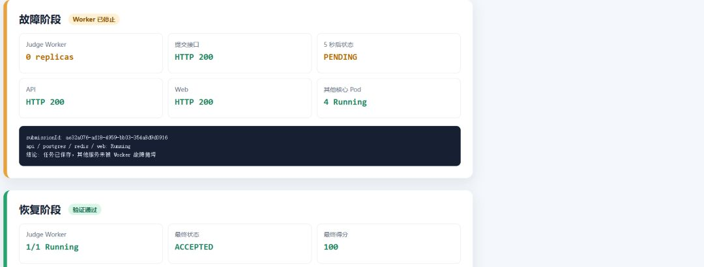
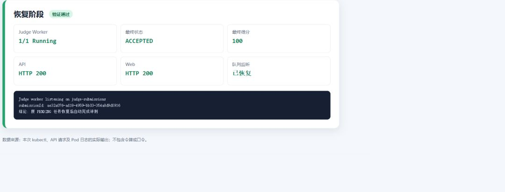

# B-08 Judge Worker 故障实验报告

## 结论

实验通过。Judge Worker 停止期间，实验提交仍由 API 接收并以 `PENDING` 状态可靠保存；
API、Web、PostgreSQL 和 Redis 未受影响。Worker 恢复后，同一提交被自动消费并进入
`ACCEPTED`，得分 100。

## 环境

| 项目 | 值 |
| --- | --- |
| 时间 | 2026-09-01 19:57—20:03（Asia/Shanghai） |
| Kubernetes Context | `docker-desktop` |
| Namespace | `teaching-platform` |
| Worker Deployment | `judge-worker` |
| 队列 | `judge-submissions` |
| 访问方式 | 临时转发 `service/web` 到 `127.0.0.1:18080` |

集群数据库开始时为空，因此通过公开 API 创建了带 `B08` 前缀的隔离教师、课程、实验集、
实验和测试用例。测试数据保留用于复验，测试口令没有写入仓库或证据文件。

## 实验步骤与结果

### 1. 正常基线

```text
judge-worker-694f56c645-brx2l   1/1   Running   0
Judge worker listening on judge-submissions
API HTTP 200
Web HTTP 200
```

### 2. 停止 Worker

执行：

```powershell
kubectl scale deployment/judge-worker -n teaching-platform --replicas=0
```

停止后的实际状态：

```text
judge-worker requested replicas: 0
api       Running
postgres  Running
redis     Running
web       Running
```



### 3. 故障期间提交代码

提交编号：`ae32a076-ad18-4959-bb03-354a8d9d0916`

```json
{
  "submitHttpStatus": 200,
  "submitStatus": "PENDING",
  "statusAfterFiveSeconds": "PENDING",
  "apiHttpStatus": 200,
  "webHttpStatus": 200
}
```

说明：停止 Worker 不会使提交接口报错或丢失任务。任务保存在数据库和 Redis 队列中，用户
可以稍后查询；其余核心服务保持可用，符合故障隔离与降级要求。

API 日志同时记录了提交请求和后续查询均为 HTTP 200：

```text
POST /labs/d7e4e3b4-fba6-456b-8a7f-d1e99c707dbc/submit 200
GET /submissions/ae32a076-ad18-4959-bb03-354a8d9d0916 200
GET /health 200
```

### 4. 恢复 Worker

执行：

```powershell
kubectl scale deployment/judge-worker -n teaching-platform --replicas=1
kubectl rollout status deployment/judge-worker -n teaching-platform --timeout=120s
```

恢复结果：

```json
{
  "worker": "1/1 Running",
  "submissionId": "ae32a076-ad18-4959-bb03-354a8d9d0916",
  "finalStatus": "ACCEPTED",
  "finalScore": 100,
  "apiHttpStatus": 200,
  "webHttpStatus": 200,
  "workerLog": "Judge worker listening on judge-submissions"
}
```



## 验收清单

| 验收项 | 结果 | 证据 |
| --- | --- | --- |
| 正常状态可评测 | 通过 | Worker `1/1 Running` 且监听队列 |
| Worker 可被停止并隔离故障 | 通过 | Worker 为 0，其余四个核心 Pod 运行 |
| 故障时提交不丢失 | 通过 | HTTP 200，5 秒后仍为 `PENDING` |
| 其他服务不受影响 | 通过 | API、Web 均 HTTP 200 |
| 恢复后自动续评 | 通过 | 原提交变为 `ACCEPTED`、100 分 |
| 环境恢复 | 通过 | Worker 恢复 `1/1 Running` |

原始结构化结果见
[`evidence/b08-fault-experiment.json`](./evidence/b08-fault-experiment.json)。复验脚本为
[`scripts/b08-fault-experiment.mjs`](../../../scripts/b08-fault-experiment.mjs)。

## 复验注意事项

执行脚本前通过环境变量提供隔离测试账号口令，不要把口令提交到仓库：

```powershell
$env:B08_TEST_PASSWORD = "至少十二位的临时测试口令"
node scripts/b08-fault-experiment.mjs fault
node scripts/b08-fault-experiment.mjs recover <submissionId>
Remove-Item Env:B08_TEST_PASSWORD
```
