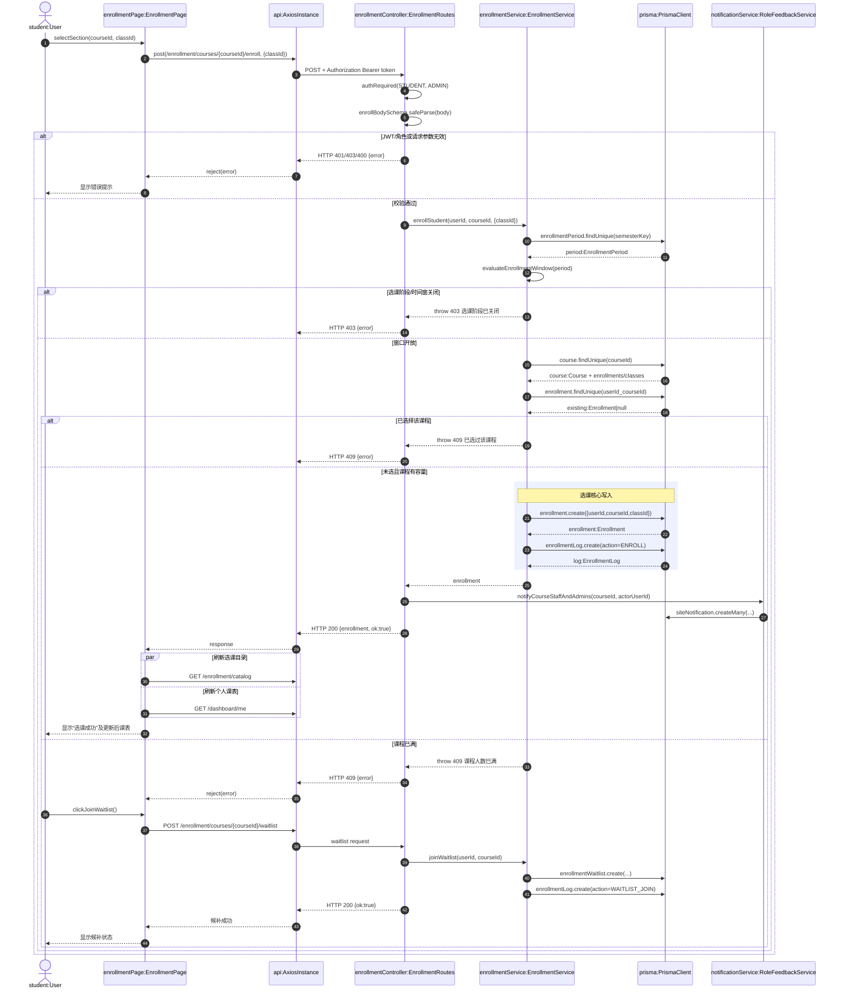
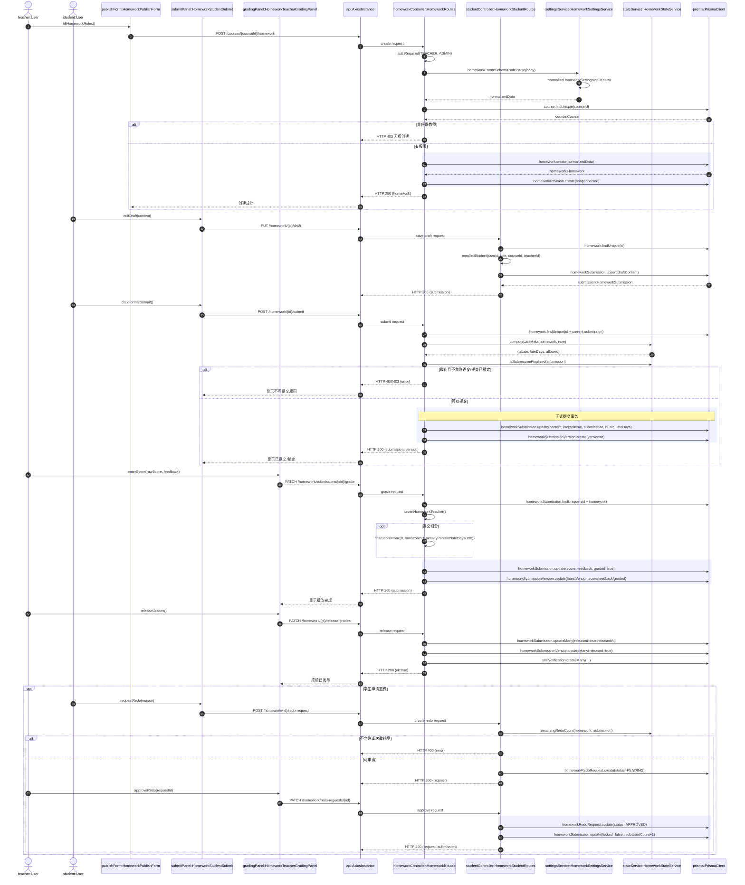
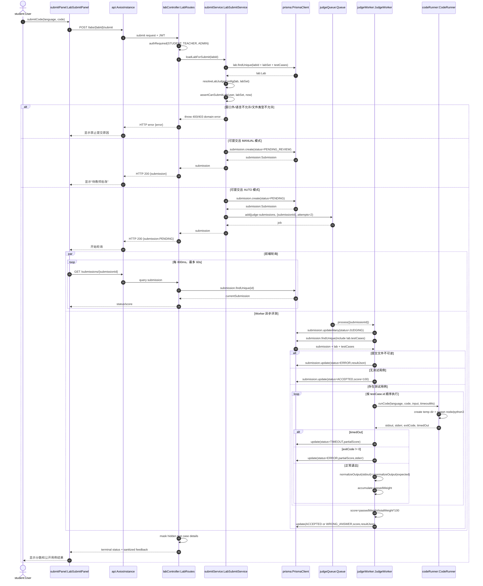
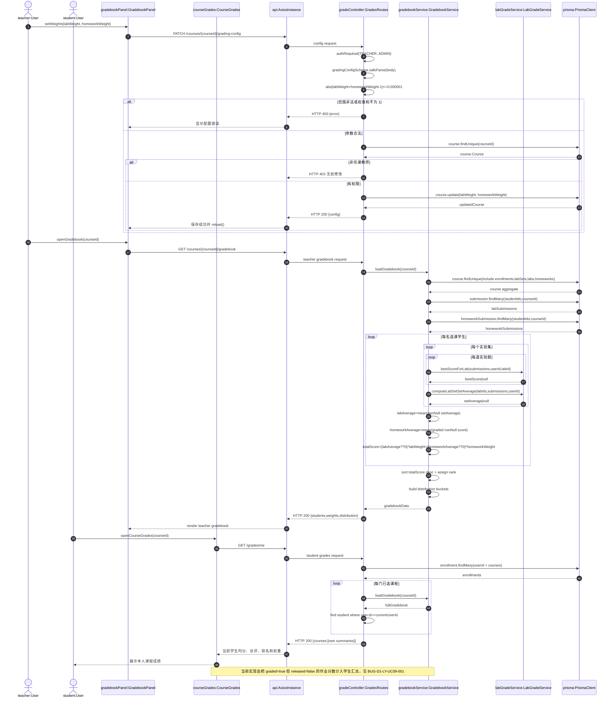

# 08 对象级顺序图（第一批）

- 任务：基于组件级顺序图细化到具体对象（类实例）之间的消息传递
- 用例总数：10
- 本批完成：**4/10 张**（达到总数 1/3 向上取整要求）
- 已完成：UC01、UC05、UC06、UC09
- 组件级输入：[`05-关键调用链与关系图.md`](./05-关键调用链与关系图.md)

## 1. 建模约定

- 参与者统一使用 `对象名:类名` 表示，例如 `enrollmentPage:EnrollmentPage`。
- React 函数组件、Fastify 路由插件和函数模块在对象图中按其运行期职责视为边界对象、控制对象和服务对象。
- Prisma 模型操作通过 `prisma:PrismaClient` 发出，并在消息中写明具体模型方法。
- `alt` 表示互斥业务分支，`opt` 表示可选流程，`loop` 表示循环，`par` 表示并行，`rect` 表示事务或异步处理边界。
- 返回消息使用虚线箭头；异常响应明确标出 HTTP 状态或领域错误。

## 2. UC01 对象级顺序图：学生选课、候补与课表同步

### 2.1 对象映射

| 对象实例 | 类/模块 | 类型 | 职责 |
| --- | --- | --- | --- |
| `student` | `User` | Actor/Entity | 发起选课的学生 |
| `enrollmentPage` | `EnrollmentPage` | Boundary | 收集教学班选择并刷新目录 |
| `api` | `AxiosInstance` | Gateway | 附加 JWT 并发送 HTTP 请求 |
| `enrollmentController` | `EnrollmentRoutes` | Control | 鉴权、Zod 校验、响应映射 |
| `enrollmentService` | `EnrollmentService` | Service | 选课窗口、重复、容量和候补规则 |
| `notificationService` | `RoleFeedbackService` | Service | 通知教师和管理员 |
| `prisma` | `PrismaClient` | Repository | 持久化课程、选课和日志 |

### 2.2 关键对象状态变化

`Enrollment` 从不存在变为已创建；`EnrollmentLog.action=ENROLL`。满员分支不创建 `Enrollment`，而创建 `EnrollmentWaitlist` 和 `WAITLIST_JOIN` 日志。

## 3. UC05 对象级顺序图：作业发布、提交、批改、发布与重做

### 3.1 对象映射

| 对象实例 | 类/模块 | 类型 | 职责 |
| --- | --- | --- | --- |
| `teacher`、`student` | `User` | Actor | 教师与学生 |
| `publishForm` | `HomeworkPublishForm` | Boundary | 创建作业 |
| `submitPanel` | `HomeworkStudentSubmit` | Boundary | 草稿、附件和正式提交 |
| `gradingPanel` | `HomeworkTeacherGradingPanel` | Boundary | 批改、发布成绩、处理重做 |
| `homeworkController` | `HomeworkRoutes` | Control | 作业主流程控制 |
| `studentController` | `HomeworkStudentRoutes` | Control | 草稿、附件和重做控制 |
| `settingsService` | `HomeworkSettingsService` | Service | 作业规则归一化 |
| `stateService` | `HomeworkStateService` | Service | 迟交、锁定、可提交状态 |
| `prisma` | `PrismaClient` | Repository | 作业聚合持久化 |

### 3.2 关键对象状态变化

`HomeworkSubmission` 经历草稿 → 正式提交/锁定 → 已批改 → 已发布；重做批准后重新解锁。每次正式提交形成一个不可替代的 `HomeworkSubmissionVersion`。

## 4. UC06 对象级顺序图：实验提交与 Worker 自动评测

### 4.1 对象映射

| 对象实例 | 类/模块 | 类型 | 职责 |
| --- | --- | --- | --- |
| `student` | `User` | Actor | 提交代码并查看结果 |
| `submitPanel` | `LabSubmitPanel` | Boundary | 发起提交并轮询状态 |
| `labController` | `LabRoutes` | Control | 鉴权、提交和反馈序列化 |
| `submitService` | `LabSubmitService` | Service | 时间窗、评测配置与提交创建 |
| `judgeQueue` | `Queue` | Queue | 保存 `submissionId` 任务 |
| `judgeWorker` | `JudgeWorker` | Worker | 消费任务并按用例计分 |
| `codeRunner` | `CodeRunner` | Service | 子进程执行 JS/Python |
| `prisma` | `PrismaClient` | Repository | 提交、实验和用例持久化 |

### 4.2 关键对象状态变化

AUTO 提交状态为 `PENDING → JUDGING → ACCEPTED/WRONG_ANSWER/ERROR/TIMEOUT`；MANUAL 提交直接进入 `PENDING_REVIEW`，不入队。

## 5. UC09 对象级顺序图：权重配置、成绩汇总与学生查看

### 5.1 对象映射

| 对象实例 | 类/模块 | 类型 | 职责 |
| --- | --- | --- | --- |
| `teacher`、`student` | `User` | Actor | 配置/查看成绩 |
| `gradebookPanel` | `GradebookPanel` | Boundary | 教师权重和全班成绩册 |
| `courseGrades` | `CourseGrades` | Boundary | 学生课程成绩 |
| `gradeController` | `GradesRoutes` | Control | 权限、配置和响应 |
| `gradebookService` | `GradebookService` | Service | 聚合、总评、排名和分布 |
| `labGradeService` | `LabGradeService` | Service | 实验题最高分与实验集均分 |
| `prisma` | `PrismaClient` | Repository | 课程、名单、作业和实验成绩 |

### 5.2 关键对象状态与一致性

教师和学生入口复用同一个 `gradebookService:GradebookService` 聚合结果，因此公式口径一致。学生响应只返回当前用户行；但发布状态过滤是当前实现的已知缺陷。

## 6. 完成进度与后续批次

| 用例 | 对象级顺序图 | 本批状态 |
| --- | --- | --- |
| UC01 | 选课、满员候补、课表刷新 | 已完成 |
| UC02 | 创建、配置并发布课程 | 待补 |
| UC03 | 发布公告与阅读记录 | 待补 |
| UC04 | 上传、浏览、收藏与下载资料 | 待补 |
| UC05 | 作业发布、提交、批改、发布和重做 | 已完成 |
| UC06 | 实验提交、入队、Worker 评测与轮询 | 已完成 |
| UC07 | 练习组卷、作答、批改、错题与辅导 | 待补 |
| UC08 | 发帖、评论、提及与通知 | 待补 |
| UC09 | 权重配置、成绩汇总与学生查看 | 已完成 |
| UC10 | 选课阶段、用户与审计 | 待补 |

本批完成 **4/10**，覆盖三个业务领域和异步 Worker，满足“总数的 1/3”要求。
