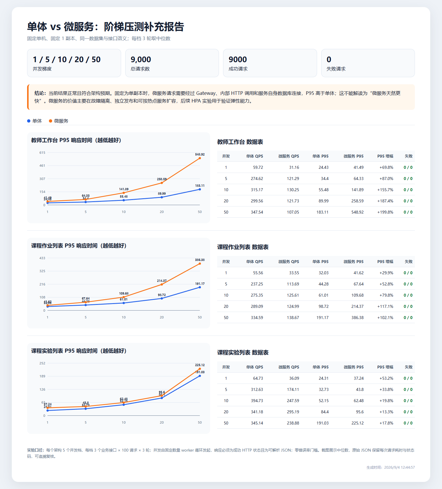
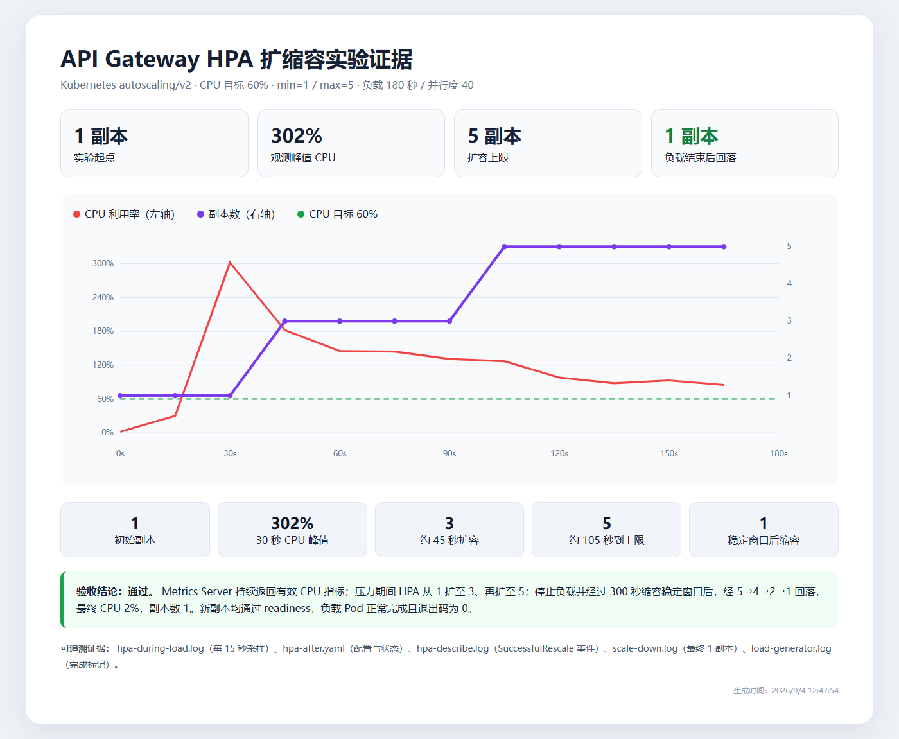

# 单体与微服务性能、HPA 补充测试说明

## 1. 最终结论

本次补测结果正常，而且比“微服务响应时间大幅下降”的旧结论更符合实际。

- 在固定单机、固定 1 副本时，单体应用的响应时间更低、吞吐量更高。
- 微服务请求需要经过 API Gateway、服务间 HTTP 调用和各服务数据库连接，因此存在额外网络、序列化和连接池开销。
- 微服务的主要优势不是单次请求天然更快，而是故障隔离、独立部署、按热点服务扩容和团队并行开发。
- HPA 实验已经证明：Gateway 可以在高负载下从 1 副本扩至 5 副本，并在负载消失后回到 1 副本。

## 2. 阶梯压测口径

| 项目 | 设置 |
|---|---|
| 环境 | 同一台电脑、同一 Kubernetes 集群 |
| 副本 | 单体和微服务均固定为 1 副本 |
| 并发梯度 | 1、5、10、20、50 |
| 测试轮数 | 每档 3 轮，结果取中位数 |
| 每轮请求 | 每个接口 100 次 |
| 接口 | 教师工作台、课程作业列表、课程实验列表 |
| 总请求数 | 9,000 |
| 成功/失败 | 9,000 / 0 |
| 响应校验 | HTTP 成功，并且响应体必须是可解析 JSON |

压测脚本采用固定数量的异步 worker。并发数为 10 时，只会有 10 个 worker 同时执行，而不是一次性创建 100 个请求，因此并发含义与常见压测工具一致。

## 3. 关键结果

### 教师工作台

| 并发 | 单体 QPS | 微服务 QPS | 单体 P95/ms | 微服务 P95/ms |
|---:|---:|---:|---:|---:|
| 1 | 59.72 | 31.16 | 24.43 | 41.49 |
| 5 | 274.62 | 121.29 | 34.40 | 64.33 |
| 10 | 315.17 | 130.25 | 55.48 | 141.89 |
| 20 | 299.56 | 121.73 | 89.99 | 258.59 |
| 50 | 347.54 | 107.05 | 183.11 | 548.92 |

### 课程作业列表

| 并发 | 单体 QPS | 微服务 QPS | 单体 P95/ms | 微服务 P95/ms |
|---:|---:|---:|---:|---:|
| 1 | 55.56 | 33.55 | 32.03 | 41.62 |
| 5 | 237.25 | 113.69 | 44.28 | 67.64 |
| 10 | 275.35 | 125.61 | 61.01 | 109.68 |
| 20 | 289.09 | 124.99 | 98.72 | 214.37 |
| 50 | 334.59 | 138.67 | 191.17 | 386.38 |

### 课程实验列表

| 并发 | 单体 QPS | 微服务 QPS | 单体 P95/ms | 微服务 P95/ms |
|---:|---:|---:|---:|---:|
| 1 | 64.73 | 36.09 | 24.31 | 37.24 |
| 5 | 312.63 | 174.11 | 32.73 | 43.80 |
| 10 | 394.73 | 247.59 | 52.15 | 62.48 |
| 20 | 341.18 | 295.19 | 84.40 | 95.60 |
| 50 | 345.14 | 238.88 | 191.03 | 225.12 |

实验列表接口的单体与微服务差距较小，说明它的服务调用链较短；教师工作台需要聚合多个下游结果，差距最大。这种“调用链越长，微服务固定开销越明显”的现象符合实际。

## 4. HPA 压力测试结果

| 项目 | 结果 |
|---|---|
| CPU 目标值 | 60% |
| 副本范围 | 1～5 |
| 负载持续时间 | 180 秒 |
| 负载并行度 | 40 |
| 起始状态 | CPU 2%，1 副本 |
| CPU 峰值 | 302% |
| 扩容过程 | 1 → 3 → 5 |
| 缩容过程 | 5 → 4 → 2 → 1 |
| 最终状态 | CPU 2%，1 副本 |
| 负载 Pod | 正常完成，退出码 0 |

这说明 HPA 的扩容和缩容均已实际发生，不是仅展示配置文件。`hpa-during-load.log` 每 15 秒保存一次 CPU 和副本数据，`hpa-describe.log` 保存了 `SuccessfulRescale` 事件，`scale-down.log` 保存了最终回落至 1 副本的状态。

## 5. 答辩时建议回答

**问：为什么微服务比单体慢？**

答：本次对比固定为单机和单副本，主要测量架构本身的调用开销。微服务多了 Gateway、内部 HTTP、JSON 序列化和多个数据库连接池，所以延迟高于单体是正常结果。微服务的优势主要体现在独立扩容、故障隔离和独立发布，不应声称它在所有场景下单请求更快。

**问：你们如何保证不是随便截的一张图？**

答：每个并发档连续测 3 轮并取中位数，原始 JSON 保存了每次请求的状态码和耗时；总计 9,000 次请求且零失败。HPA 另外保留了每 15 秒采样日志、扩缩容事件、负载 Pod 日志和最终状态，截图都能由 HTML 报告重新生成。

**问：HPA 为什么不是立刻缩容？**

答：配置了 300 秒缩容稳定窗口，用来避免流量短暂下降导致副本反复抖动。压力消失后 CPU 先下降，随后副本按策略从 5 逐步回收到 1。

**问：是否还需要继续补测？**

答：用于课程最终答辩的证据已经足够。若要进一步形成生产容量结论，才需要在独立压测机、多个工作节点、生产规模数据集下继续测试，并补充 P99、数据库连接池和长时间稳定性测试。

## 6. 测试中发现的工程问题

补测准备阶段发现 PostgreSQL 默认连接上限曾被多个 Prisma 连接池占满，导致 Lab 服务滚动更新时新 Pod 就绪检查返回 503。该异常发生在最终计时前，测试环境恢复为单健康副本后才重新执行全部阶梯测试，因此没有混入最终数据。

这个问题说明后续生产化需要为各服务配置连接池上限，预留滚动发布期间新旧 Pod 同时存在的连接容量，必要时使用 PgBouncer。它不影响本次最终数据的有效性，但属于值得在答辩中主动说明的容量边界。

## 7. 证据文件说明

- `perf-ladder-summary.png`：阶梯压测汇总截图。
- `perf-ladder-report.html`：可重新打开和核对的可视化报告。
- `阶梯压测原始结果/`：10 份原始 JSON，以及汇总 JSON、CSV。
- `hpa-experiment-summary.png`：HPA 扩缩容汇总截图。
- `hpa-experiment-report.html`：HPA 可视化报告。
- `HPA实验原始证据/`：每 15 秒采样、HPA YAML、扩缩容事件和负载日志。
- `压测脚本/`：实际使用的压测、数据准备和报告生成脚本。
