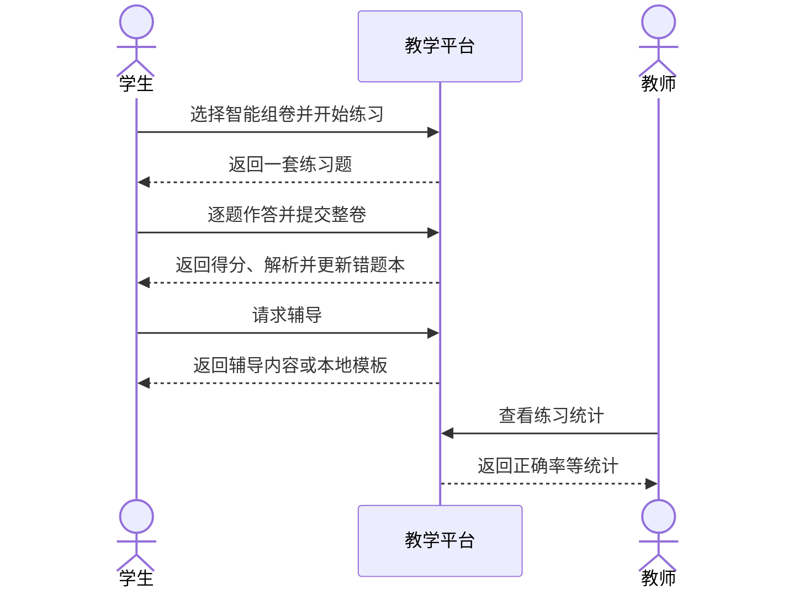
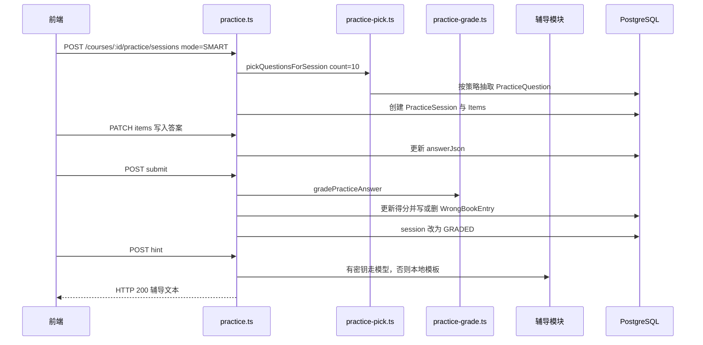
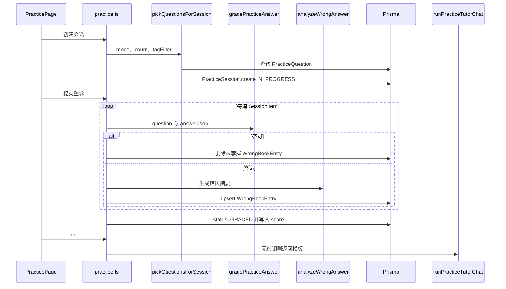

# UC07 完成练习组卷、答题和错题反馈

- 日期：2026-08-26
- 负责人：吴本昭
- 对应任务：D2-S07
- 用例编号：UC07
- 对应服务（拆分后）：`lab-practice-service`

## 1. 用例概述

已选课学生按智能组卷、知识点、错题本或自定义方式生成一套练习，逐题作答后整卷提交；系统自动批改客观题，更新错题本，并提供练习统计。学生可对不会的题目请求辅导；未配置大模型时返回本地模板，按备选流程验收。

本用例与当日「评测 / 失败 / 补交 / 讨论 / 通知」五条强制路径无直接对应，但是 D2「三个用例」之一，必须单独成篇。

## 2. 参与者

| 参与者 | 类型 | 职责 |
| --- | --- | --- |
| 学生 | 主执行者 | 组卷、作答、提交、查看错题、请求辅导、反馈题目 |
| 教师 | 次要执行者 | 维护题库与标签、查看统计、处理题目反馈；教师不能以学生身份组卷 |
| 系统 | 辅助 | 抽题、批改、维护错题本；可选调用大模型生成辅导 |

## 3. 条件

### 3.1 前置条件

1. 学生已登录，且已选该课程。
2. 课程题库中存在可供抽取的练习题（演示种子课含知识点标签）。
3. 辅导接口在未配置 LLM 密钥时允许降级，不作为主流程失败条件。

### 3.2 后置条件（成功）

1. 存在 `PracticeSession`，状态为 `GRADED`，含每题正误与总分。
2. 答错题目写入或更新 `WrongBookEntry`；答对且原先未掌握的错题被删除。
3. 教师可读取该课练习统计。
4. 辅导请求返回 HTTP 200（有密钥为模型内容，无密钥为本地模板）。

### 3.3 触发条件

学生进入课程「练习」页，选择组卷方式并开始练习。

## 4. 页面与接口追溯

| 角色 | 前端路由 | 关键 API |
| --- | --- | --- |
| 练习入口 | `/student/courses/:courseId/practice` | `GET /courses/:courseId/practice/tags`、`POST /courses/:courseId/practice/sessions` |
| 答题页 | `/student/courses/:courseId/practice/session/:sessionId` | `PATCH .../items/:itemId`、`POST .../submit`、`POST .../hint` |
| 错题本 | 练习页/个人错题入口 | `GET /wrong-book/mine` |
| 教师统计 | 课程练习管理 | `GET /courses/:courseId/practice/stats` |

关键代码：`backend/src/routes/practice.ts`、`backend/src/lib/practice-pick.ts`、`practice-grade.ts`、`practice-tutor.ts`。

组卷模式：`SMART`、`BY_TAG`、`WRONG_BOOK`、`CUSTOM`。题型：`CHOICE`、`FILL`、`SHORT_ANSWER`、`CODE`。

## 5. 主流程

| 编号 | 步骤 | 说明 |
| --- | --- | --- |
| M-01 | 进入练习 | 学生打开课程练习页，读取知识点标签 `GET /courses/:id/practice/tags`。 |
| M-02 | 智能组卷 | `POST /courses/:id/practice/sessions`，`mode=SMART`。服务端 **固定抽取 10 题**，请求体中的 `count` **不生效**。必须在需求说明书中写明，避免按请求参数验收。 |
| M-03 | 生成会话 | `pickQuestionsForSession` 抽题；创建 `PracticeSession(status=IN_PROGRESS)` 及 `PracticeSessionItem`。 |
| M-04 | 逐题作答 | `PATCH /practice/sessions/:sessionId/items/:itemId`，写入 `answerJson`、可选 `timeSpentMs`。 |
| M-05 | 提交批改 | `POST /practice/sessions/:sessionId/submit`。仅会话所有者可提交；已提交则拒绝。 |
| M-06 | 逐题判分 | `gradePracticeAnswer` 计算每题 `correct`、`score`；累加题目作答统计。 |
| M-07 | 更新错题本 | 答对：删除该用户该题 `mastered=false` 的错题。答错：按题干摘要 upsert `WrongBookEntry`。 |
| M-08 | 结束会话 | 会话改为 `GRADED`，写入 `score`、`maxScore`、`submittedAt`、`gradedAt`。 |
| M-09 | 查看记录 | `GET /courses/:id/practice/sessions/mine`；`GET /wrong-book/mine`。 |
| M-10 | 请求辅导（可选） | `POST .../items/:itemId/hint` 或多轮 `.../tutor`。 |
| M-11 | 教师查看统计 | `GET /courses/:id/practice/stats`，含题目数、反馈分布等。 |

**D1 可验证结果**：SMART 会话 `a13de4ad-815d-4c31-bc3c-9de4d403f7ca`，**10 题**；盲选第一选项 **score=1.5/10**，状态 `GRADED`；错题本返回 `entries`；hint HTTP 200，内容为本地「解题思路」模板。证据：`docs/吴本昭/2026-8-25/02-D1-UC06-UC08验证记录.md`。

## 6. 异常与备选流程

| 编号 | 名称 | 触发 | 系统行为 |
| --- | --- | --- | --- |
| B1 | 教师组卷 | 教师调用创建会话接口 | HTTP 403，「教师请使用题库管理出题或导入，无需进行学生练习」。 |
| B2 | 重复提交 | 会话已非 `IN_PROGRESS` | HTTP 400，「已提交」。 |
| B3 | 按标签组卷缺参数 | `mode=BY_TAG` 且未选标签 | HTTP 400，「请至少选择一个知识点标签」。 |
| B4 | 无权提交他人会话 | `session.userId` 不是当前用户 | HTTP 403。 |
| B5 | 无大模型密钥 | 调用 hint/tutor 且未配置 LLM | HTTP 200，返回本地模板；调用失败可为 503。按 **备选流程** 验收，不作为主流程缺陷。 |
| B6 | 题目反馈 | 学生 `POST /practice/questions/:id/feedback` | 进入教师反馈队列；教师 `PATCH /practice/feedbacks/:id` 处理。D1 未跑闭环（GAP-UC07-05）。 |
| B7 | 错题组卷无库存 | `WRONG_BOOK` 且错题本为空 | 抽题可能不足或失败。D1 未覆盖（GAP-UC07-03），说明中保留为扩展路径。 |
| B8 | 自定义题量 | `mode=CUSTOM` | `count` 生效，范围 1～20，默认 10。与 SMART 行为不同。 |

未在 D1 自动覆盖、但属于本用例范围的组卷方式：`BY_TAG`、`WRONG_BOOK`、`CUSTOM`（GAP-UC07-01），D3 补测试。

## 7. 业务规则摘要

| 规则 | 约定 |
| --- | --- |
| SMART 题量 | 服务端固定 10，忽略请求 `count` |
| CUSTOM 题量 | 使用请求 `count`，默认 10，最大 20 |
| 会话状态 | `IN_PROGRESS` → 提交后 `GRADED`（当前实现提交即批改完成） |
| 错题表 | `WrongBookEntry` 归实验练习域；作业模块也会写入，拆分前需与成绩域确认唯一写入口 |
| 未批改会话 | 详情接口不向学生返回标准答案 |
| 编程练习题 | 练习 CODE 类型走本地 runner，与实验 Worker 队列不是同一条路径 |

## 8. 涉及数据

`PracticeKnowledgeTag`、`PracticeQuestion`、`PracticeSession`、`PracticeSessionItem`、`PracticeQuestionFeedback`、`WrongBookEntry`。

## 9. 三层图

### 9.1 系统级

### 9.2 组件级

### 9.3 对象级

对象清单：`PracticeRoutes`、`pickQuestionsForSession`、`gradePracticeAnswer`、`analyzeWrongAnswer`、`PracticeSession`、`PracticeSessionItem`、`WrongBookEntry`、`runPracticeTutorChat`。

## 10. 结果

| 项目 | 结论 |
| --- | --- |
| 主流程 | D1 已验证组卷、作答、提交、错题、辅导降级 |
| 必须写明的接口行为 | SMART 的 `count` 被忽略，实际 10 题 |
| 备选 | 无 LLM 时辅导走本地模板 |
| 与 UC06 边界 | 练习批改在 API 进程内完成，不经过 `judge-submissions` 队列 |
