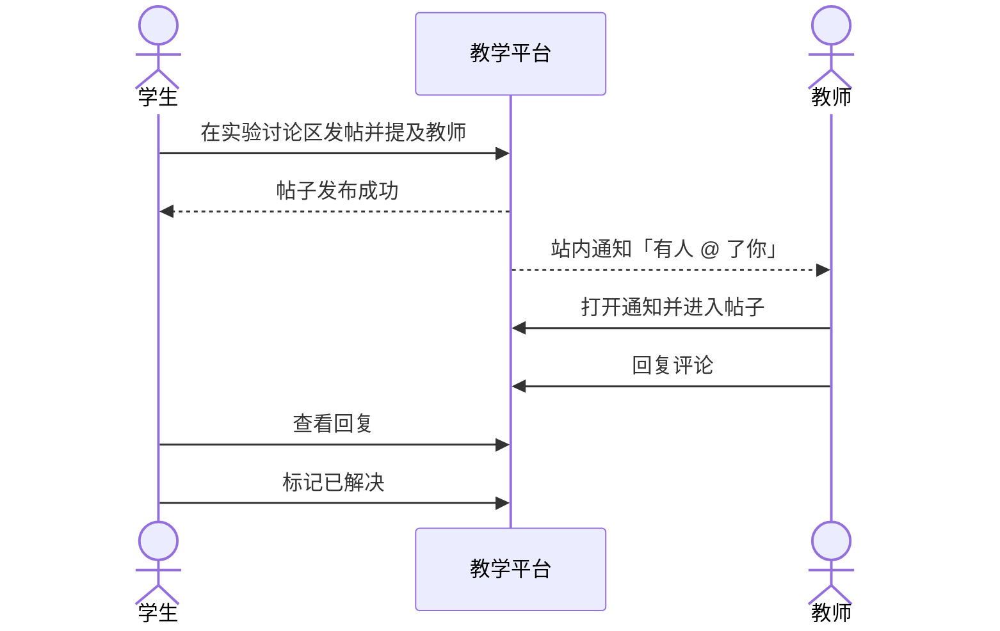
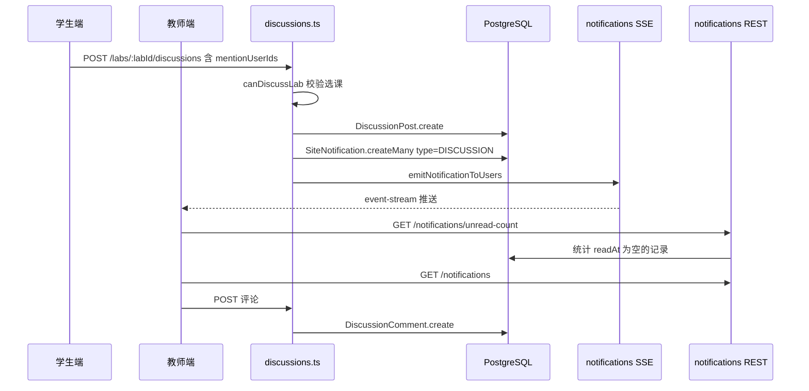
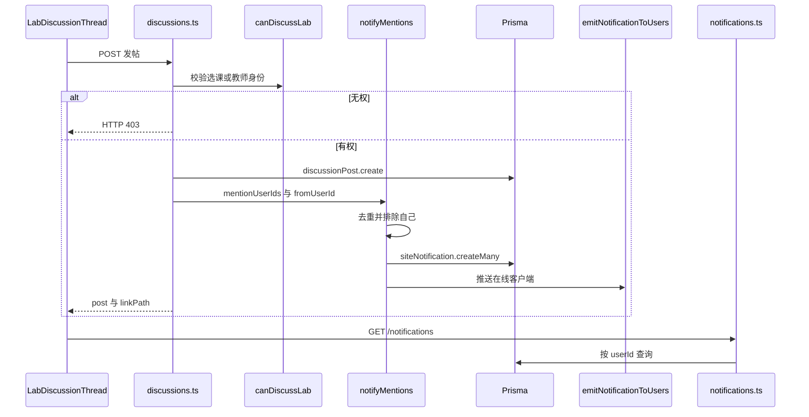

# UC08 参与实验讨论并接收提醒

- 日期：2026-08-26
- 负责人：吴本昭
- 对应任务：D2-S08
- 用例编号：UC08
- 对应服务（拆分后）：讨论归 `lab-practice-service`；通知表与通知查询归 `course-service`

## 1. 用例概述

已选课学生或任课教师在实验（或实验集、课程）讨论区发帖、评论，并可在发帖/评论时 `@` 其他成员。系统为被提及且非作者本人的用户创建站内通知；接收人可在通知列表查看未读并跳转到帖子。

本用例覆盖当日验收中的 **讨论** 与 **通知（提及）** 路径。实验发布、打回产生的通知见 UC06，不在此重复展开。

## 2. 参与者

| 参与者 | 类型 | 职责 |
| --- | --- | --- |
| 学生 | 主执行者 | 发帖、评论、匿名、标记已解决、`@` 他人、查看通知 |
| 教师 | 主执行者 | 回帖、置顶、删除不当内容、接收 `@` 通知 |
| 管理员 | 次要 | 可删帖、可置顶 |
| 通知子系统 | 辅助 | 当前与 API 同进程；拆分后由 course-service 提供创建通知内部接口，以及 `GET /notifications` |

## 3. 条件

### 3.1 前置条件

1. 用户已登录。
2. 讨论所在实验或课程存在；发帖人是任课教师、管理员，或该课已选课学生。
3. 被 `@` 的用户 ID 来自课程讨论成员列表。

### 3.2 后置条件（成功）

1. 存在 `DiscussionPost`，可选存在 `DiscussionComment`。
2. 发帖或评论携带的 `mentionUserIds` 中，排除空值与作者本人后，每人一条 `SiteNotification`，`type=DISCUSSION`，正文为「有人在讨论区 @ 了你」。
3. 被提及用户的未读通知数增加，且可通过 `GET /notifications` 查到记录。
4. 在线客户端可通过 SSE `/notifications/events` 收到推送。

### 3.3 触发条件

学生或教师在实验详情页讨论区发布帖子或评论，并选择提及对象。

## 4. 页面与接口追溯

| 角色 | 前端路由 | 关键 API |
| --- | --- | --- |
| 实验讨论列表 | 实验页内嵌；帖子 `/student/courses/:courseId/labs/:labId/discussions/:postId` | `GET/POST /labs/:labId/discussions` |
| 帖子详情 | 教师/管理员路径前缀不同，页面组件相同 | `GET /labs/:labId/discussions/:postId`、`POST .../comments` |
| @ 成员 | 发帖组件 | `GET /courses/:courseId/discussion-members` |
| 通知 | 顶栏未读与通知列表 | `GET /notifications/unread-count`、`GET /notifications`、`PATCH /notifications/:id/read` |

亦支持实验集讨论 `/courses/:courseId/lab-sets/:labSetId/discussions` 与课程级讨论 `/courses/:courseId/discussions`。验收以 **题目讨论 + 提及通知** 为代表路径。

关键代码：`backend/src/routes/discussions.ts`（`canDiscussLab`、`notifyMentions`）、`backend/src/routes/notifications.ts`、`backend/src/lib/notification-events.ts`。

## 5. 主流程（讨论与通知）

| 编号 | 步骤 | 说明 |
| --- | --- | --- |
| M-01 | 打开讨论区 | `GET /labs/:labId/discussions`。支持搜索 `q`、排序 `sort`（默认热门）；返回帖子列表与热门推荐。 |
| M-02 | 拉取可 @ 成员 | `GET /courses/:courseId/discussion-members`。 |
| M-03 | 学生发帖并提及教师 | `POST /labs/:labId/discussions`，body：`title`、`body`、可选 `anonymous`、`mentionUserIds`。 |
| M-04 | 鉴权与落库 | `canDiscussLab` 通过后写入 `DiscussionPost`（含 `courseId`、`labId`、`labSetId`）。无权则 403，实验不存在则 404。 |
| M-05 | 创建提及通知 | `notifyMentions` 对 `mentionUserIds` 去重，**排除作者自己**，批量创建通知，`type=DISCUSSION`，`linkPath` 指向帖子，再 `emitNotificationToUsers`。 |
| M-06 | 教师查看通知 | `GET /notifications/unread-count`、`GET /notifications`。列表中存在讨论类型通知。可选连接 SSE `/notifications/events?token=`。 |
| M-07 | 进入帖子并评论 | `GET .../discussions/:postId`（浏览量 +1）；`POST .../comments`，评论同样可带 `mentionUserIds`。 |
| M-08 | 收尾操作（可选） | 作者标记 `resolved`；教师置顶 `pinned`；作者或教师/管理员删除。 |

**D1 可验证结果**：学生发帖并 `@` 教师，`postId=4b920e1e-522c-402f-b5f4-2c200c7de9de`；评论 `commentId=65bc2ada-8877-481e-8452-51c60d15a214`；教师未读 **count=5**，列表中存在 `type=DISCUSSION`。证据：`docs/吴本昭/2026-8-25/02-D1-UC06-UC08验证记录.md`。

## 6. 异常与备选流程

| 编号 | 名称 | 触发 | 系统行为 |
| --- | --- | --- | --- |
| C1 | 未选课发帖 | 非本课学生且非教师/管理员 | HTTP 403，「未选课或无权访问」。D1 未自动测（GAP-UC08-05），说明中必须列出。 |
| C2 | 实验不存在 | 无效 `labId` | HTTP 404，「实验不存在」。 |
| C3 | 提及自己 | `mentionUserIds` 含作者 ID | `notifyMentions` 过滤 `fromUserId`，不产生通知。 |
| C4 | 空提及列表 | 未传或去重后为空 | 发帖成功，不写通知。 |
| C5 | 学生置顶 | 非教师/管理员设置 `pinned` | 置顶仅教师或管理员。 |
| C6 | 非作者编辑正文 | 他人 PATCH 标题或正文 | 仅作者可改内容。 |
| C7 | 非权限删除 | 路人删帖 | 仅作者、任课教师或管理员可删。 |
| C8 | 标记已解决 | 非作者设置 `resolved` | 仅作者可将帖子标为已解决。 |

D1 未覆盖：匿名、置顶、已解决、附件、删除权限、通知已读。列入缺口 GAP-UC08-02～06，不阻塞本说明。

## 7. 业务规则摘要

| 规则 | 约定 |
| --- | --- |
| 讨论范围 | 题目级（`labId`）、实验集级（`labSetId`）、课程级（仅 `courseId`） |
| 匿名 | `anonymous=true` 时对他人隐藏作者名；作者本人与教师仍可识别教师身份帖 |
| 热门 | 非置顶帖按 `viewCount + commentCount * 3` 排序，取前 5 |
| 通知类型 | 讨论提及为 `DISCUSSION`；不与 UC06 的 `LAB_PUBLISHED` / `LAB_RETURNED` / `LAB_SUBMITTED` 混写 |
| 通知归属 | 当前直写 `SiteNotification`；拆分后改调 course-service，讨论失败不得因通知失败回滚发帖（草案约定） |
| 已读 | `PATCH /notifications/:id/read`；`POST /notifications/read-all` |

## 8. 涉及数据

`DiscussionPost`、`DiscussionComment`、`DiscussionAttachment`。通知使用 `SiteNotification`（本域不拥有，拆分后只调用）。

## 9. 三层图

### 9.1 系统级

### 9.2 组件级

讨论 API 与通知 API 在单体中同进程；拆分后通知查询仍走 course-service，图中分开画以体现边界。

### 9.3 对象级

对象清单：`DiscussionsRoutes`、`canDiscussLab`、`notifyMentions`、`DiscussionPost`、`DiscussionComment`、`SiteNotification`、`emitNotificationToUsers`、`NotificationsRoutes`。

## 10. 结果

| 项目 | 结论 |
| --- | --- |
| 讨论 | D1 已验证发帖、评论、列表可见 |
| 通知 | D1 已验证 `type=DISCUSSION` 与未读数 |
| 与 UC06 分工 | UC06 写实验发布/打回/提交通知；UC08 只写讨论提及 |
| 自动评测 | **不**产生 `LAB_GRADED`，不要画进本用例 |
