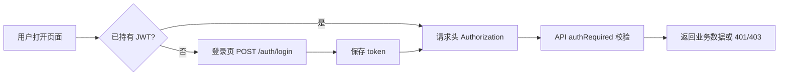
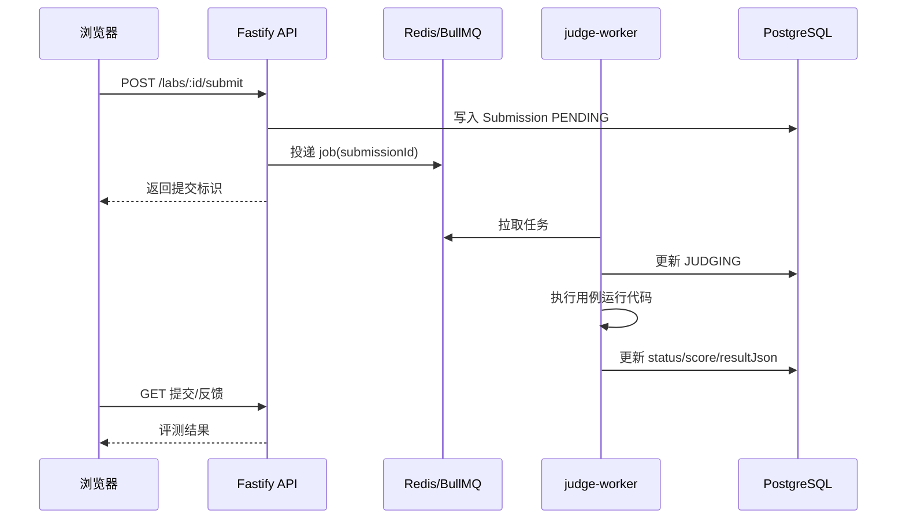
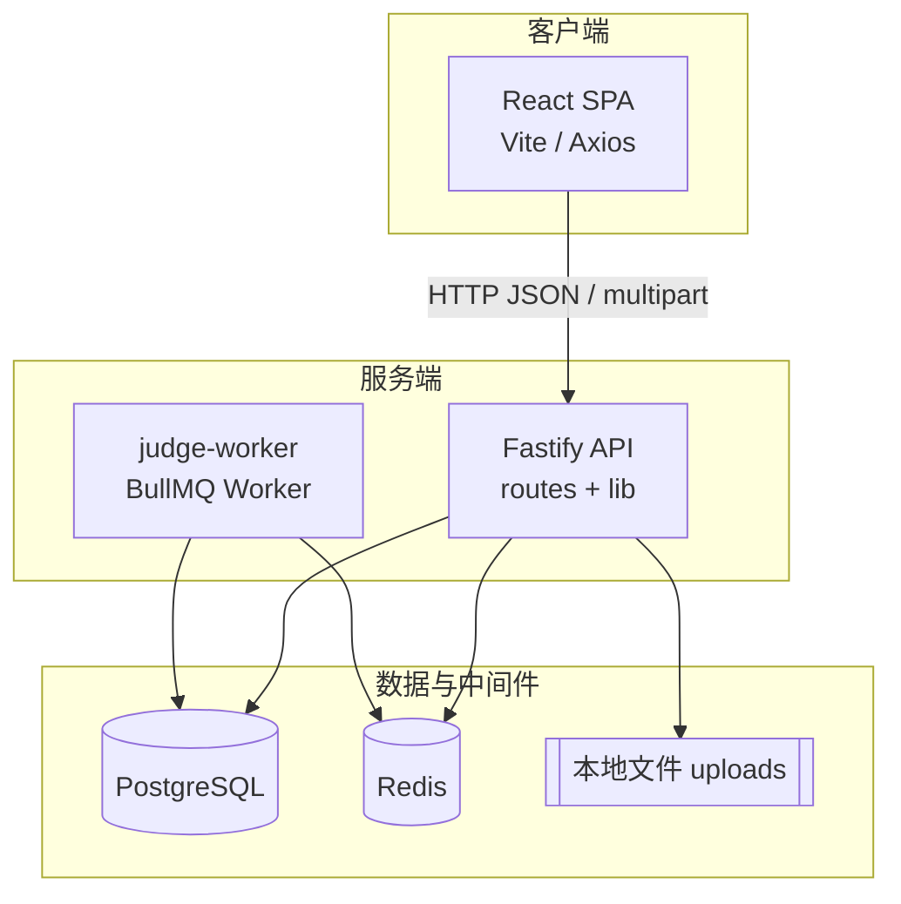
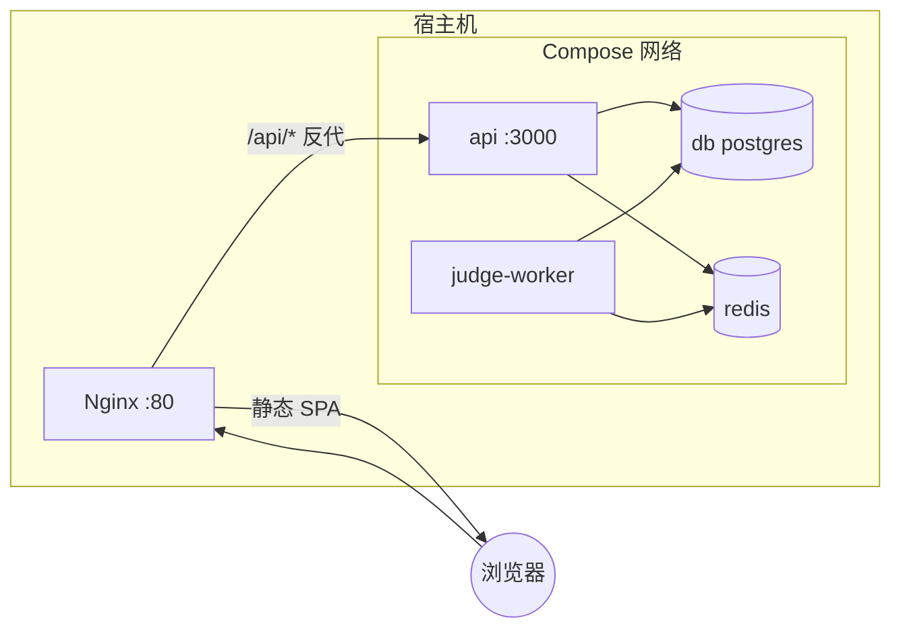

# 软件概要设计说明书

[Toc]

## 1 引言

### 1.1 编写目的

本说明书对「在线教学与实训平台」程序系统进行概要设计说明，包括基本处理流程、组织结构、模块划分、功能分配、接口设计、运行设计、安全与出错处理要点、数据结构设计等，为详细设计与编码实现提供统一依据。预期读者为项目开发人员、测试人员、课程指导教师及答辩评审。

### 1.2 背景

a．待开发软件系统的名称：**在线教学与实训平台**（仓库名 `teaching-platform` / 根包 `teaching-platform`）。

b．任务提出者一般为课程教学单位或指导教师；开发者为课程项目小组；用户为选课的**学生**、授课的**教师**及**系统管理员**；软件运行于开发人员的个人计算机、实验室服务器或 Docker 编排环境（本机或计算中心提供的 Linux/Windows 主机），通过浏览器访问 Web 前端，后端连接本机或容器内的 PostgreSQL 与 Redis。

### 1.3 定义

| 术语或缩写 | 含义 |
| :--- | :--- |
| JWT | JSON Web Token，用于无状态身份认证 |
| REST | Representational State Transfer，基于 HTTP 的资源风格接口 |
| Prisma | Node.js/TypeScript ORM，用于访问 PostgreSQL 并管理迁移 |
| BullMQ | 基于 Redis 的任务队列库，本项目用于实验代码评测任务 |
| Worker | `judge-worker` 进程，消费评测队列并执行用户提交代码 |
| SPA | Single Page Application，单页 Web 应用 |
| multipart | RFC 1867 文件上传编码，用于课程资料与实验附件 |
| Enrollment | 选课记录，关联用户与课程（可选班级） |

### 1.4参考设计

1. 项目根目录 `RUN.txt`（运行环境、启动步骤、扩展说明）。
2. `已实现功能.md`（功能与非功能落地清单）。
3. `docker-compose.yml`（可选容器化部署拓扑）。
4. `backend/prisma/schema.prisma`（持久化数据模型定义）。
5. `nginx/default.conf`（生产反向代理与 `/api` 转发规则）。
6. `backend/.env.example`、`frontend/vite.config.ts`（环境变量与开发代理约定）。

---

## 2 系统需求概述

### 2.1需求规定

**输入：** 用户通过浏览器输入账号密码、表单与富文本；教师上传课程资料与实验附件（二进制流）；学生在 Monaco 编辑器中输入源代码并提交；各类 JSON 请求体（课程信息、测试用例、作业内容、讨论帖等）。

**输出：** JSON 格式的业务数据与 HTTP 状态码；文件下载流；前端页面渲染与错误提示；评测结果写入数据库并可被查询（状态、得分、对学生可见的反馈摘要）。

**处理与性能（课程范围）：** 支持多用户并发访问 API；实验评测通过队列异步执行，避免长时间占用 HTTP 请求线程；全局与部分接口限流；请求体大小可配置；健康检查用于就绪探针。高并发与大规模数据下的容量规划以课程演示为主，可通过水平扩展 API 与 Worker 进程数提升吞吐（见 `RUN.txt`）。

### 2.2业务目标

支撑在线教学闭环：课程发布与选课、班级与资料管理、编程实验与自动评测、作业布置批改与成绩发布、成绩统计与导出、课程讨论；辅助教师进行知识图谱维护、实验内提示与作业批改建议；管理员可维护用户列表。系统应结构清晰、可本地一键开发与可选 Docker 部署，便于课程验收与演示。

### 2.3运行环境

本系统为 B/S 架构，浏览器为客户端；服务端为 Node.js 进程与数据库、缓存、可选 Nginx。

#### 2.3.1设备 

客户端：具备现代浏览器（Chrome、Edge、Firefox 等）的 PC 或笔记本，建议 4GB 以上内存以保证 Monaco 编辑器流畅。

服务器端（开发或单机部署）：x86_64 或 ARM64 主机，建议 4GB 以上内存；若使用 Docker 全栈，需支持 Docker Engine。PostgreSQL 与 Redis 可部署于同机或容器；评测 Worker 与用户代码同进程树执行，属教学演示级资源占用。

#### 2.3.2支持软件

客户端：无需单独安装运行时，依赖浏览器。

服务端：Node.js 20 及以上；npm；PostgreSQL 14+（项目示例为 16 镜像）；Redis 7；可选 Docker、Docker Compose。开发时前端使用 Vite 6；后端使用 Fastify 5、tsx、Prisma CLI；评测使用 `judge-worker` 独立进程。

### 2.4设计约束

技术栈约束：前端 React 19 + TypeScript + Vite；后端 TypeScript + Fastify；持久化 PostgreSQL + Prisma；队列 Redis + BullMQ；不引入与本课程无关的直播、流媒体子系统。API 路径在应用层不含 `/api` 前缀，由 Vite 开发代理或 Nginx 将浏览器侧 `/api` 转发并剥离前缀。文件上传大小受 `multipart` 与 Nginx `client_max_body_size` 限制（如 20MB）。用户代码评测隔离强度为教学演示级，不作为公网多租户生产安全基线。

### 2.5功能需求

系统按角色划分能力：学生选课、做实验、交作业、查成绩与讨论；教师管理课程班级资料、配置实验与测试用例、批改作业、发布成绩、查看成绩册与导出；管理员管理用户。核心业务概念为「课程—实验/作业—提交—反馈」与「选课—班级—成绩权重—总评」。

**主要处理流程（登录与访问受保护资源）：**

**实验提交与异步评测：**

**作业批改与成绩可见性：** 教师批改后 `graded=true`，默认 `released=false`；教师执行发布后 `released=true`，学生端接口才返回分数与反馈。

### 2.6非功能需求

可用性：提供 `/health/live` 与 `/health/ready`（含数据库与 Redis 探测）。安全性：HTTPS 由部署侧终止；Helmet 响应头；密码 bcrypt 哈希；JWT 密钥来自环境变量；全局与关键路由限流；请求 ID 回传。可维护性：路由按文件拆分、Prisma 迁移版本化。可扩展性：API 无状态，可横向扩展实例；Worker 可独立扩容。可测试性：种子数据与冒烟压测脚本 `npm run perf:smoke`。

### 2.7系统总体架构

系统分为表现层（React SPA）、应用层（Fastify API）、异步评测层（judge-worker）、数据层（PostgreSQL）、队列基础设施（Redis），可选反向代理（Nginx）与静态资源托管。

**UML 组件图（逻辑视图）：**

**UML 部署图（可选 Docker 全栈示意）：**

整体说明：浏览器只与 Nginx 或 Vite 开发服务器通信；业务逻辑集中在 API；评测计算与潜在阻塞操作在 Worker 中完成，与 Web 请求解耦，便于独立伸缩与失败重试（BullMQ 任务配置见 `backend/src/lib/queue.ts`）。

---

## 3 系统接口设计

### 3.2接口设计

#### 3.2.1用户接口

本系统用户接口以 **Web GUI** 为主，无独立 CLI 或专用硬件控制面板。

用户通过鼠标与键盘操作页面：导航栏进入课程中心、课程详情、实验页（Monaco 编辑）、作业与成绩册等；表单提交注册、登录、个人资料、课程与作业信息；按钮触发提交评测、发布作业成绩、导出 CSV 等。软件以页面跳转、列表、表单校验、加载状态与错误消息（HTTP 错误与业务提示）反馈操作结果。认证成功后令牌保存在浏览器 `localStorage`，后续 XHR 自动附加 `Authorization: Bearer <token>`。

#### 3.2.2 与其他软件、硬件接口

**与其他软件：** 浏览器通过 HTTP(S) 调用后端；开发时 Vite 将前缀 `/api` 代理到 `http://127.0.0.1:3000` 并去掉前缀（`frontend/vite.config.ts`）。生产环境 Nginx 将 `/api/` 转发至上游 API 服务。API 通过 Prisma 使用 **PostgreSQL** 官方协议访问数据库；通过 **ioredis** 连接 **Redis** 供 BullMQ 使用。`judge-worker` 与 API 共享队列名与数据库连接配置。本课程实现不强制依赖外部邮件服务、对象存储或第三方 LLM；若扩展，可通过新增环境变量与 HTTP 客户端接入。

**与硬件：** 除标准以太网与磁盘存储外无专用硬件接口。上传文件落盘于服务器文件系统（如 `backend/uploads/`），路径保存在数据库记录中。

**系统元素间接口：** 前端 `src/api/client.ts` 统一 Axios 实例；后端 `backend/src/index.ts` 注册各路由插件；评测由 API 写队列、Worker 读队列并写回 `Submission` 表。

### 3.3 系统数据结构设计

#### 3.3.1 逻辑结构设计要点

持久化逻辑结构以 **实体–关系** 组织，与 Prisma 模型一致，核心如下。

| 结构名称 | 标识（模型） | 主要数据项与说明 |
| :--- | :--- | :--- |
| 用户 | User | id(UUID)、email(唯一)、passwordHash、name、role、头像与邮箱验证/重置令牌字段、createdAt |
| 课程 | Course | id、title、teacherId、published、labWeight/homeworkWeight、时间字段、knowledgeGraphJson |
| 选课 | Enrollment | userId+courseId 唯一、可选 classId |
| 班级 | Class | courseId 下班级名称 |
| 课程资料 | CourseMaterial | courseId、storedPath、sizeBytes、上传者 |
| 实验 | Lab | courseId、language、starterCode |
| 测试用例 | TestCase | labId、input、expected、hidden、weight |
| 代码提交 | Submission | labId、userId、code、status(枚举)、score、resultJson |
| 实验附件 | LabFile | labId、storedPath、元数据 |
| 作业 | Homework | courseId、targetClassId、dueAt、published |
| 作业提交 | HomeworkSubmission | homeworkId+userId 唯一、content、score、graded、released |
| 作业问答 | HomeworkQuestion | homeworkId、question、answer、answeredById |
| 讨论 | DiscussionPost | courseId、title、body |

层次关系：User 与 Course（任教）、Enrollment、Submission、HomeworkSubmission 等一对多；Course 与 Lab、Homework、Class、CourseMaterial、DiscussionPost 一对多；Lab 与 TestCase、Submission、LabFile 一对多；Homework 与 HomeworkSubmission、HomeworkQuestion 一对多。

#### 3.3.2 物理结构设计要点

**PostgreSQL：** 表名与列名由 Prisma 映射（默认驼峰列需查看迁移 SQL）；主键多为 UUID 字符串；外键带 `onDelete: Cascade` 或 `SetNull`（见 schema）。访问方式为 Prisma Client 生成的 SQL；存取单位为元组。`CourseMaterial`、`LabFile` 等对高频查询列建立 `@@index`（如 courseId、labId）。**保密：** 密码仅存哈希；JWT 密钥仅存环境变量；不宜在日志中打印 token 与密码。

**文件：** `storedPath` 指向服务器磁盘路径，访问经 API 鉴权后读取或流式下载，不直接暴露裸文件 URL 于公网目录（由路由控制）。

**Redis：** 存队列任务与 BullMQ 元数据，非业务主数据的权威来源；任务完成后结果以数据库为准。

#### 3.3.3数据结构与程序关系

| 程序模块（路由/前端） | 主要读写的数据结构 |
| :--- | :--- |
| `routes/auth.ts` | User |
| `routes/courses.ts` | Course、Class、Enrollment、User |
| `routes/course-materials.ts` | CourseMaterial、Course、User |
| `routes/labs.ts` | Lab、TestCase、Submission、User、Course |
| `routes/lab-files.ts` | LabFile、Lab |
| `routes/homework.ts` | Homework、HomeworkSubmission、HomeworkQuestion、Class |
| `routes/grades.ts` | 聚合 Submission、HomeworkSubmission、Course、Enrollment、User |
| `routes/discussions.ts` | DiscussionPost、Course |
| `routes/ai-help.ts` | Lab、TestCase（只读用于生成提示） |
| `judge-worker` | Submission、Lab、TestCase（读写 Submission） |
| 前端页面 | 通过 REST 间接使用上述实体对应 DTO |

---

## 4 系统数据库设计

**数据库类型：** PostgreSQL，Schema 由 Prisma 管理，迁移文件位于 `backend/prisma/migrations/`。

**概念与表对应：** 第 3.3.1 节所列实体即主要表/集合；枚举类型 `Role`（STUDENT、TEACHER、ADMIN）、`SubmissionStatus`（PENDING、JUDGING、ACCEPTED、WRONG_ANSWER、ERROR、TIMEOUT）映射为 PostgreSQL 枚举或等价实现（以迁移 SQL 为准）。

**完整性：** `Enrollment` 上 `@@unique([userId, courseId])`；`HomeworkSubmission` 上 `@@unique([homeworkId, userId])`；外键保证课程删除时级联清理从属实验、作业、资料等（见各 `onDelete`）。

**索引：** `Submission` 上 labId、userId；`CourseMaterial` courseId；`LabFile` labId；`HomeworkQuestion` homeworkId；利于列表与关联查询。

**初始化：** `backend/prisma/seed.ts` 提供演示账号与基础数据；生产环境禁用或替换种子。

**与文件系统协同：** `CourseMaterial.storedPath`、`LabFile.storedPath` 与磁盘文件一一对应，删除记录时需同步删除或孤儿文件策略以详细设计为准。

---

## 5 运行设计

### 5.1运行模块组合

**最小可演示组合（无评测）：** PostgreSQL + `backend`（Fastify）+ `frontend`（Vite），命令 `npm run dev`（根目录）。用户可浏览与登录，但实验提交队列无消费者时任务将积压。

**完整教学组合：** 在以上基础上增加 **Redis** 与 **`judge-worker`**，命令 `npm run dev:full` 或另开进程 `npm run dev:worker`。

**容器组合（可选）：** `docker-compose.yml` 中 `db`、`redis`、`api`、`judge-worker`、`nginx` 同时运行；Nginx 对外提供 80 端口与静态页及 API 反代。

### 5.2运行控制

由操作人员或进程管理器启动与停止各 Node 进程及数据库服务。API 监听 `PORT`（默认 3000）。Worker 从环境变量读取 `REDIS_URL`、`DATABASE_URL` 与 `JUDGE_TIMEOUT_MS`（默认 8000 ms）控制单次用例执行超时。数据库迁移通过 `prisma migrate deploy` 在部署阶段执行。就绪依赖：API 依赖 PostgreSQL；入队依赖 Redis；`/health/ready` 用于检查 DB 与 Redis 可用性。

### 5.3运行时间

交互类 REST 请求在本地开发环境下期望**亚秒级**返回（不含大文件传输与复杂聚合）；文件上传耗时与带宽及大小成正比。单次实验评测时间取决于用例数量与代码执行时间，**单用例**受 `JUDGE_TIMEOUT_MS` 上限约束；整份作业总评测时间为各用例顺序执行之和（同 job 内）。队列任务可配置重试与保留时间（完成约 1 小时内按条数清理等，见 `queue.ts`）。批处理型成绩重算与 CSV 导出时间与选课人数和提交量相关，课程规模下通常秒级至数十秒级。
