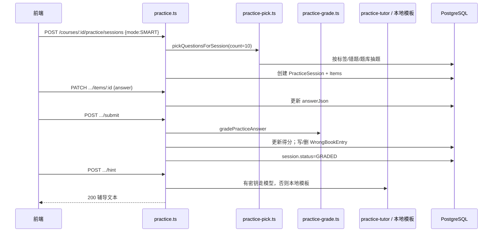

# 练习会话时序图

```mermaid
sequenceDiagram
    participant 前端
    participant API as practice.ts
    participant Pick as practice-pick.ts
    participant Grade as practice-grade.ts
    participant LLM as practice-tutor / 本地模板
    participant DB as PostgreSQL

    前端->>API: POST /courses/:id/practice/sessions {mode:SMART}
    API->>Pick: pickQuestionsForSession(count=10)
    Pick->>DB: 按标签/错题/题库抽题
    API->>DB: 创建 PracticeSession + Items
    前端->>API: PATCH .../items/:id {answer}
    API->>DB: 更新 answerJson
    前端->>API: POST .../submit
    API->>Grade: gradePracticeAnswer
    API->>DB: 更新得分；写/删 WrongBookEntry
    API->>DB: session.status=GRADED
    前端->>API: POST .../hint
    API->>LLM: 有密钥走模型，否则本地模板
    API-->>前端: 200 辅导文本
```