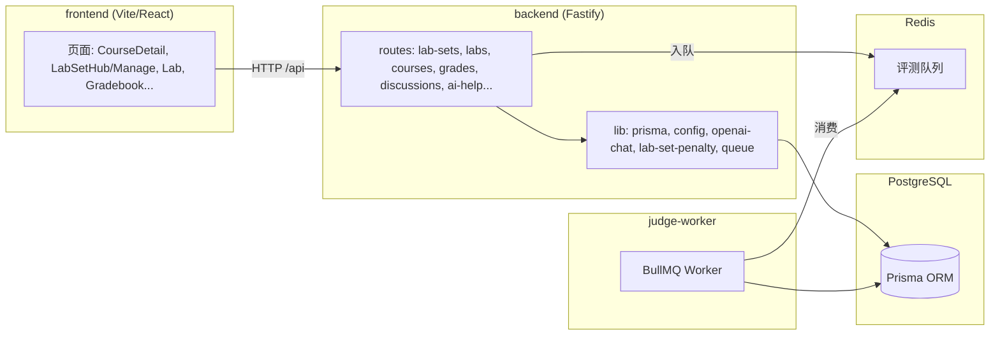

# 修改说明 · 在线实验（及相关能力）

## 当前项目架构

本仓库为**教学平台**单体多目录工程：根目录通过 `npm run dev` / `dev:full` 并行启动各子项目（见根目录 `package.json`）。

### 子项目与职责

| 目录 | 技术栈 | 职责 |
|------|--------|------|
| **`frontend/`** | Vite + React + TypeScript | 浏览器 SPA：课程、实验集、做题页、成绩册、管理端等；经 Vite 代理访问后端 `/api`。 |
| **`backend/`** | Fastify 5 + Prisma 6 + PostgreSQL | HTTP API：认证、课程、**实验集 / 题目 / 提交 / 用例**、作业、成绩、讨论、AI、资料上传等；`src/index.ts` 注册各路由插件。 |
| **`judge-worker/`** | BullMQ + Redis + Prisma | 异步**评测**：消费 `judge-submissions` 队列，拉取 `Submission` 与 `TestCase`，执行代码比对 stdout，回写 `status` / `score` / `resultJson`。 |
| **`backend/prisma/`** | Prisma schema + migrations + seed | 数据模型与迁移；**在线实验**相关核心实体：`Course` → `LabSet` → `Lab`（题目）→ `TestCase` / `Submission` / `LabFile` 等。 |

### 在线实验在架构中的位置

- **写路径**：前端 `Lab.tsx` 提交代码 → `POST /labs/:id/submit` → 后端入队 → **judge-worker** 判题 → 更新 `Submission`。
- **读路径**：题目详情、提交列表、反馈 `GET /submissions/:id/feedback`、教师统计 `GET /labs/:id/teacher-metrics` 等均依赖上述落库结构。
- **组织层级**：业务上为 **课程（Course）→ 实验集（LabSet，含截止）→ 题目（Lab）**；成绩册等聚合逻辑按该层级统计。

### 组件关系示意

### 与外部/基础设施的依赖

- **PostgreSQL**：主库；`DATABASE_URL`。
- **Redis**：提交评测队列；`REDIS_URL`（仅浏览可不启 worker，提交评测需 Redis + judge-worker）。
- **可选 LLM**：`OPENAI_*` / `DEEPSEEK_*`（题目 AI 助手）。

---

本文档汇总本会话/迭代中与**在线实验（实验集、题目、评测、成绩、讨论、AI）**相关的主要改动，便于回顾与合并分支时对照。

---

## 一、添加的功能

### 1. 实验集与罚时统计

- 实验集维度：**汇总统计**（选课人数、全做完人数与比例、按题的提交数/参与人数/通过人数）。
- **罚时规则**（与 ICPC 思路对齐）：以实验集创建时间为起点；每题首次 AC 前每次 WRONG_ANSWER / ERROR / TIMEOUT 记固定罚分；总罚时为各已 AC 题罚时之和。
- **学生进度**：按选课学生列出各题通过情况、最后提交、总罚时等。
- API：`GET /courses/:courseId/lab-sets/:labSetId/stats`、`GET /courses/:courseId/lab-sets/:labSetId/students-progress`（须在「实验集详情」路由之前注册，避免路径被 `:labSetId` 误匹配）。

### 2. AI 助手（步骤 6）

- 服务端 **OpenAI 兼容** Chat Completions（默认对接 DeepSeek 类 `BASE_URL`），环境变量：`OPENAI_API_KEY` / `DEEPSEEK_API_KEY`、`OPENAI_BASE_URL`、`OPENAI_MODEL`、`AI_TIMEOUT_MS`、`AI_MAX_TOKENS`、`AI_RATE_LIMIT_MAX`。
- 无 API Key 时 **本地模板**降级；有 Key 时多轮 **`messages`**，系统提示词含题干与**仅公开用例**，禁止泄露隐藏用例。
- 路由：`POST /labs/:labId/ai-help`（子路由限流）；前端题目页 AI Tab **多轮对话**。

### 3. 讨论区题目维度（步骤 5）

- `DiscussionPost` 增加可选 **`labId`**；`GET/POST /labs/:labId/discussions`。
- 课程讨论 `GET/POST /courses/:courseId/discussions` 仅 **`labId` 为空** 的帖子，避免与题目帖混列表。
- 题目页讨论 Tab：**本题讨论** / **课程讨论** 双入口。

### 4. 成绩册按实验集聚合（步骤 7）

- 实验总均分 = 各**实验集均分**的算术平均；每集均分 = 该集内各题**最高分**的算术平均（仅统计已有分数的题）。
- 成绩册 API 增加 `labSets`、`labColumnPlan`、`labGradingRule`；CSV 含各题列与各实验集均分列。

### 5. 题目弹窗增强

- **多行公开用例**、JSON **文件追加**、`POST /labs/:id/testcases/batch` 批量创建。
- **`GET /labs/:id/teacher-metrics`**：按 `resultJson.details` 聚合每用例通过人数等（学生逐条测评仍用 **`GET /submissions/:id/feedback`**）。
- 新建完成后可展示单题统计（metrics）；编辑模式见下。

### 6. 课程页教师区去重

- 去掉重复的「教师：实验与作业」大卡片；**新建实验集**并入「实验」卡；**新建作业**并入「作业」卡。
- **作业内嵌「作业问答」**移除，引导至页面底部 **「课程问答」**（减少重复问答入口；后端作业问答接口仍保留）。

### 7. 题目编辑（含已发布）

- **`PATCH /labs/:id`**：更新标题、描述、Markdown 题干、语言、初始代码等。
- 实验集管理：**编辑题目**打开弹窗（`editLabId`）；编辑时不在弹窗内改用例，引导至题目页教师区。

### 8. 删除实验集

- 沿用已有 **`DELETE /courses/:courseId/lab-sets/:labSetId`**（有题目时需 **`force=1`**）。
- **课程详情**每实验集行增加「删除」；**实验集管理**页增加「删除实验集」，成功后返回课程页。

### 9. 其他（上下文已存在、本迭代可能触达）

- 判题 worker 已写入带 `testCaseId` / `pass` 的 `resultJson.details`（未改表结构，与 teacher-metrics 一致）。
- Prisma 迁移：`DiscussionPost.labId` 等（若本地尚未 `prisma generate`，需处理 Windows 上偶发 EPERM）。

---

## 二、修改与新增的文件（按路径）

| 路径 | 说明 |
|------|------|
| `backend/prisma/schema.prisma` | `DiscussionPost.labId`、`Lab.discussionPosts` 等 |
| `backend/prisma/migrations/*discussion_post_lab_id*` | 上述字段迁移 |
| `backend/src/lib/config.ts` | AI 相关环境变量 |
| `backend/src/lib/openai-chat.ts` | **新增**，OpenAI 兼容请求封装 |
| `backend/src/lib/lab-set-penalty.ts` | **新增**，罚时纯函数 |
| `backend/src/routes/lab-sets.ts` | stats、students-progress、既有 CRUD/DELETE |
| `backend/src/routes/labs.ts` | teacher-metrics、testcases/batch、`PATCH /labs/:id`、解析 resultJson 等 |
| `backend/src/routes/discussions.ts` | 题目讨论 + 课程讨论过滤 `labId` |
| `backend/src/routes/ai-help.ts` | LLM / 模板、限流封装 |
| `backend/src/routes/grades.ts` | 按实验集聚合成绩册 |
| `backend/src/index.ts` | 插件注册顺序（discussions 早于 labs） |
| `backend/.env.example` | AI 变量说明 |
| `frontend/src/pages/LabSetManage.tsx` | 统计表、删除实验集、编辑题目入口 |
| `frontend/src/pages/LabSetHub.tsx` | （既有学生实验集入口，本迭代若未改则略） |
| `frontend/src/pages/Lab.tsx` | AI 多轮、讨论双入口等 |
| `frontend/src/pages/CourseDetail.tsx` | 教师区去重、删除实验集、作业新建位置等 |
| `frontend/src/pages/Gradebook.tsx` | 按集展示与说明 |
| `frontend/src/components/LabProblemCreateModal.tsx` | 多用例、文件、metrics、编辑模式 |

---

## 三、功能与文件对应关系（速查）

| 功能 | 主要文件 |
|------|-----------|
| 罚时计算 | `backend/src/lib/lab-set-penalty.ts` |
| 实验集统计 API | `backend/src/routes/lab-sets.ts` |
| 成绩册实验分 | `backend/src/routes/grades.ts` + `frontend/src/pages/Gradebook.tsx` |
| 题目 CRUD / 提交 / 用例 / metrics / PATCH | `backend/src/routes/labs.ts` |
| 题目讨论 API | `backend/src/routes/discussions.ts` |
| AI 问答 | `backend/src/routes/ai-help.ts` + `backend/src/lib/openai-chat.ts` + `backend/src/lib/config.ts` |
| 题目弹窗 | `frontend/src/components/LabProblemCreateModal.tsx` |
| 实验集管理 UI | `frontend/src/pages/LabSetManage.tsx` |
| 做题页 | `frontend/src/pages/Lab.tsx` |
| 课程页 | `frontend/src/pages/CourseDetail.tsx` |
| 路由注册顺序 | `backend/src/index.ts` |
| 数据模型 | `backend/prisma/schema.prisma` + `migrations/` |

---

## 四、「在线实验」独享 vs 合并时易冲突的共享文件

### 1. 相对独享（主要服务实验/实验集链路）

- `backend/src/lib/lab-set-penalty.ts`
- `frontend/src/pages/LabSetHub.tsx`、`LabSetManage.tsx`
- `frontend/src/components/LabProblemCreateModal.tsx`
- `backend/src/lib/openai-chat.ts`（当前仅为题目 AI 使用，若他处也要 OpenAI 兼容可复用）

说明：`backend/src/routes/lab-sets.ts` 虽以实验集为主，但挂在 **course** 路径下，与课程域强相关，合并时仍可能与「课程路由」改动冲突。

### 2. 共享、合并分支需重点留意

| 文件 | 风险说明 |
|------|-----------|
| `backend/src/routes/labs.ts` | 题目、提交、用例、反馈、metrics、PATCH 集中；他人改评测/权限/路由极易冲突 |
| `backend/src/index.ts` | 插件顺序（discussions 须在 labs 前等约定） |
| `backend/prisma/schema.prisma` | 全局模型；`Lab`、`DiscussionPost` 等任何分支改表都易冲突 |
| `backend/src/routes/discussions.ts` | 课程讨论 + 题目讨论同一文件 |
| `frontend/src/pages/CourseDetail.tsx` | 课程首页大块 UI，易与选课、作业、资料等改动重叠 |
| `frontend/src/pages/Lab.tsx` | 做题页布局、Tab、IDE，易与 UI/评测展示改动冲突 |
| `backend/src/routes/grades.ts` | 成绩逻辑；与作业权重、课程结构变更相关 |
| `frontend/src/pages/Gradebook.tsx` | 成绩册展示 |
| `backend/src/lib/config.ts` | 全局配置项增多 |
| `backend/.env.example` | 文档性合并冲突 |

---

## 五、测试说明（建议手工回归）

### 1. 实验集与统计

- 教师：创建实验集 → 管理页能看到汇总统计、学生进度表；罚时文案与数值合理。
- 学生：课程页进入实验集 → 题目列表与截止时间正常。

### 2. 删除实验集

- 教师：**无题目**的集删除（不带 `force`）；**有题目**的集删除（带 `force=1`），确认列表与数据库级联（题目、提交、用例）符合预期。
- 课程详情与管理页两处删除入口均可走通。

### 3. 题目新建 / 编辑

- 新建：多行用例 + 可选 JSON 文件 → 批量创建；完成后 metrics 可加载（可为 0）。
- 编辑：改标题/Markdown/语言/初始代码保存；题目页学生可见更新（注意缓存/刷新）。

### 4. 讨论

- 本题发帖仅出现在 `GET /labs/:id/discussions`；课程帖不出现在题目列表。
- 题目页切换「本题 / 课程」讨论，列表与发帖 URL 正确。

### 5. 成绩册

- 教师打开成绩册：按实验集分组展示；总评与 CSV 导出与手算抽样一致（多集、多空分边界）。

### 6. AI

- 不配 Key：模板回复正常。
- 配 Key：多轮对话成功；超时/429 有友好错误（可 mock 断网抽查）。

### 7. 数据库与生成

- `npx prisma migrate deploy`（或 dev）与 **`npx prisma generate`** 成功；若 Windows EPERM，关闭占用进程后重试。

### 8. 自动化

- 仓库若已有 `npm test` / E2E，可在 CI 中补充对关键 API 的契约测试；当前以手工为主。

---

## 六、文档与目录

- 本说明路径：`修改说明-在线实验/修改说明.md`（主目录下**文件夹** `修改说明-在线实验`，内附本文件）。

如需改名为「修改说明-在线实现」或与 `拓展.md` 交叉引用，可自行复制或重命名目录，内容结构可复用。
